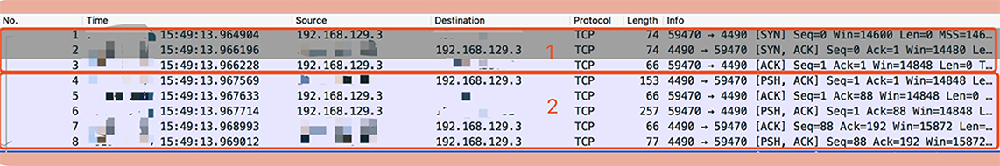

为什么频繁创建连接会造成响应时间慢呢？来看一个实际的测试。

用```"tcpdump -i bond0 -nn -tttt port 4490"```命令抓取了线上 MySQL 建立连接的网络包来做分析，从抓包结果来看，整个 MySQL 的连接过程可以分为两部分：

第一部分是前三个数据包。第一个数据包是客户端向服务端发送的一个“SYN”包，第二个包是服务端回给客户端的“ACK”包以及一个“SYN”包，第三个包是客户端回给服务端的“ACK”包，可以看出这是一个 TCP 的三次握手过程。

第二部分是 MySQL 服务端校验客户端密码的过程。其中第一个包是服务端发给客户端要求认证的报文，第二和第三个包是客户端将加密后的密码发送给服务端的包，最后两个包是服务端回给客户端认证 OK 的报文。从图中，你可以看到整个连接过程大概消耗了 4ms



发现 SQL 的平均执行时间大概是 1ms，也就是说相比于 SQL 的执行，MySQL 建立连接的过程是比较耗时的。这在请求量小的时候其实影响不大，因为无论是建立连接还是执行 SQL，耗时都是毫秒级别的。

可是请求量上来之后，如果按照原来的方式建立一次连接只执行一条 SQL 的话，1s 只能执行 200 次数据库的查询，而数据库建立连接的时间占了其中 4/5

只要使用连接池将数据库连接预先建立好，这样在使用的时候就不需要频繁地创建连接了。调整之后，你发现 1s 就可以执行 1000 次的数据库查询，查询性能大大提升了。

### 用连接池预先建立数据库连接 ###

数据库连接池有两个最重要的配置：最小连接数和最大连接数，它们控制着从连接池中获取连接的流程：

* 如果当前连接数小于最小连接数，则创建新的连接处理数据库请求；

* 如果连接池中有空闲连接则复用空闲连接；

* 如果当前连接数已经大于等于最大连接数，则按照配置中设定的时间（C3P0 的连接池配置是 checkoutTimeout）等待旧的连接可用；

* 如果等待超过了这个设定时间则向用户抛出错误

  注意池子中连接的维护问题:

  1. 数据库的域名对应的 IP 发生了变更，池子的连接还是使用旧的 IP，当旧的 IP 下的数据库服务关闭后，再使用这个连接查询就会发生错误；
  2. MySQL 有个参数是“wait_timeout”，控制着当数据库连接闲置多长时间后，数据库会主动地关闭这条连接。这个机制对于数据库使用方是无感知的，所以当我们使用这个被关闭的连接时就会发生错误。

  

  怎么保证你启动着的连接一定是可用的呢

  1. **启动一个线程来定期检测连接池中的连接是否可用，比如使用连接发送“select 1”的命令给数据库看是否会抛出异常**，如果抛出异常则将这个连接从连接池中移除，并且尝试关闭。目前 C3P0 连接池可以采用这种方式来检测连接是否可用。
  2. 在获取到连接之后，先校验连接是否可用，如果可用才会执行 SQL 语句。比如 DBCP 连接池的 testOnBorrow 配置项，就是控制是否开启这个验证。这种方式在获取连接时会引入多余的开销

  

  ### 用线程池预先创建线程 ###

  * 如果线程池中的线程数少于 coreThreadCount 时，处理新的任务时会创建新的线程
  * 如果线程数大于 coreThreadCount 则把任务丢到一个队列里面，由当前空闲的线程执行；
  * 当队列中的任务堆积满了的时候，则继续创建线程，直到达到 maxThreadCount；
  * 当线程数达到 maxTheadCount 时还有新的任务提交，那么我们就不得不将它们丢弃了。

  但是，我们平时开发的 Web 系统通常都有大量的 IO 操作，比方说查询数据库、查询缓存等等。**任务在执行 IO 操作的时候 CPU 就空闲了下来，这时如果增加执行任务的线程数而不是把任务暂存在队列中，就可以在单位时间内执行更多的任务，大大提高了任务执行的吞吐量**

Tomcat 使用的线程池就不是 JDK 原生的线程池，而是做了一些改造，当线程数超过 coreThreadCount 之后会优先创建线程，直到线程数到达 maxThreadCount，这样就比较适合于 Web 系统大量 IO 操作的场景了

其次，**线程池中使用的队列的堆积量也是我们需要监控的重要指标**，对于实时性要求比较高的任务来说，这个指标尤为关键。

最后，如果你使用**线程池请一定记住不要使用无界队列**（即没有设置固定大小的队列）。也许你会觉得使用了无界队列后，任务就永远不会被丢弃，只要任务对实时性要求不高，反正早晚有消费完的一天。但是，大量的任务堆积会占用大量的内存空间，一旦内存空间被占满就会频繁地触发 Full GC，造成服务不可用


