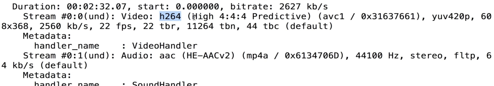

### 生成YUV ###

```shell
ffmepeg -i input.mp4
				-an
				-c:v rawvideo
				-pix_fmt yuv420p out.yuv
				
#  -an 过滤掉音频 rawvideo 视频处理方式  pix_fmt yuv输出格式  比如yuv420p


ffplay ~/Documents/new_killer.mp4


```



编码是h264 原始数据是yuv420p 分辨率是608 * 368

#### 播放YUV ####

```shell
ffplay -pix_fmt yuv420p -s 608 * 368 out.yuv

# -s 播放的分辨率
```

#### 播放Y分量 ####

```shell
ffplay -pix_fmt yuv420p 
			-s 608 * 368
			-vf extractplanes= 'y' out.yuv
# -vf 简单滤波
```

#### 提取各分量 ####

```shell
ffmpeg -i ~/Documents/new_killer.mp4
			-filter_complex
			'extractplanes=y+u+v[y][u][v]'
			-map '[y]' y.yuv
			-map '[u]' u.yuv
			-map '[v]' v.yuv
			
			
			
# 播放提取后的y 分量
fflplay -s 608 * 368 -pix_fmt gray y.yuv
```


