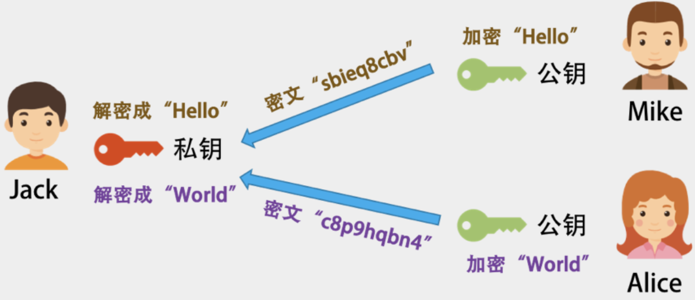
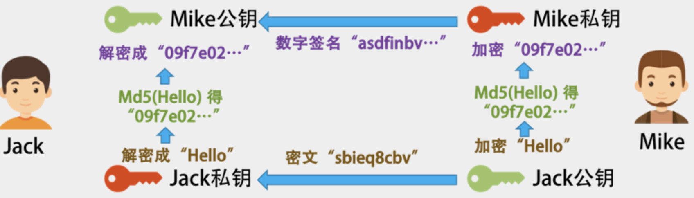

### 比特币的加密方法 ###

非对称加密技术。这种技术，在对信息进行加密和解密时，使用两个不同的密钥。这样一来，我们就可以把其中一个密钥公布出去，称之为公钥，另一个密钥私密地保管好，称之为私钥。


比如，我把我加密的密钥发布给所有人，然后大家都用这个公钥加密信息，但其他人没有私钥，所以他们解不了密文，只有我能解密文，也只有我能看得懂别人用我的公钥加密后发给我的密文。如下图所示。



这会有个问题，那就是每个人都有我的公钥，别人可以截获 Mike 发给我的信息，然后自己用我的公钥加密一个别的信息，伪装成 Mike 发给我， 这样我就被黑了。于是，我们需要对 Mike 的身份进行验证，此时就需要用到“数字签名”的概念了。

Mike 也有一对密钥对，**一个公钥给了我，私钥自己保留**。

* Mike 发自己想要的信息，做个 SHA 或 MD5 的 hash，得到一个 hash 串，又叫 Digest。
* Mike 用自己的私钥，把 Digest 加密，得到一段 Digest 的密文。我们把这个事叫数字签名，Signature。
* 然后，**Mike 把他想发给我的信息用我的公钥加密后，连同他的数字签名一同发给我**
* 我用**我的私钥解密 Mike 发给我的密文**，然后**用 Mike 的公钥解密其数字签名得到 Digest**。然后，我**用 SHA 或 MD5 对解开的密文做 Hash**。如果结果和 Digest 一致，就说明，这个信息是 Mike 发给我的，没有人更改过。



假设有个黑客偷偷地把 Jack 电脑上的 Mike 的公钥给换了，换成自己的，然后截获 Mike 发出来的信息，用自己的密钥加密一段自己的信息，以及自己的数字签名。

于是，对于 Jack 来看，因为他用了黑客的公钥，而不是 Mike 的，那么对他来说，他就以为信息来自 Mike，于是黑客可以用自己的私钥伪装成 Mike 给 Jack 通信。反之亦然，于是黑客就可以在中间伪装成 Jack 或 Mike 来通信，这就是中间人攻击

他只能和 Jack 找了个大家都相信的永不作恶的权威的可信机构来认证他的公钥。这个**权威机构，用自己的私钥把 Mike 的公钥和其相关信息一起加密，生成一个证书。**

Mike 只需要在发布其信息的时候放上这个权威机构发的数字证书，然后 Jack 用这个权威机构的公钥解密这个证书，得到 Mike 的公钥，再用 Mike 的公钥来验证 Mike 的数字签名

在比特币的世界里，每一笔交易的 From 和 To 都是每个用户的公钥（Public Key）

* 支付方需要用自己的私钥来加密交易信息并制作相关的交易签名
* 网络上其他人会用你的公钥来做解密来验证。

为什么不需要那个证书机构呢？不怕中间人攻击吗？这是因为，**如果黑客想要伪造一笔别人的交易，那么他需要换掉半数以上结点上的被攻击者的公钥，这不太现实。**与其这样做，还不如去偷被攻击者的私钥，可能还简单一些。

### 比特币的挖矿 ###

在比特币的区块 hash 算法中，要确保下面这个公式成立

```
SHA-256(SHA-256 (Block Header)) < Target
```

在区块头中，可以完全自由修改的只有一个字段，就是 Nonce，其他的 Timestamp 可以在特定范围内修改，Merkle Root 和你需要记录的交易信息有关系（所有的矿工可以自由地从待确认交易列表中挑选自己想要的交易打包）。

所以，基本上来说，**你要找到某个数字，让整个 hash 值小于 Target。这个 Target 是一个数，其决定了，我们计算出来的 hash 值的字符串最前面有几个零。**我们知道，hash 值本身就是一串相对比较随机的字符串。但是要让这个随机的字符串有规律，是一件很困难的事，除了使用暴力破解，没有其他办法。在计算机世界里，我们把这个事叫 " 哈希碰撞 "(hash collision)，碰撞前几个位都是 0 的哈希值。

下面是一个示例。我想找到一个数，其和 "ChenHao" 加起来被 hash 后的值前面有 5 个零。

```python
import hashlib

data="ChenHao"

n=1
while n < 2**32:
    str = data + `n`
    hash = hashlib.sha256(str).hexdigest()
    hash = hashlib.sha256(hash).hexdigest()
    if hash.startswith('00000'):
        print  str, hash
        break
    n = n + 1
```

那么，控制前面有多个 0 的那个 Target 又是怎么来的呢？是由 Bits 这个字段控制的，也就是难度系数，前面需要的 0 越多，难度也就越大

这个难度系数，会在每出 2016 个区块后就调整一次。现在，这个难度是要在前面找到有 18 个零。如下所示 (一个真实的区块链的 Hash 值)：

000000000000000000424118cc80622cb26c07b69fbe2bdafe57fea7d5f59d68

一般的挖矿流程如下。

* 从网络上取得之前的区块信息。
* 从 " 待记账区 " 中获取一组交易数据（有优先级，比如成长时间、矿工小费等）。
* 形成区块头（计算 Merkle Root 并设计记账时间 Timestamp 等）。
* 开始穷举 Nonce，来计算区块头的 hash 值。如果前面有 18 个零（小于 Target），那么记账成功。如果没有，则从第一步重新开始。
* 一旦某矿工成功打包一个区块，他就会告诉其他矿工。收到消息的矿工会停下手上的工作，开始验证，验证通过后，广播给其他矿工。


