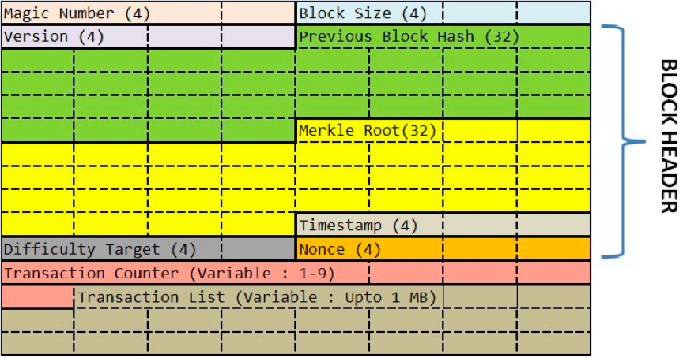

区块链就像一个单向链表，一个数据块中保存着三个信息。

* 真正的数据。
* 自己的地址（或是 ID）。
* 前一个数据块的地址。


### 比特币的 hash 算法 ###



其中 Version，Previous Block Hash，Merkle Root，Timestamp，Difficulty Target 和 Nonce 这六个数据字段是区块链的区块数据协议头。后面的数据是交易数据

* Version：当前区块链协议的版本号，4 个字节。如果升级了，这个版本号会变。
* Previous Block Hash：前面那个区块的 hash 地址。32 个字节。
* Merkle Root：这个字段可以简单理解为是后面交易信息的 hash 值 。32 个字节。
* Timestamp：区块生成的时间。这个时间不能早于前面 11 个区块的中位时间，不能晚于 " 网络协调时间 "——你所连接的所有结点时间的中位数。4 个字节。
* Bits：也就是上图中的 Difficulty Tagrget，表明了当前的 hash 生成的难度（后面会说）。4 个字节。
* Nonce：一个随机值，用于找到满足某个条件的 hash 值。4 字节。

对这六个字段进行 hash 计算，就可以得到本区块的 hash 值，也就是其 ID 或是地址。其 hash 方式如下（对区块头做两次 SHA-256 的 hash 求值）：

```
SHA-256(SHA-256 (Block Header))
```

事情并没有这么简单。比特币对这个 hash 值是有要求的，其要求是那个 Bits 字段控制的，然后你可以调整 Nonce 这个 32 位整型的值来找到符合条件的 hash 值。我们把这个事情叫做“挖矿”（在下一篇中)


