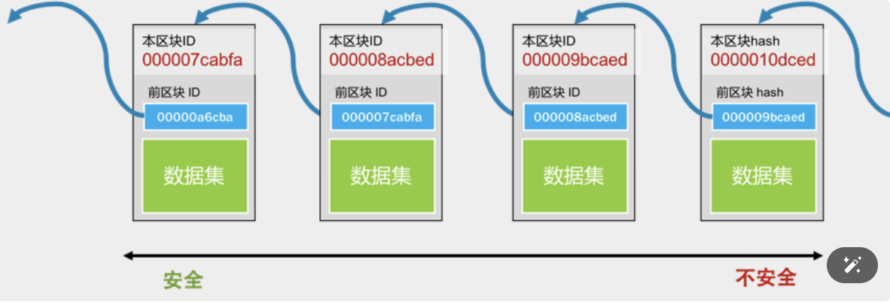

2010 年，看到好多人在讨论一个叫 bitcoin 的东西，还看到有人说用几万个这个东西换了个披萨，看了一下它的白皮书：https://bitcoin.org/bitcoin.pdf

下面是这几篇文章要回答的关键问题。

1. 为什么区块链技术会成为热点技术？它解决了什么问题？
2. 区块链（blockchain）究竟是个什么技术
3. 去中心意味着没有一个公司，没有公司就意味着没有服务器，没有服务器的软件是怎样提供服务的？
4. 智能合约是个什么鬼？它有什么意思？
5. 简单地谈一谈金融，你可以自行思考一下，区块链虚拟货币是否有可能取代现有的金融服务？
6. “去中心化”的优劣，以及相关的逻辑和哲学问题。

### 区块链技术的革命性 ###

比特币号称有下面几个特性：

1. **去中心化。**这意味着没有中心的服务器，不受某个人的控制，整个系统直接由用户端的电脑构成。
2. **数据防篡改**。所有交易记录全量保存，并公开给所有的人，而且还被加密和校验。并不是数据不能被篡改，而是数据被篡改的成本非常大。
3. **固定的发行量**。不会像国家中央银行那样乱印钞票，造成通货膨胀。

去中心化的比特币交易处理流程如下：

* 首先，需要交易的用户把交易传到网络中。
* 然后，网络上有些机器叫记账结点，它们通过比拼计算力的方式竞争记账权。这也叫“挖矿”。
* 获得记账权的结点，会把待记账的交易进行计算打包，并向全网广播。收到新的记账包的结点会对其进行验证，验证通过后加入自己的区块

注意，整个比特币的世界是没有服务器的，其完全是靠大家用自己的电脑拼出来的一个分布式系统。既然这些电脑都是大家自己的，所以这种 P2P 的去中心化网络有一个前提假设——“**网络中的任何结点都是不能信任的，它们中的任何一个都可能会作恶”**。

基于这个前提假设，这个分布式的账本系统就需要有如下的设计：**任何人都可以拿到所有的数据。所以，数据要能很容易被验证是合法的没有被修改过的，而且也要是很难被人修改的。**

基于这个设计，比特币使用了两个比较大的技术：**“区块链技术”和“工作量证明共识机制”。**

### 区块链 ###

区块链又叫 blockchain，其中有一个一个的区块，每个区块中包括着一组交易信息，然后，每一个区块都会有一个 ID（或是一个地址），这些区块通过记录前一个区块的 ID 来形成一条链。

* 每个块的 ID 都是通过其内容生成的，所以，只要是内容有一丁点儿的变化，这个 ID 都会完全不一样。
* 而生成 ID 的内容中还包括上一个块的 ID。于是只要上一个块的内容变了，其 ID 也要跟着变（不然就不合法了），那么后面指向这个块的 ID 也要变
* 这种一处改，处处改的方式，并不代表不能篡改，而只是让修改面比较大，让你的改动麻烦一点。
* 越旧的区块的篡改会造成越大面积的修改，于是越旧的区块就不容易篡改，就越安全。反之，越新的区块就越不安全。

而真正让区块链做到非常难篡改的是工作量证明的共识机制。

### 工作量证明共识机制 ###

分布式网络的数据一致性是最难的问题了，在这种去中心化的网络集群下就更难了。其中最大的本质差别是，一个公司内的分布式系统中的结点是被假设成可信任的，而在去中心化的网络下，结点要被假设成不可信任的。

* 以谁的数据为准？ 任何结点都可以修改自己所下载的账本，也就是任何一个人都可以伪造账本。那么，谁的数据才是对的？在去中心化的网络下，我们只能认为，大多数人认识的数据是对的。只要我控制了一半以上的结点，我让这“大多数人”伪造同一份账本，那么相当于整个账本都被我修改过来了。因为在没有服务器的去中心化的网络下，所谓的真理只不过是大多数人同意的东西。
* “大多数人”的问题。 是人数吗？在网络世界里，我可以用程序模拟出无穷多的“人”出来投票，所以，用人数来解决去中心化的问题，在分不清是人还是狗，是生物还是程序的计算机世界里，是一件很愚蠢的事。

为了解决这几个问题，比特币使用了 Proof-of-Work 工作量证明机制，也就是“挖矿”。**所谓的“挖矿”其实就是用大规模的计算来找到一个符合系统要求的区块 ID。要找到符合条件的区块 ID 只能通过暴力穷举的方式，所以要付出大量的系统计算资源和电力**

用这种“极度消耗计算力”的方式来提高成本，从而有效地遏制或解决下面几个问题。

1. 修改几乎变得不可能。试想，如果生成一个区块需要大量的长时间的计算力。也就是在世界上最好的电脑集群下计算 10 分钟才能打好一个包。那么，当我们要去修改数据内容的时候，这个过程也是一样的。前面说过，如果你要伪造一个块，那么你就要修改后面所有的块，修改一个块的成本如此之高，那么修改整个链的成本也就非常之高了
2. 能掌握 51% 的算力的人变得几乎不可能。除了伪造一条链的成本很高，还要控制大多数人的算力，这意味着需要巨额的资金投入。这两个难度加起来，几乎不太可能。
3. 解决分歧。一方面，这么大的工作量找出来的区块 ID，已经有效地降低了大家有意见冲突的概率。另一方面，就算是出现了合法冲突的区块（同时出现了多个合理的区块，即区块链出现分支 / 分叉），也就是多个合法的账本。而因为挖矿的成本太高，导致要同时跟进多个账本是不可能的，所以矿工们只能赌跟其中一个。大多数人所选择的那一个分支的链就会越来越多

