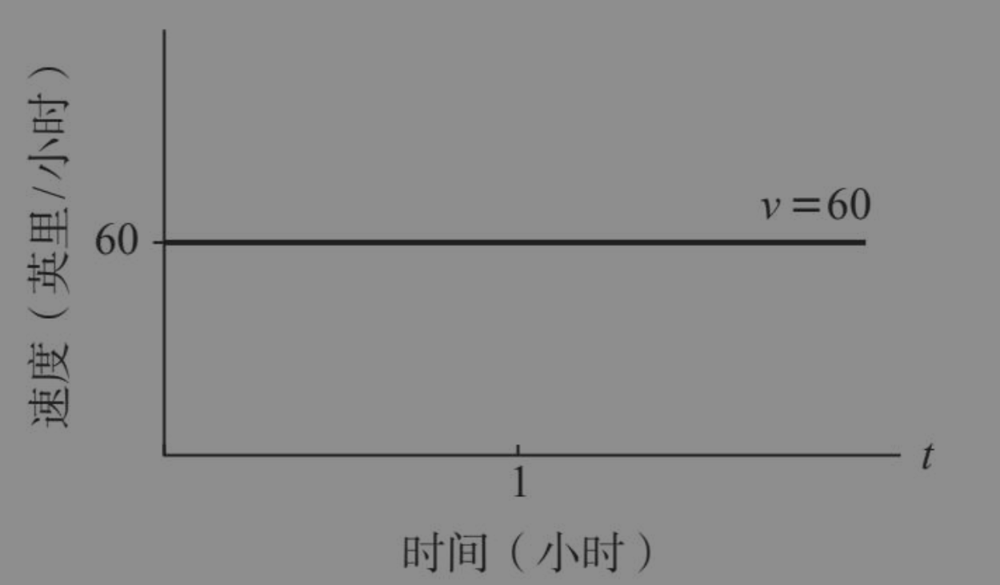

#### 微积分的三大核心问题 ####

1.正向问题：已知一条曲线，求它各处的斜率。

2.反向问题：已知一条曲线各处的斜率，求这条曲线。

3.面积问题：已知一条曲线，求曲线下方的面积。

那么，如何算出曲线的不断变化的斜率呢？如何根据斜率重建曲线呢？如何算出曲线下方不断变化的面积呢？

本章主要介绍一元函数及其导数（变化率），从以恒定速率变化的函数讲起，再转换到以不断变化的速率变化的复杂函数。理解不断变化的变化，才是微积分真正的闪光之处。

#### 线性函数及其恒定的变化率 ####

1. 工作t小时后她可以赚到y美元，即y=10t。
2. 根据《美国残疾人法案》，无障碍轮椅坡道每12英寸的水平距离对应的垂直高度不得超过1英寸，垂直高度与水平距离之间的关系式是y=x/12，其中y是垂直高度，x是水平距离

在微积分的专业术语中，变化率指两个变化量的商，也就是y的变化量除以x的变化量，写作Δy/Δx
$$
\frac{\triangle y}{\triangle x}
$$
在更复杂的情况下，变化率并不是恒定的。假设我们行走在一段高低起伏的路上，有些路段陡峭，而有些路段平坦。同样地，当汽车加速或者行星绕太阳旋转时，它们的速度也在不断变化。在这种情况下，把速度看作时间的函数显得至关重要。所以，我们现在应该养成一种习惯：不再把变化率看作数字，而将其视为函数。

#### 非线性函数及其不断变化的变化率 ####

如果一个函数是非线性的，它的变化率Δy/Δx就不是常数。用几何术语来说，这意味着函数图像是一条各点斜率均不相同的曲线。

图中是曲线 
$$
y = x^2
$$
检视这条抛物线，我们看到它的有些部分陡峭，而有些部分相对平坦。其中最平坦的部分出现在抛物线底部，即x=0的那一点。无须做计算我们就能看出来，这个点的导数必定是0。它也只能是0，因为底部的切线显然是x轴。如果把这条切线看作一个斜坡，它自始至终都没有上升，因此它的斜率为0。

切线斜率并不那么显而易见，事实上根本不明显。为了解决这个问题，我们做一个爱因斯坦式的思想实验,放大抛物线上的任意一点(x,y)，并让这个点始终处于视野的中心,就像我们在显微镜下观察曲线中的一段，并且逐渐增加放大率一样。随着镜头越来越近，这段抛物线看起来会越来越直。在放大无穷倍的极限情况下（相当于放大了我们感兴趣的那一点周围的一段无穷小的曲线），被放大的那一段曲线应该接近于一条直线。如果是这样，**这条极限直线就会被定义为曲线上那一点的切线，它的斜率也会被定义为那一点的导数**

请注意，我们在这里利用的是无穷原则，即通过把一条复杂的曲线切分成无穷小的线段来简化它。在微积分领域，这是我们一直在做的事情。曲线形状很难对付，而直线形状即使无穷小且有无穷多个，处理起来也会容易得多。利用这种方法计算导数是微积分的一种典型操作，也是无穷原则最基本的应用之一。

随着我们继续放大图像，视野中的那段抛物线看起来越来越直。对这个几乎变成直线的部分来说，我们计算它的垂直高度与水平距离之比Δy/Δx，实际上就是在求解当Δx趋于0时这段抛物线斜率(Δy/Δx)的极限值。计算机图形学有力地表明，这个部分的斜率越来越接近1，相当于一条45度角的直线

此外，不仅是在x=1/2处，在x取任意值时执行相同的计算，都可以得出抛物线上任意一点(x,y)的极限斜率或切线斜率等于2x。用微积分术语来说：
$$
x^2 的导数是 2x
$$
只有当被放大的曲线逼近极限直线时，我们才能定义导数。而对某些病态曲线来说，情况就不一样了。比如，如果有一条曲线呈V形，即在某个点上有一个尖角，那么当我们放大这个点时，它看起来仍然像一个角。无论放大多少倍，这个角都不会消失，曲线看上去也永远不会像直线。因此**，V形曲线在拐角处没有明确的切线或斜率，在这一点上也就没有导数。**

由于物理系统的突跳或其他不连续性行为，非光滑曲线的不便性和反常性时常会凸显出来。比如，当我们打开电路中的一个开关时，电流就会从完全不流动变为突然大幅度地流动。随着电流的接通，电流–时间图像会显示出一个几乎垂直的突然上升趋势，近似于不连续跳跃。**有时我们将这种突然转变当作真正的不连续跳跃会更省事，在这种情况下，作为时间函数的电流在开关被打开的瞬间是没有导数的**。

#### 面积、积分和基本定理 ####

在牛顿和莱布尼茨创立微积分之后，情况发生了变化。他们各自发现并证明了一个基本定理，它能使这类问题常规化。该定理将面积与斜率联系起来，进而将积分与导数联系在一起，这着实令人惊讶。就像狄更斯小说中的情节转折一样，两个看似毫不相干的人物竟然是最亲近的家人，积分和导数之间也存在着“血缘关系”

当牛顿动态地看待面积问题时，他发现了基本定理。他的想法是在这幅图景中引入时间和运动，用他的话说就是让面积流动起来，并不断扩大。

现在我们把这个问题反过来：距离在速度图像上是如何呈现的？换句话说，速度图像是否具有某种视觉或几何特征，能让我们推断出汽车在t小时后行驶的距离呢？当然有，汽车行驶的距离是速度曲线（平线）下方累积到时间t的面积。

所以，至少在这个速度完全恒定且速度曲线是一条平线的例子中，根据速度推断出距离的关键在于计算速度曲线下方的面积。牛顿的见解是，即使速度不是恒定的，面积和距离之间的这个等式也会一直成立。不管物体的运动有多么不规律，它的速度曲线下方累积到时间t的面积总会等于它在t小时后行驶的距离。这是基本定理的版本之一

我们的最终目标是找到牛顿基本定理的通用几何版本，它是用抽象曲线y(x)及其下方的累积面积A(x)表示的

汽车每个时刻的速度都由线性函数v(t)=10t给出，其中数字10表示汽车的加速度。如果加速度是其他常数，比如a，那么这个公式可以泛化为：
$$
v(t) = at
$$
对这样一辆车来说，它从时间0至t行驶的距离是多少？换句话说，它从起点开始行驶的距离是如何随时间增加的,已知速度按照v=at呈线性增长，那么距离会如何增长呢？基本定理认为，行驶的距离等于速度曲线下方累积到时间t的面积。而且，这里的速度曲线是斜线v=at，所以相关的面积很容易计算，它等于图7–3中灰色三角形的面积。

加速度的定义是速度的变化率。所以，**如果速度函数v(t)已知，就很容易找到相应的加速度a(t)，这被称作“解决正向问题”。就像我们运用放大抛物线的方法来计算它的斜率一样**，我们可以通过计算速度函数的变化率来解决这个问题。而求解已知函数的变化率只需要利用导数的定义，以及不同函数的多种求导法则。

但反向问题的棘手之处在于，速度函数是未知的。**假设速度函数的变化率（它的加速度）已知，我们要尝试计算什么样的速度函数才能满足这个变化率。如何从已知的变化率反向推导出未知的速度函数呢**

或者，如果这条曲线是由物理学感兴趣的事物来定义的，比如一个粒子的运动轨迹或者一道光线的传播路径，那么我们是否有办法系统地算出它下方的面积呢？这就是面积问题.

斜率引出了导数的概念。作为曲线斜率的导数非常自然地出现在几何学中。在物理学中，**导数也是作为其他变化率出现的，比如速度**。因此，**导数表明了斜率与速度之间的联系**

当牛顿动态地看待面积问题时，所有这些概念——斜率与面积、曲线与函数、速率与导数——之间深藏的联系就从阴影中显现出来。秉持着我们在前两节内容中的研究精神，请你观察图，并想象x以恒定的速度向右滑动。你甚至可以把x看作时间，牛顿经常这样做。然后，**随着x的移动，灰色区域的面积会不断变化。这个面积取决于x，它应该被视为x的函数，所以我们把它写作A(x)。当我们想强调这个面积是x的函数（而不是一个固定的数）时，我们就称它为面积累积函数**

我们要解决的问题是：当x向右移动时，灰色区域的扩张速率是多少？或者说，当滚筒到达x处时，它刷油漆的速率是多少？为了回答这个问题，想想在下一个无穷小的时间间隔内会发生什么。答案是：滚筒会向右移动无穷小的距离dx。而且，当它滚过这个微小的距离时，它在垂直方向上的长度y几乎保持不变，**因为在这个无限短的滚动过程中它几乎没有时间改变自己的长度（具体细节我们将在下一章再做讨论）。在这个短暂的时间间隔内，滚筒刷出来的是一个长而细的矩形：高为y，底为无穷小的dx，面积为无穷小的dA=ydx。将方程两边同时除以dx，就可以得到面积累积的速率**：
$$
\frac{dA}{dx} = y
$$
滚筒当前的长度越长，它在下一个瞬间刷的油漆就越多，面积累积的速率也越快。

#### 基本定理的意义 ####

已知的曲线在中间，未知的斜率在右边，未知的面积在左边。它们都是出现在微积分三大核心问题中的函数。已知曲线y，我们尝试计算它的斜率和面积

基本定理揭示了A的导数就是y。这是一个惊人的事实。它为我们提供了一种计算任意曲线下方面积的方法，而这个古老的谜题在近2 000年的时间里曾让那些最伟大的人头疼不已。现在，这幅图为我们指出了一条通向答案的路径

