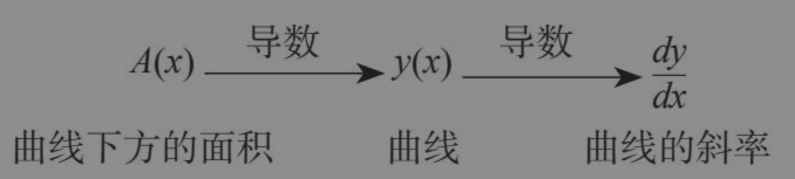
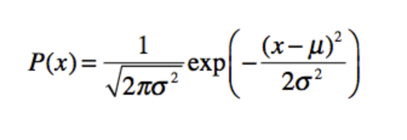
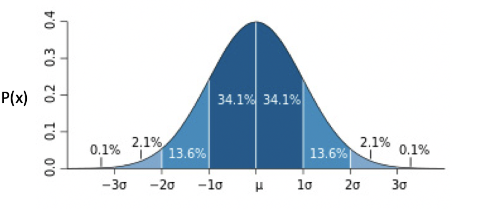
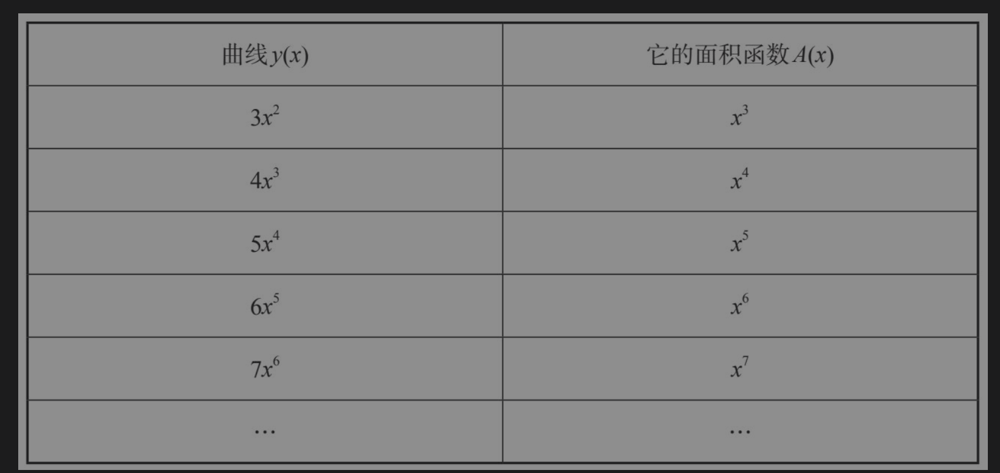

想明确的一点是，基本定理不能完全解决面积问题。尽管它提供了关于面积变化率的信息，但我们仍要对面积本身进行推导。

用符号表示的话，基本定理告诉我们dA/dx=y，其中y(x)是已知函数。我们还需要找到能满足这个方程的A(x),比如：我想的是一个面积函数A(x)，它的导数是12x+x10–sinx，那么我想的面积函数是什么呢？

正态分布（Normal Distribution），也叫高斯分布（Gaussian Distribution）

在这个公式中有两个参数，μ表示均值，σ表示标准差 (即**曲线函数)**

越靠近中心点μ，出现的概率越高，而随着渐渐远离μ，出现的概率先是加速下降，然后减速下降，直到趋近于 0。蓝色区域上的数字，表示了这个区域的面积（**曲线函数的面积，反向问题**），也就是数据取值在这个范围内的概率。例如，数据取值在[-1σ, μ]之间的概率为 34.1%。

现实中，很多数据分布都是近似于正态分布的。例如人类的身高体重。拿身高来说，大部分人都是接近平均值身高，偏离平均身高越远，相对应的人数越少。这也是为什么正态分布很常用的原因。

构建能解决12x+x10–sinx等任意曲线y(x)的反向问题的方法，就变成了微积分的圣杯。更准确地说，它是积分学的圣杯。一旦解决了反向问题，就可以彻底解决面积问题

反向问题的解决方案还会产生更大的影响，原因如下：根据阿基米德的观点，面积是无穷多个无穷小的矩形条之和。因此，面积是一个积分，它是所有碎片重新拼凑起来的整体，是无穷小变化的累积

处理棘手的反向问题的方法之一是无视它，把它搁在一边，并用更简单的正向问题（已知A，计算它的变化率dA/dx；根据基本定理，我们知道这个变化率一定等于我们正在寻找的y）取代它。相比反向问题，正向问题要容易得多，因为我们知道该从哪里着手去解决它。**我们可以从已知的面积函数A(x)入手，然后运用标准导数公式计算它的变化率。由此得出的变化率dA/dx一定扮演着函数y的角色，因为基本定理向我们保证dA/dx=y**

我们的第一项任务是制作一张大查询表，以[A(x),y(x)]对的形式列出几百个面积函数及其关联曲线。那么，基于这张表的规模和多样性，我们找到解决真正的面积问题所需的搭档函数的概率将大幅增加。一旦找到那对必需的函数，我们就无须做进一步的工作了，因为答案就在那张表里

比如，$x^3$的导数是$$3x^2$$，这个结果是我们通过解决正向问题，即进行简单的求导得出来的。然而，其中的奇妙之处在于，它告诉我们$x^3$可以扮演A(x)的角色，而$$3x^2$$可以扮演y(x)的角色。就这样，我们不费吹灰之力地解决了$$3x^2$$的面积问题。以此类推，我们也可以将x的其他幂函数填到表中。如表所示，$$x^4$$的导数是$$4x^3$$,x5的导数是$$5x^4$$……一般而言，$$x^n$$的导数是$$nx^{n-1}$$​。对幂函数来说，这些都是很容易得到的正向问题的答案。

找到一种求任意曲线而不只是幂函数面积的方法。有了它，人们也有可能算出平面上任意一个不规则形状的面积，还可以计算球面、抛物面、瓮、桶及其他通过绕轴旋转曲线所得到的曲面（就像陶钧上的花瓶一样）的表面积、体积和重心。阿基米德和一位18世纪的数学天才思考过的关于曲线形状的经典问题，一下子就变得容易解决了

不仅如此，某些预测问题也将得到解决。只要解决了曲线求积问题，我们就可以预测出运动物体在遥远未来的位置，比如，即使一颗行星受到的引力与我们宇宙中的引力不同，我们也能预测出某一时刻它在轨道上的位置

这就是算出任意曲线下方的面积如此重要的原因。由于面积问题与反向问题之间存在着密切的关系，所以它不只是与面积有关。面积问题也不只是关于形状，或者关于距离与速度之间的关系，或者关于其他狭义事物的问题，而是完全通用的。从现代的角度看，**面积问题旨在预测以不断变化的速率变化的事物与它随时间的累积程度之间的关系。它与银行账户的波动性流入和累计余额有关；它与世界人口的增长率和地球上的净人口数有关；它与化疗药物在患者血液中不断变化的浓度和随时间的累积暴露剂量有关，因为总暴露量会影响化疗药物的效果和毒性。面积问题之所以重要，是因为未来对我们而言至关重要**。

问题1：已知流量，如何求出它们的流数？（这相当于我们在前文中提到的正向问题，也就是求已知曲线的斜率，或者一般来说，求已知函数的变化率或导数的简单问题。这个过程在今天被称为微分。）

问题2：已知流数，如何求出它们的流量？（这相当于反向问题，也是面积问题的关键所在。它是根据斜率推导曲线，或者一般来说，根据变化率推导未知函数的困难问题。这个过程在今天被称为积分。）

问题2比问题1难得多，对预测和破解宇宙密码来说也更加重要

微分是一种局部操作。正如前文所说，我们在计算导数的时候，就像在显微镜下观察事物一样。随着我们反复放大视野中的曲线，曲线的弯曲度看上去越来越小。我们看到了曲线的放大版，它是一段微小的斜坡，几乎完全笔直，垂直高度是Δy，水平距离是Δx。在放大倍数为无穷的极限情况下，它趋近某条直线，即显微镜中心点的切线，这条极限线的斜率就是该点的导数。显微镜的作用是让我们把注意力集中在我们关心的那段曲线上，而其他一切都会被忽略。正因为如此，我们才说求导是一种局部操作，它舍弃了唯一关注点的无穷小邻域以外的所有细节

而积分是一种整体操作。我们现在用的不是显微镜，而是望远镜。我们试图眺望远方或者预测未来

回到北京奥运会期间博尔特打破100米世界纪录的那场比赛。回想一下，为了求出他的瞬时速度，我们先用一条光滑曲线去拟合显示他在赛道上的位置随时间变化的数据。然后，为了求出他在某个时刻（比如比赛进行到7.2秒时）的速度，我们**利用拟合曲线来估计他在一小段时间后（比如7.25秒时）的位置，再用距离的变化量除以时间的变化量，估算出他在那一时刻的速度。这些都是局部计算，它们利用的唯一信息就是他在那个给定时刻前后的几百分之一秒内的运动情况**

相比之下，如果我们拿到一份展示博尔特在比赛中的所有瞬时速度的无限长的电子表格，并且要重建他在比赛开始后7.2秒时的位置，那么请你想一想我们需要用到哪些信息, 一点一点地在赛道上不断前进，每次累积0.01秒的信息，我们就可以更新他在整场比赛中的位置。在计算方面，这是一件费力的苦差事，也是整体计算如此困难的原因。我们需要计算每一步，才能得到一个关于遥远未来（在这个例子中是发令枪响后7.2秒时）的期望答案。

**但如果我们能以某种方式快进，直达我们关注的那个瞬间**，那么这种方法将大有帮助。而且，这正是反向积分问题的解决方案所要实现的效果。它将为我们提供一条穿越时间的捷径或者一个虫洞

