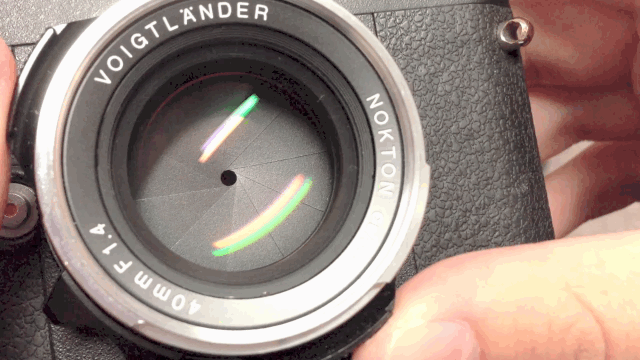

**光圈是镜头里用来控制镜头孔径大小的部件，它和快门协同工作控制进光量**。对于一枚成品镜头，我们不能随便改变镜头本身的直径，但我们可以在镜头里放一些多边形叶片，它们围成一圈儿，中间留个孔，我们可以通过改变它们的收缩幅度以控制中间那个孔的大小，然后以此控制镜头的通光量

我们通常用 F 值来表示光圈大小，它的计算方式是：光圈 F 值 = 镜头的焦距 / 光圈口径

**F 值小的是大光圈，F 值大的是小光圈。**

相机在完成对焦以后（**对焦：指的是拍照前，调整对焦点到相应的距离位置上，以使拍出来的照片清晰**），其实不光焦点上的物体是清晰的，焦点前后一段距离内的物体也是清晰的。这个距离范围，就是景深。

在不考虑镜头焦段的情况下，同一枚镜头，光圈越大，景深越浅（照片中清晰的范围越小）；光圈越小，景深越大（照片中清晰的范围越大）

我们常说的什么背景虚化，其实就是大光圈搞出来的，好多人最早买相机的原因之一就是为了拍出那种照片

背景虚化从来不是单纯地为了屏蔽画面中的干扰因素而存在的，虚化的背景本身也要作为画面中的一部分进入我们的考量范围。在川内伦子的照片里，我们能清楚地发现虚化掉的背景更像是纯净的色块儿，让画面更加简洁。

景深陷阱也叫陷阱对焦，指的是在手动对焦的情况下，提前预估被摄主体与相机之间的距离，利用镜头小光圈所带来的更大的景深范围，在被摄主体进入这个景深范围时，不需要再临时对焦，而直接进行拍摄。

**再快的自动对焦，也没有不对焦快**。实际拍摄时，哪怕 0.1s 的耽搁都会让你眼睁睁地看着画面转瞬即逝。景深陷阱是所有熟练掌握相机操作的摄影师在拍摄的时候常用的技术手段，只需要提前设置好光圈，就可以专注于构图，等待拍摄时机到来，直接按快门

比如这是一枚 Leica 35mm 镜头，它上面刻着景深标尺。这枚镜头光圈开在 F5.6，对焦点设置在 ∞（无穷远），观察景深标尺可知，光圈开在 F5.6 时，大概 7.5m-∞（无穷远）,都是清晰的景深范围。

**先看光圈，设置在 F5.6 上**；再看**对焦距离，设置在 ∞ 上**；**接着看最下面的标尺**，有两个 5.6，这两个 5.6 的标尺指向了上面的距离数值；最后看，左边的 5.6 基本指向了 5m 和 10m 的正中间，我们可以认为那大概是 7.5m，右边的 5.6 指在了 ∞ 的右边，也就是说大于 ∞。

