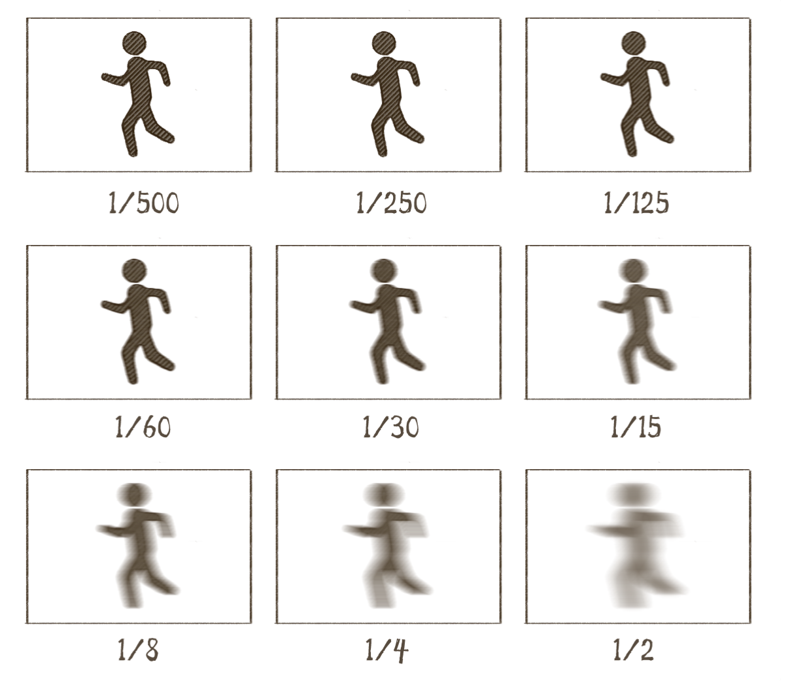
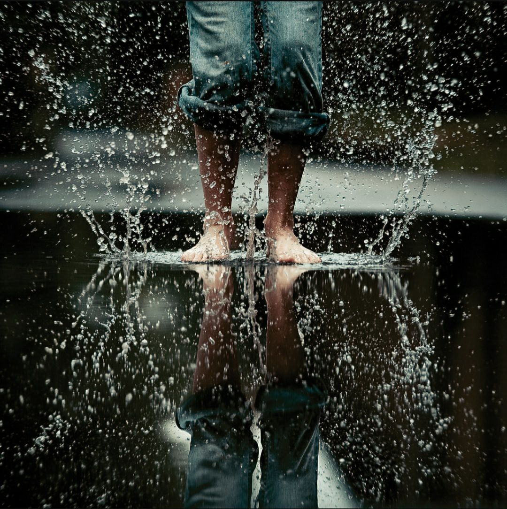
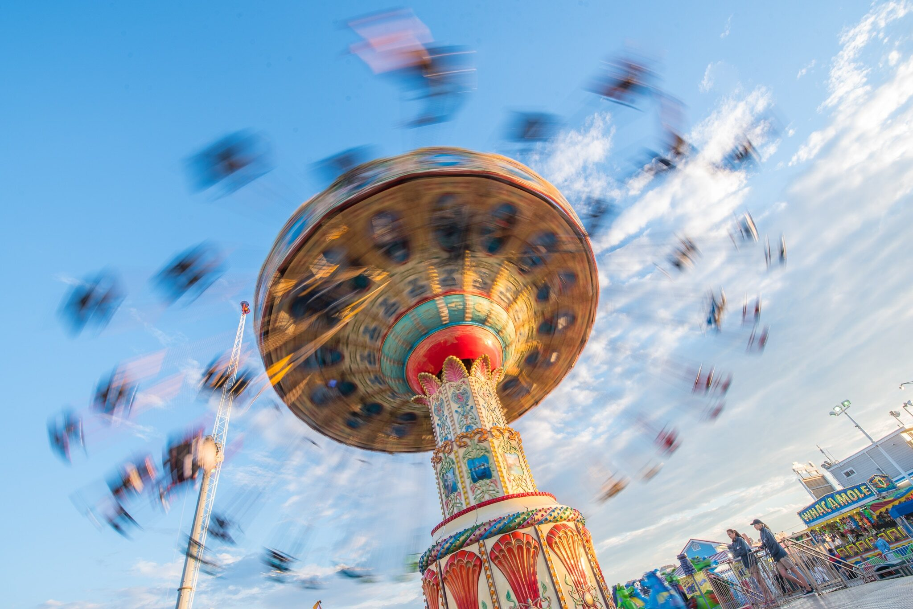

光圈控制光的方法是控制通光量——孔开得大一点，能钻进镜头的光就多一点；孔开得小一点，能钻进镜头的光就少一点，但如果少了“时间”这个因素，光圈控制光线的作用就失效了。比如说，我可以让这个孔一直开着，开一万年，也就是说让相机曝光一万年，这样一来，光圈再小，也挡不住相机接收了一万年的光。所以，这个时候，**我们就要靠快门来控制相机睁眼的时间**。

快门是相机里用来控制光线照射在感光元件上时间长短的装置，它挡在感光元件前面，它打开，感光元件才能被射进镜头里的光照到；它关上，就跟相机闭眼了差不多，感光元件就瞎了。换句话说，**快门控制的就是曝光时间的长短**

* 快门速度越快，等于一次快门帘打开的时间越短，等于传感器接收到的光线越少，等于曝光时间越短，等于画面越暗，也基本等于画面会更“实”，不容易出现被摄物的拖影，不怕手抖患者，不容易拍虚。
* 而快门速度越慢，等于一次拍摄的时间越长，等于传感器接收到的光线越多，等于曝光时间越长，等于画面越亮，容易出现被摄物的拖影，容易拍“虚”。**当快门慢到一定程度，就会用到三脚架**，如果不用三脚架，就需要传说中的“铁手”了，就是说，要把相机端得很稳，以避免拍虚。但“铁手”通常也就 1 秒之内铁，1 秒或更长的曝光时间，什么铁手也没戏，还是得三角架

除了多少分之一秒之外，等于或大于 1 秒的快门速度会被写成 1"、2"、4"、8"……这样一路到 30"，然后相机上会出现一个“BULB”的提示

如果我们把快门从 1/4s 调回了 1/8s，这就叫调快了一档快门，同样的道理，就等于是调低了一档曝光。

快门快，我们可以拍什么？比如拍孩子和小畜生，比如拍各种运动，比如把倾盆大雨定格成满屏的水珠，比如把高速运动的子弹凝固下来

而快门慢，我们可以拍什么？比如夜晚街道上车灯的拖尾，比如星空的星轨

通常，**高速快门是为了定格住运动中的物体的某一瞬间，捕捉人眼看不见的细微动态。而慢门则是为了突出物体的运动轨迹**，将细微动态通过长时间曝光，变成超越人眼自然视觉范围的画面。

BULB 档是拍光绘、星轨、闪电、烟花的必备。拿星轨举例，你爬上高山，先把帐篷支好，然后把相机架好，调整好参数，拿着快门线按一下，快门打开，用释放锁锁住，快门一开开一夜，你不用一直盯着，也不用一直按着快门键，你可以进帐篷睡觉，早上起来把释放锁松了，这就结束了持续了一整夜的拍摄。

**安全快门。**所谓安全快门，指的是只要保证快门速度比安全快门速度快，就基本上能保证画面不会因为手抖而拍糊拍虚。

它的计算方式是：安全快门速度 = 焦距的倒数，也就是安全快门速度 = 1 / 焦距。比如在全画幅的机身上使用一枚 50mm 的镜头，那么安全快门速度就是 1/50s

