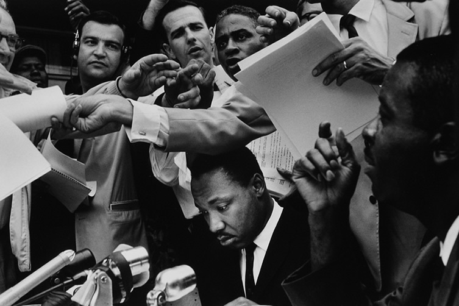
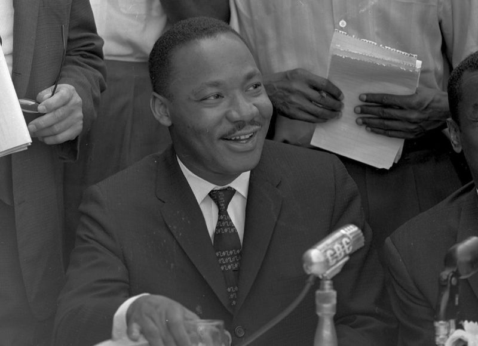
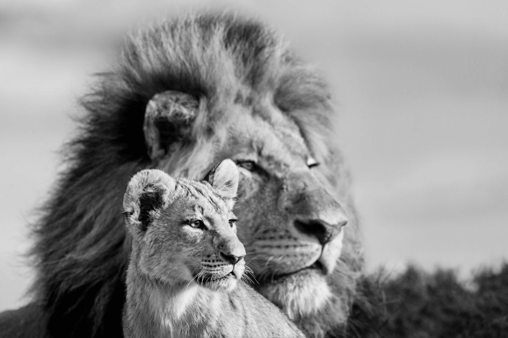
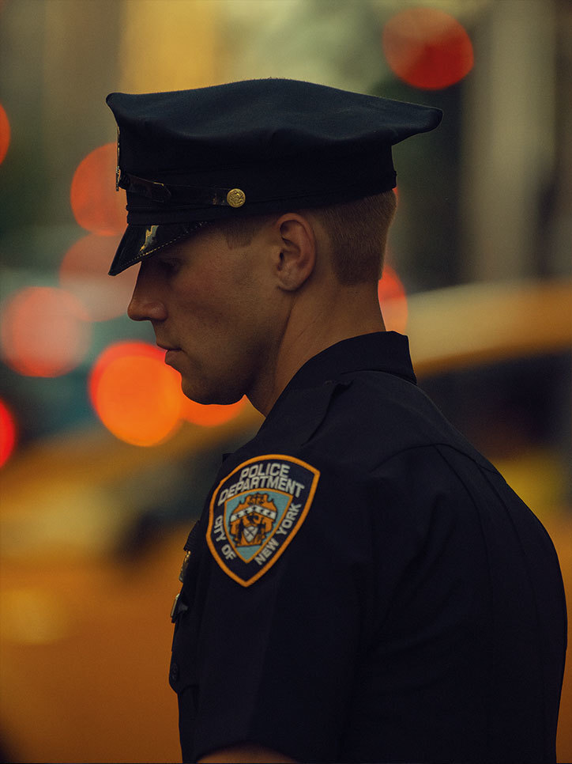

重点要讲的就是镜头焦段是如何影响景深范围的。与此同时，我们也会讲解不同的镜头焦段在对同一画面进行拍摄的时候，成片会有什么区别

简单来说，**镜头焦段越长（数字越大），景深越浅，视角越窄；镜头焦段越短（数字越小），景深越大，视角越广，**这也就是为什么主流新闻摄影大都使用小广角或者标准镜头进行拍摄 (24mm-70mm)。

这是 Bruce Davidson 拍摄的马丁·路德·金。观察画面我们可以发现，通过**使用 28mm 小广角镜头配合小光圈，保证了摄影师在离主体（中间下方麦克风前的马丁·路德·金）足够近时，也能拥有全景深的景深范围**。最右侧黑人离摄影师不到半米，但依然能和背景一样保持足够的清晰，这就是广角镜头带来的好处。如果换成长焦镜头远距离拍摄，就不会有这样的临场感，身后的工作人员也会由于浅景深而被模糊成一片。

**长焦镜头就是能把离我们很远的画面给拉近的镜头**。那些我们经常在旅游景点里见到的“长枪短炮”，都属于这个范畴。它景深浅，视角窄，成像大，在同一距离上能拍出比标准镜头更大的影像，但由于视角窄，牺牲掉的就是主体外的其他画面信息。而因为景深浅，所以就很容易制造虚化效果，拍摄人像的时候通常能把背景完全虚掉。加上它相比广角镜头，透视变形较小，拍到的人物更像我们眼睛实际看到的人物大小和透视状态

跟 Bruce Davidson 那张不一样的是，这张是用长焦镜头拍的。很明显，由于没有广角镜头的那种景深透视，照片本身就少了广角镜头能给人带来的临场感，看起来很平实，没有戏剧张力了。那又由于视角很窄，画面虽然更有效地突出了拍摄主体,但照片里只有马丁·路德·金这一个完整人物，背景里的其他人都被裁切掉了，因为长焦镜头能拍到的画面范围非常有限。

**长焦镜头**还有另外一个特点，就是可以**压缩画面，压缩空间感**。

这就是因为长焦镜头有压缩空间感的功能，把前景中景背景强行压成一层，减小他们在画面里的距离感。在拍野生动物的时候，我们很难跑它们跟前拍去，只能离老远拿一长焦狙它们。另外，由于长焦镜头成像的景深很浅，所以摄影师可以比较容易地模糊掉背景，主体合焦，分毫毕现

说回来，总结一下就是，长焦镜头由于景深浅、视角窄、畸变小，广泛应用在特写拍摄上

使用 200 mm-500 mm 焦段的超长焦镜头在街头快拍所得的人像特写。他利用超长焦镜头的浅景深，完全忽略掉背景和其他元素，只将重点放在人脸或者身体局部上，然后用虚化的背景颜色塑造氛围

