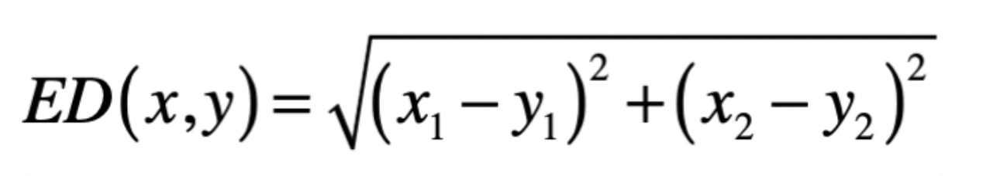

### 向量空间模型 ###

如何让计算机理解现实世界中的事物，方法是把事物的各种特性转为机器所能理解的数据字段。而这些数据字段，在机器学习里通常被称为特征。有了特征，我们不仅可以刻画事物本身，还能刻画不同事物之间的关系。

#### 向量之间的距离 ####

可以把一个向量想象为 n 维空间中的一个点。而向量空间中两个向量的距离，就是这两个向量所对应的点之间的距离。距离通常都是大于 0 的

##### 曼哈顿距离（Manhattan Distance） #####

在美国人口稠密的曼哈顿地区，从一个十字路口开车到另外一个十字路口，驾驶距离是多少呢？当然不是两点之间的直线距离，因为你无法穿越挡在其中的高楼大厦。你只能驾车绕过这些建筑物，实际的驾驶距离就叫作曼哈顿距离。由于这些建筑物的排列都是规整划一的，形成了一个个的街区，所以我们也可以形象地称它为“城市街区”距离。

从 A 点到 B 点有多条路径，但是无论哪条，曼哈顿距离都是一样的

在二维空间中，两个点（实际上就是二维向量）**x(x1,x2)** 与 **y(y1,y2)** 间的曼哈顿距离是：

推广到 n 维空间，曼哈顿距离的计算公式为

其中 n 表示向量维度

##### 欧氏距离（Euclidean Distance） #####

欧氏距离，其实就是欧几里得距离。欧氏距离是一个常用的距离定义，指在 n 维空间中两个点之间的真实距离，在二维空间中，两个点 x(x1,x2) 与 y(y1,y2) 间的欧氏距离是

推广到 n 维空间，欧氏距离的计算公式为：

##### 切比雪夫距离（Chebyshev Distance） #####

切比雪夫其实是在模拟国际象棋里国王的走法。国王可以走临近 8 个格子里的任何一个，那么国王从格子 (x1,x2) 走到格子 (y1,y2) 最少需要多少步呢

一开始，为了走尽量少的步数，国王走的一定是斜线，所以横轴和纵轴方向都会减 1，直到国王的位置和目标位置在某个轴上没有差距，这个时候就改为沿另一个轴每次减 1。所以，国王走的最少格子数是 ∣x1−y1∣ 和 ∣x2−y2∣ 这两者的较大者。所以，在二维空间中，两个点 x(x1,x2) 与 y(y1,y2) 间的切比雪夫距离是：

##### 向量的长度 #####

向量的长度，也叫向量的模，是向量所对应的点到空间原点的距离。通常我们使用欧氏距离来表示向量的长度。

范数满足非负性、齐次性、和三角不等式。你可以不用深究这三点的含义，不过你需要知道范数常常被用来衡量某个向量空间中向量的大小或者长度。

##### 向量之间的夹角 #####

向量夹角的余弦，它计算了空间中两个向量所形成夹角的余弦值

**分子是两个向量的点乘**，**而分母是两者长度（或 L2 范数）的乘积**，而 L2 范数可以使用向量点乘自身的转置来实现。夹角余弦的取值范围在[-1,1]，当两个向量的方向重合时夹角余弦取最大值 1，当两个向量的方向完全相反夹角余弦取最小值 -1。值越大，说明夹角越小，两点相距就越近；值越小，说明夹角越大，两点相距就越远。

#### 向量空间模型 ####

向量空间模型假设所有的对象都可以转化为向量，然后使用向量间的距离（通常是欧氏距离）或者是向量间的夹角余弦来表示两个对象之间的相似程度。我使用下图来展示空间中向量之间的距离和夹角。

由于夹角余弦的取值范围已经在 -1 到 1 之间，而且越大表示越相似，所以可以直接作为相似度的取值。相对于夹角余弦，欧氏距离 ED 的取值范围可能很大，而且和相似度呈现反比关系

早在上世纪的 70 年代，人们把向量空间模型运用于信息检索领域。由于向量空间可以很形象地表示数据点之间的相似程度，因此现在我们也常常把这个模型运用在基于相似度的一些机器学习算法中，例如 K 近邻（KNN）分类、K 均值（K-Means）聚类等等

