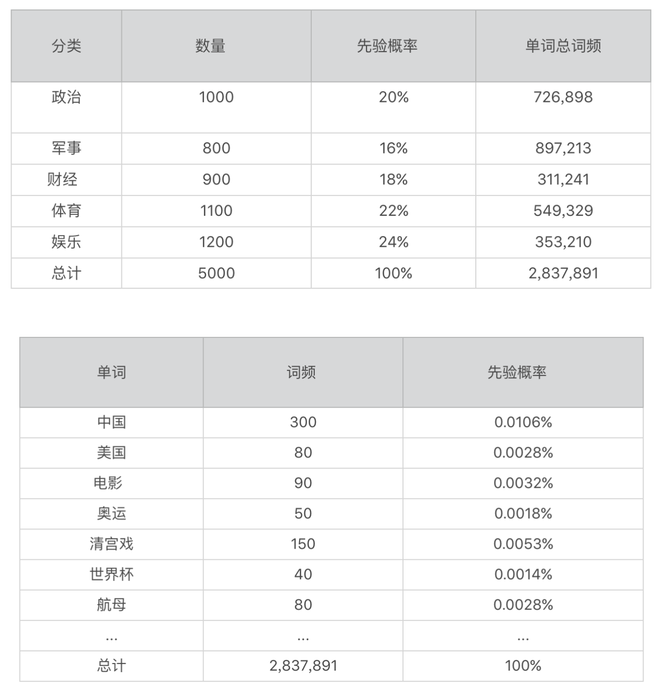
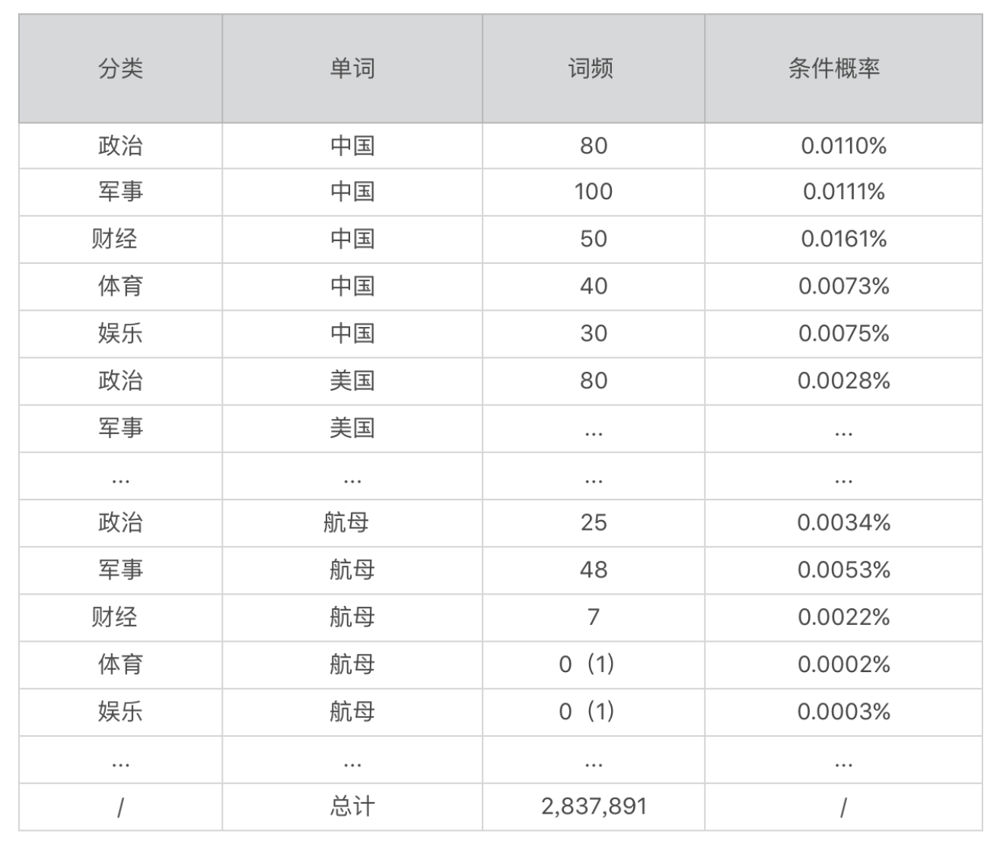
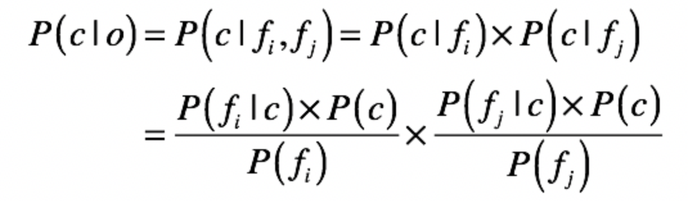
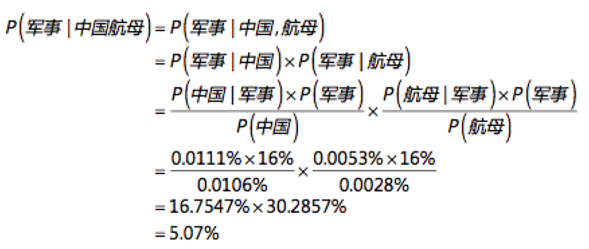
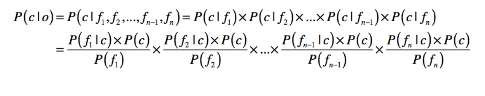

### 文本分类系统的基本框架 ###

#### 采集训练样本 ####

对于每个数据对象，我们必须告诉计算机，它属于哪个分类。比如，我们给每个水果打上“苹果”“甜橙”和“西瓜”的标签，这就是采集训练样本。

同样，我们可以给每一篇新闻打上标签，也就是说，我们首先要分辨某条新闻是什么类型的，比如是政治的、军事的、财经的、体育的，还是娱乐的等等。这一点非常关键，因为分类标签就相当于计算机所要学习的标准答案，其质量高低直接决定了计算机的分类效果

#### 预处理自然语言 ####

把这些水果的特征值提取出来后，能很容易地将它们的属性转化成计算机所能处理的数据，可是这一步对于文本而言就没有那么容易了。好在专家们已经发明出了一套相对成熟的方法，包括词包（bag of words）、分词、词干（Stemming）和归一化（Normalization）、停用词（Stopword）、同义词（Synonyms）和扩展词处理

#### 训练模型 ####

训练模型就是算法通过训练数据进行模型拟合的过程。**对于朴素贝叶斯方法而言，训练的过程就是要获取每个分类的先验概率、每个属性的先验概率以及给定某个分类时，出现某个属性的条件概率**

#### 实时分类预测 ####

算法模型在训练完毕后，根据新数据的属性来预测它属于哪个分类的过程。对于朴素贝叶斯方法而言，分类预测的过程就是根据训练阶段所获得的先验概率和条件概率，来预估给定一系列属性的情况下属于某个分类的后验概率。

### 基于自然语言的预处理 ###

假如说，有人给你一篇几千字的文章，让你在 10 秒钟之内说出文章大意，你会怎么办？我想大部分人的解决方案是“找关键词”！没错，我们也可以教给计算机同样的办法。而计算机处理文本的基本单位就是字和单词，这就是人们最常用的方法：词袋（Bag of words）模型。

将整篇文章仅仅看作是一个大量单词的组合。**文本中每个词的出现都是独立的，不依赖于其他词的出现情况**。讲到这里，你有没有发现在词包模型中，所有单词相互之间是独立的，这个假设和朴素贝叶斯模型的独立假设是不是一致呀

#### 分词 ####

对于英语等拉丁语系的语言来说，单词之间是以空格作为自然分界符的，所以我们可以直接使用空格对句子进行分割，然后来获取每个单词。但是，中文、日文、韩文这些语言在书写的时候，词和词之间并没有空格可以进行自然分界，所以我们就需要使用一些算法，来估计词语之间的划分

**第一种是基于字符串匹配**。其实就是扫描字符串。如果发现字符串的子串和词相同，就算匹配成功。匹配规则通常是“正向最大匹配”“逆向最大匹配”“长词优先”。这些算法的优点是只需使用基于字典的匹配，因此计算复杂度低；缺点是处理歧义词效果不佳。

**第二种是基于统计和机器学习**。这类分词基于人工标注的词性和统计特征，对中文进行建模。训练阶段，根据标注好的语料对模型参数进行估计。在分词阶段再通过模型计算各种分词出现的概率，将概率最大的分词作为最终结果。常见的序列标注模型有隐马尔科夫模型（HMM，Hidden Markov Model）和条件随机场（CRF，Conditional Random Field）

#### 取词干和归一化 ####

取词干的目标就是为了减少词的变化形式，将派生词转化为基本形式，就像下面这样：将car，cars，car’s，cars’全部转换为car

#### 停用词 ####

有的时候干脆可以指定一个叫停用词（stop word）的字典，直接将这些词过滤，不予以考虑。例如英文中的 a、an、the、that、is、good、bad 等。中文“的、个、你、我、他、好、坏”等。

如此一来，我们可以在基本不损失语义的情况下，减少数据文件的大小，提高计算机处理的效率。当然，也要注意停用词的使用场景，例如用户观点分析，good 和 bad 这样的形容词反而成为了关键。不仅不能过滤，反而要加大它们的权重

#### 同义词和扩展词 ####

例如，在中国北方“番茄”应该叫“西红柿”，而台湾地区将“菠萝”称为“凤梨”。对于计算机而言，需要意识到这两个词是等价的。添加同义词就是一个很好的手段

通过词包模型的假设，以及上述这些自然语言处理的方法，我们可以将整篇的文字，**切分为一个个的单词，这些是表示文章的关键属性。你不难发现，每个单词可以作为文章的属性，而通过这些单词的词频（出现的频率），我们很容易进行概率的统计。下面我对分类的先验概率、单词的先验概率**、某个分类下某个单词的条件概率分别给出了示例。

下一步就是如何使用朴素贝叶斯模型进行文本的分类了。

### 运用朴素贝叶斯模型 ###

在新闻分类中，o 就表示一篇文章，而 c 表示新闻的种类（包括政治、军事、财经等等）。而属性字段 f 就是我们从文档集而建立的各种单词。**公式等号左边的 P(c|f) 就是待分类新闻中，出现单词 f 时，该新闻属于类别 c 的概率。而等号右边的 P(f|c) 是根据训练数据统计，得到分类 c 中出现单词 f 的概率。P( c ) 是分类 c 在新闻训练数据中出现的概率，P(f) 是单词 f 在训练样本中出现的概率**。

用刚才表格中的数据来计算下“中国航母”这个短语属于每个分类的概率。

“中国航母”这个短语本身属于“政治”和“军事”分类的可能性最高，而属于“财经”的可能性最低。需要注意的是，我在上述公式使用了中文词便于你的理解，在真正的实现中，我们需要将中文词和中文分类名称转换为数字型的 ID，以提高系统的效率。

当然，一篇文章所包含的不同的单词数量要远远大于 2 个，之前如果我们只看“中国航母”这个短语，那么它属于“政治”和“军事”的概率基本一致。如果我们考虑更长的文章（也就是更多的单词），那么这个情况也许就会发生变化。为了支持更多的单词，我们将上述公式扩展为：

这里需要注意一个很实际的问题：文章的篇幅很长，常常会导致非常多的 P(f|c) 连续乘积。而 P(f|c) 通常是非常小的数值，因此最后的乘积将快速趋近于 0 以至于计算机无法识别。这里可以使用我们之前提到的一些数学手法进行转换，比如取 log，将小数转换为绝对值大于 1 的负数。这样的转换，虽然会改变每篇文章属于每个分类的概率的绝对值，但是并不会改变这些概率的相对大小。

