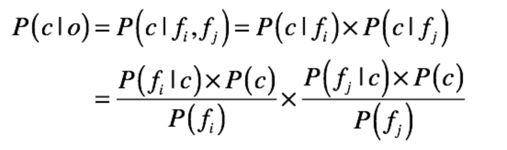

#### 如何将原始信息转化为计算机能看懂的数据？ ####

我们需要将水果的特征转化为计算机所能理解的数据。最常用的方式就是提取现实世界中的对象之属性，并将这些转化为数字。

以水果为例，你会提取它们的哪些属性呢？我会考虑这些，比如：形状、外皮颜色、斑马纹理、重量、握感、口感。我手边刚好有一个苹果、一个甜橙和一个西瓜，把它们的属性分别统计了一下

然后，我们需要这些属性转化为计算机能够理解的东西——数字，也就是说，我给每种属性都定义了具体的数值，用来代表它们的具体属性。

把重量由连续值转化成了离散值，这是因为朴素贝叶斯处理的都是离散值。

为了保证训练的质量，我们可以继续扩展到 10 个水果。

#### 朴素贝叶斯的核心思想 ####

现在已经拿到了这 10 个水果的数据，那如果现在我手上有一个新的水果，它也有一定的形状、颜色、口感等等，你怎么判断它是哪种水果呢？

先验概率、后验概率、条件概率和贝叶斯法则，它们是朴素贝叶斯分类的核心组成部分。通过贝叶斯法则，我们可以根据先验概率和条件概率，推导出后验概率。首先让我们快速回想一下贝叶斯公式。

再强调一下贝叶斯定理的核心思想：**用先验概率和条件概率估计后验概率。**

将上述公式改写成这样：

其中，**c 表示一个分类（class**），f 表示属性对应的数据字段（field）。如此一来，等号左边的 **P(c|f) 就是待分类样本中，出现属性值 f 时，样本属于类别 c 的概率。**而等号右边的 **P(f|c) 是根据训练数据统计**，得到分类 c 中出现属性 f 的概率。**P©是分类 c 在训练数据中出现的概率，P(f) 是属性 f 在训练样本中出现的概率。**

这里的贝叶斯公式只描述了单个属性值属于某个分类的概率，可是我们要分析的水果每个都有很多属性啊，这该怎么办呢？

这是基于一个简单假设建立的一种贝叶斯方法，并假定数据对象的不同属性对其归类影响时是相互独立的。此时若数据对象 o 中同时出现属性 fi 与 fj，则对象 o 属于类别 c 的概率就是这样：

给定一个水果分类时，出现某个属性值的条件概率。以此类推，所有的统计结果就是下面这个表格中这样

对于上表中出现的 0.00 概率，在做贝叶斯公式中的乘积计算时，会出现结果为 0 的情况,我们这里取 0.01。在填充训练数据中从来没有出现过的属性值的时候，我们就会使用这种技巧，我们给这种技巧起个名字就叫作平滑（Smoothing）。

有了这些条件概率，以及各类水果和各个属性出现的先验概率，我们已经建立起了朴素贝叶斯模型。现在，我们就可以用它进行朴素贝叶斯分类了。

假设我们有一个新的水果，它的形状是圆形，口感是甜的，那么根据朴素贝叶斯，它属于苹果、甜橙和西瓜的概率分别是多少呢？

其中，apple 表示分类为苹果，shape-2 表示形状属性的值为 2（也就是圆形），taste-2 表示口感属性的值为 2。以此类推，我们还可计算该水果属于甜橙和西瓜的概率。

比较这三个数值，0.00198<0.00798<0.26934，所以计算机可以得出的结论，该水果属于甜橙的可能性是最大的，或者说，这个水果最有可能是甜橙。

你可能已经注意到了，这几个公式里的概率乘积通常都非常小，在物品的属性非常多的时候，这个乘积可能就小到计算机无法处理的地步。因此，在实际运用中，我们还会采用一些数学手法进行转换（比如取 log 将小数转换为绝对值大于 1 的负数），原理都是一样的。

朴素贝叶斯分类主要包括这几个步骤：

* 准备数据：针对水果分类这个案例，我们搜集了若干水果的实例，并从水果的常见属性入手，将其转化为计算机所能理解的数据。这种数据也被称为**训练样本。**
* 建立模型：通过手头上水果的实例，我们让计算机统计每种水果、属性出现的先验概率，以及在某个水果分类下某种属性出现的条件概率。这个过程也被称为基于样本的训练。
* 分类新数据：对于一个新水果的属性数据，计算机根据已经建立的模型进行推导计算，得到该水果属于每个分类的概率，实现了分类的目的。这个过程也被称为预测。

#### 朴素贝叶斯分类 VS 其他分类算法 ####

* 和 KNN 最近邻相比，朴素贝叶斯需要更多的时间进行模型的训练，但是它在对新的数据进行分类预测的时候，通常效果更好、用时更短。
* 和决策树相比，朴素贝叶斯并不能提供一套易于人类理解的规则，但是它可以提供决策树通常无法支持的模糊分类（一个对象可以属于多个分类）。
* 和 SVM 支持向量机相比，朴素贝叶斯无法直接支持连续值的输入。所以，在前面的案例中，我将连续值转化成了离散值，便于朴素贝叶斯进行处理。

如果一个分类的应用场景中，待分类对象的属性值大部分都是离散的（或者很容易转化为离散的）、需要支持模糊分类，并且需要快速可靠的实时分类，那么这种场景通常就非常适合使用朴素贝叶斯方法。

