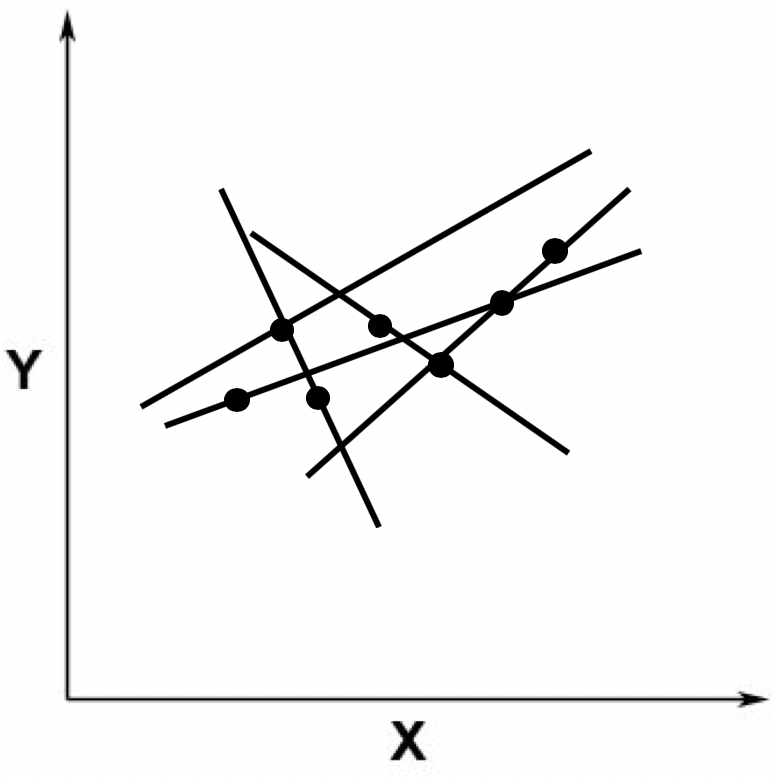

求解线性回归和普通的线性方程组最大的不同在于误差ε

* 在求解线性方程组的时候，我们并不考虑误差的存在，因此存在无解的可能
* 而线性回归允许误差ε的存在，**我们要做的就是尽量把ε最小化，并控制在一定范围之内**。这样我们就可以求方程的近似解。

但是现实中的数据一定存在由于各种各样原因所导致的误差，因此即使自变量和因变量之间存在线性关系，也基本上不可能完美符合这种线性关系

通常，多元线性回归会写作：

```math
y=b_0​+b_1​⋅x_1​+b_2​⋅x_2​+…+b_(n−1)​⋅x_(n−1)​+b_n​⋅x_n​+ε
```

这里的 x1，x2，…，xn 是自变量，y 是因变量，b0 是截距，b1，b2，…，bn 是自变量的系数，ε 是随机误差。

在线性回归中，**为了实现最小化 ε 的目标，我们可以使用最小二乘法进行直线的拟合**

**最小二乘法通过最小化误差的平方和，来寻找和观测数据匹配的最佳函数**

### 使用观测值拟合 ###

在监督式学习中，**拟合模型其实是指通过模型的假设和训练样本，推导出具体参数的过程**。有了这些参数，我们就能对新的数据进行预测。

假设我们有两个观测数据，对应于二维空间中的两个点，这两个点可以确定唯一的一条直线，两者呈现线性关系。


之后，我们又加入了一个点。这个点不在原来的那条直线上


从线性方程的角度来看，就不存在精确解了。因为没有哪条直线能同时穿过这三个点。这张图片也体现了**线性回归分析和求解线性方程组是不一样的，线性回归并不需要求精确解。**

由于我们假设ε的存在，因此在线性回归中，我们允许某条直线只穿过其中少量的点。不过，既然我们允许这种情况发生，那么就存在无穷多这样的直线。



从直觉出发，一定不会选取那些远离这些点的直线，**而是会选取尽可能靠近这些点的那些线**。比如下面这张图里展示的这两条


既然这样，**我们就需要定义哪根线是最优的**，以及在给出了最优的定义之后，如何能求解出这条最优的直线呢？

### 最小二乘法 ###

最小二乘法的主要思想就是求解未知参数，使得理论值与观测值之差（即误差，或者说残差）的平方和达到最小


* 其中，yi 表示来自数据样本的观测值
* 而 y^ 是假设的函数的理论值
* ε 就是我们之前提到的误差，在机器学习中也常被称为损失函数，**它是观测值和真实值之差的平方和**

**就是要发现使ε最小化时候的参数。**

有了上面的定义之后，我们就可以写出最小二乘问题的矩阵形式


* 其中 B 为系数矩阵
* X 为自变量矩阵
* Y 为因变量矩阵

换句话说，我们**要在向量空间中，找到一个 B，使向量 XB 与 Y 之间欧氏距离的平方数最小的 B。**

我们知道，求最极值问题直接对应的就是导数为 0，因此我对上述的矩阵形式进行求导，得到如下的式子：


一阶导数为0表示函数为“极值”，二阶导数>0表示该“极值”为“最小值”（反之为“最大值”）。