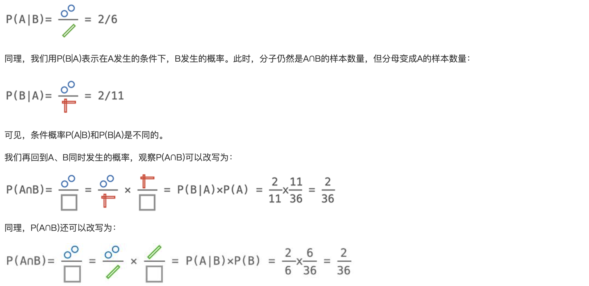

### 一文搞懂贝叶斯定理（原理篇） ###

贝叶斯定理可以广泛应用在数据分析、模式识别、统计决策，以及最火的人工智能中，结果，贝叶斯定理是如此有用，以至于不仅应用在计算机上，还广泛应用在经济学、心理学、博弈论等各种领域，可以说，掌握并应用贝叶斯定理，是每个人必备的技能。

已知有一种疾病，发病率是0.1%。针对这种疾病的测试非常准确：

- 如果有病，则准确率是99%（即有1%未检出阳性）；
- 如果没有病，则误报率是2%（即有2%误报为阳性）。

现在，如果一个人测试显示阳性，请问他患病的概率是多少？

如果我们从大街上随便找一个人，那么他患病的概率就是0.1%，因为这个概率是基于历史统计数据的**先验概率**。

现在，他做了一次测试，结果为阳性，我们要计算他患病的概率，就是计算条件概率，即：**在测试为阳性这一条件下，患病的概率是多少。**

从直觉上这个人患病的概率大于0.1%，但也肯定小于99%。究竟是多少，怎么计算，我们先放一放。

为了理解条件概率，我们换一个更简单的例子：掷两次骰子，一共可能出现的结果有6x6=36种：

这就是所谓的样本空间，每个样本的概率均为1/36，这个很好理解。

如果我们定义事件A为：至少有一个骰子是2，那么事件A的样本空间如下图红色部分所示：

我们再定义事件B：两个骰子之和为7，那么事件B的样本空间如下图绿色部分所示：

事件B一共有6种情况，我们计算事件B的概率P(B)：

接下来我们用P(A∩B)表示A和B同时发生的概率，A∩B就是A和B的交集，如下图蓝色部分所示：

接下来我们就可以讨论条件概率了。我们用P(A|B)表示在B发生的条件下，A发生的概率。由于B已经发生，所以，样本空间就是B的样本数量6，而要发生A则只能是A、B同时发生，即A∩B，有两种情况。

因此，计算P(A|B)如下：

因此，根据上述两个等式，我们推导出下面的等式：

H表示Hypothesis（假设），E表示Evidence（证据），贝叶斯定理的意义就在于，给定一个先验概率P(H)，在出现了证据E的情况下，计算后验概率P(H|E)。

有了贝叶斯定理，我们就可以回到开头的问题：

已知有一种疾病，发病率是0.1%。针对这种疾病的测试非常准确：

- 如果有病，则准确率是99%（即有1%未检出阳性）；
- 如果没有病，则误报率是2%（即有2%误报为阳性）

现在，如果一个人测试显示阳性，请问他患病的概率是多少？

用H表示患病，E表示测试为阳性，那么，我们要计算在测试为阳性的条件下，一个人患病的概率，就是计算P(H|E)。根据贝叶斯定理，计算如下：

P(H)表示患病的概率，根据发病率可知，P(H)=0.1%；

P(E|H)表示在患病的情况下，测试为阳性的概率，根据“如果有病，则准确率是99%”可知，P(E|H)=99%；

P(E)表示测试为阳性的概率。这个概率就稍微复杂点，因为它是指对所有人（包含病人和健康人）进行测试，结果阳性的概率

对于10万人的样本空间来说，事件E=显示阳性的概率为(99+1998)/100000=2.097%。

计算结果为患病的概率为4.721%，这个概率远小于99%，且与大多数人的直觉不同，原因在于庞大的健康人群导致的误报数量远多于病人，当出现“检测阳性”的证据时，患病的概率从先验概率0.1%提升到4.721%，还远不足以确诊。

