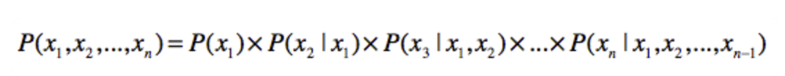
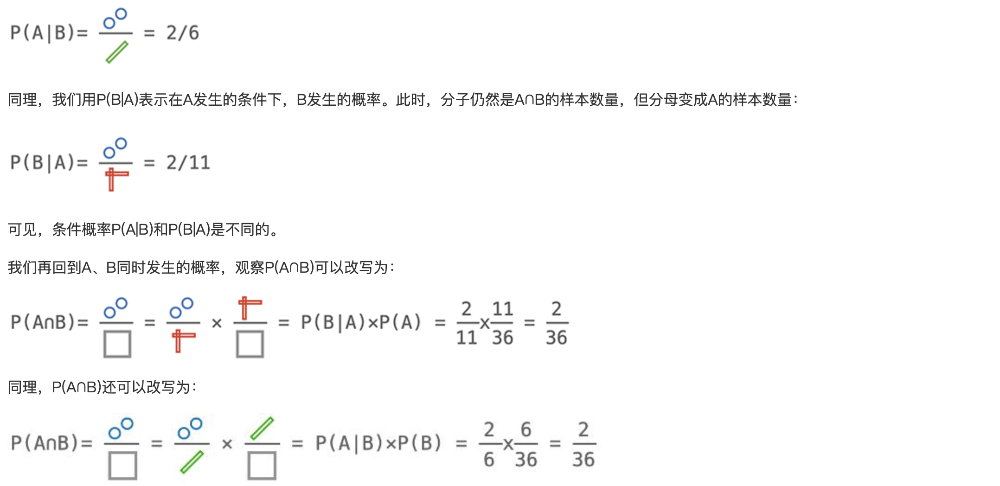
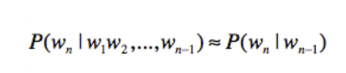
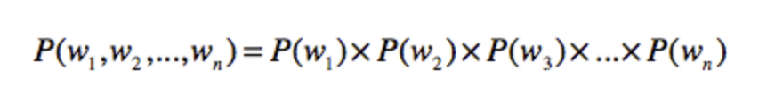
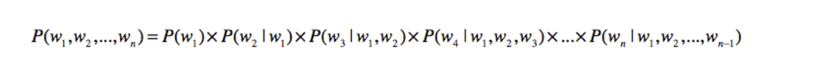
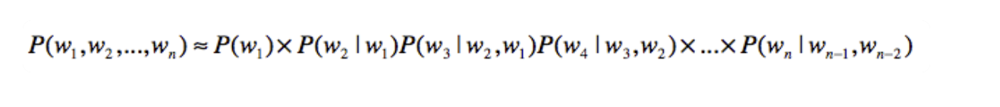
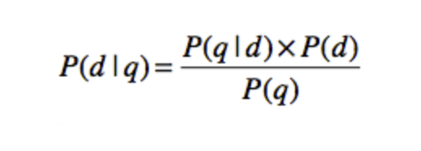
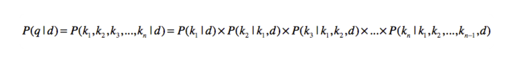
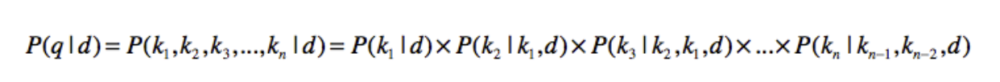

### 语言模型是什么？

链式法则可以把联合概率转化为条件概率，而马尔科夫假设通过变量间的独立性来减少条件概率中的随机变量，两者结合就可以大幅简化计算的复杂度。

#### 链式法则 ####

链式法则是概率论中一个常用法则。它使用一系列条件概率和边缘概率，来推导联合概率：

其中，$$x_1$$ 到 $$x_n$$表示了 n 个随机变量。

根据之前联合概率和条件概率的关系推导：

#### 马尔科夫假设 ####

这个假设的内容是：任何一个词 $$w_i$$出现的概率只和它前面的 1 个或若干个词有关。基于这个假设，我们可以提出多元文法（Ngram）模型。Ngram 中的“N”很重要，它表示**任何一个词出现的概率，只和它前面的 N-1 个词有关**。

二元文法表示，某个单词出现的概率只和它前面的 1 个单词有关。也就是说，即使某个单词出现在一个很长的句子中，我们也只需要看前面那 1 个单词。用公式来表示出来就是这样：

那么一元文法呢？按照字面的意思，就是每个单词出现的概率和前面 0 个单词有关。这其实说明，每个词的出现都是相互独立的。用公式来表达就是这样的：

假设我们有一个统计样本文本 d，s 表示某个有意义的句子，由一连串按照特定顺序排列的词 $$w_1$$，$$w_2$$,…,$$w_n$$ 组成，这里 n 是句子里单词的数量。现在，我们想知道**根据文档 d 的统计数据，s 在文本中出现的可能性**，即 P(s∣d)，那么我们可以把它表示为 P(s | d)=P($$w_1$$,$$w_2$$,…,$$w_n$$| d)。假设我们这里考虑的都是在集合 d 的情况下发生的概率，所以可以忽略 d，写为 P(s)=P($$w_1$$,$$w_2$$,…,$$w_n$$)。

如何计算 P($w_1$,$w_2$,…,$w_n$​) 要在集合中找到一模一样的句子，基本是不可能的。这个时候，我们就需要使用链式法则。我们可以把这个式子改写为

乍一看，问题似乎是解决了。因为通过文档集合 C，你可以知道 P($w_1$)，P($w_2∣w_1$) 这种概率。不过，再往后看，**好像 P($w_3∣w_1,w_2$) 出现概率很低，P($w_4∣w_1,w_2,w_3$) 出现的概率就更低了。一直到 P($w_n∣w_1,w_2,…,w_n−_1$​)，基本上又为 0 了。我们可以使用上一节提到的平滑技巧，减少 0 概率的出现。不过，如果太多的概率都是通过平滑的方式而得到的，那么模型和真实的数据分布之间的差距就会加大，最终预测的效果也会很差**，所以平滑也不是解决 0 概率的最终办法。

除此之外，P($w_1,w_2,…,w_n$)和P($w_n∣w_1,w_2,…,w_n−_1$) 还不只会导致 0 概率，它还会使得模型存储空间的急速增加。

如何解决 0 概率和高复杂度的问题呢？马尔科夫假设和多元文法模型能帮上大忙了。如果我们使用三元文法模型，上述公式可以改写为：

当然，多元文法模型中的 N 还是不能太大。随着 N 的增大，系统复杂度仍然会快速升高，就无法体现出多元文法的优势了。

### 语言模型的应用 ###

#### 信息检索 ####

信息检索很关心的一个问题就是相关性，也就是说，给定一个查询，哪篇文档是更相关的呢？为了解决相关性问题，布尔模型和向量空间检索模型都是从查询的角度出发，观察查询和文档之间的相似程度，并以此来决定如何找出相关的文档

它不再使用相似度定义，而是采用了概率。一种常见的做法是计算 P($d∣q$)，其中 q 表示一个查询，d 表示一篇文档。P($d∣q$) 表示用户输入查询 q 的情况下，文档 d 出现的概率是多少？如果这个概率越高，我们就认为 q 和 d 之间的相关性越高。

通过我们手头的文档集合，并不能直接获得 P($d∣q$)。贝叶斯定理可以将 P($d∣q$) 重写如下：

对于同一个查询，其出现概率 P(q) 都是相同的，同一个文档 d 的出现概率 P(d) 也是固定的。因此它们可以忽略，我们只要关注如何计算 P($q∣d$)。而语言模型，为我们解决了如何计算 P($q∣d$) 的问题，让 $k_1$,$k_2$​,…,kn 表示查询 q 里包含的 n 个关键词。那么根据之前的链式法则公式，可以重写为这样：

为了提升效率，我们也使用马尔科夫假设和多元文法。假设是三元文法，那么我们可以写成这样：

最终，当**用户输入一个查询 q 之后，对于每一篇文档 d**，我们都能获得 P($d∣q$) 的值。P($d$)的概率(这篇文档出现的概率) , 根据每篇文档所获得的 P($d∣q$) 这个值，由高到低对所有的文档进行排序。这就是语言模型在信息检索中的常见用法。

