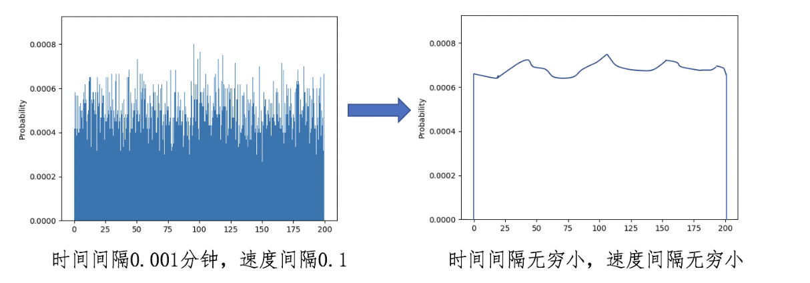
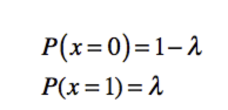
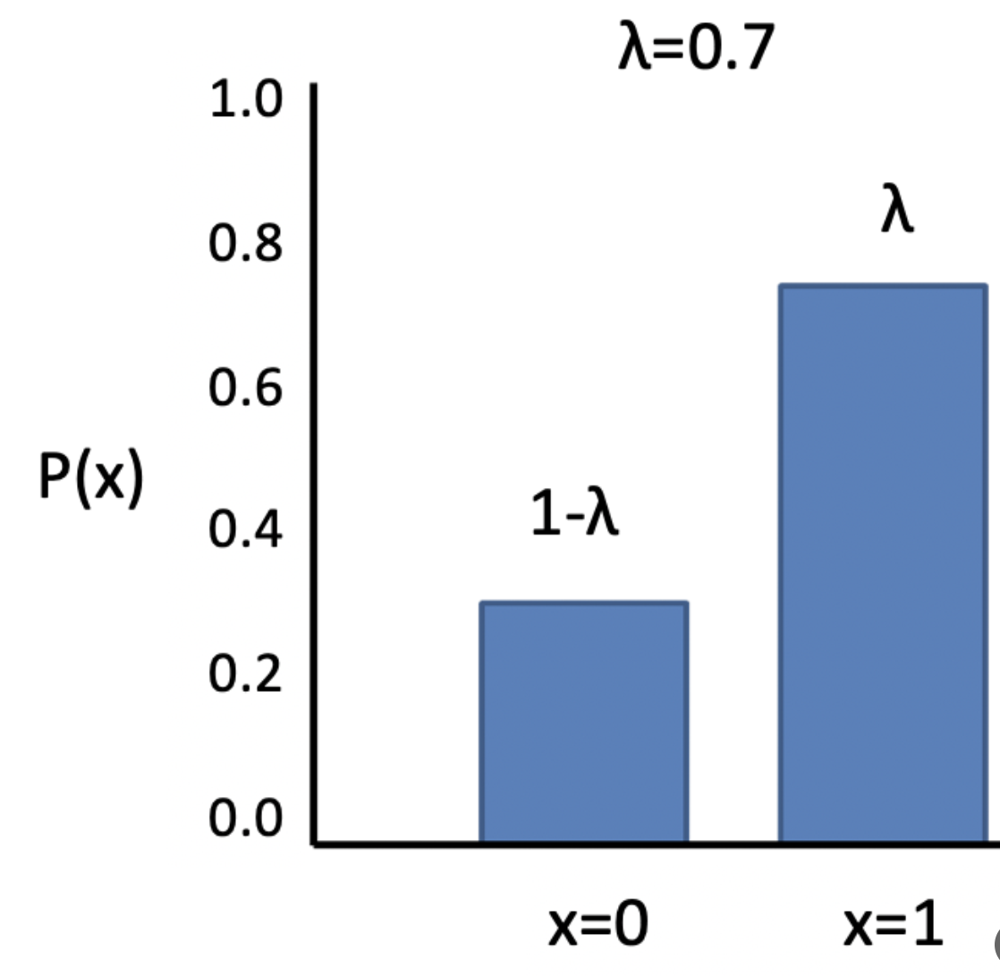
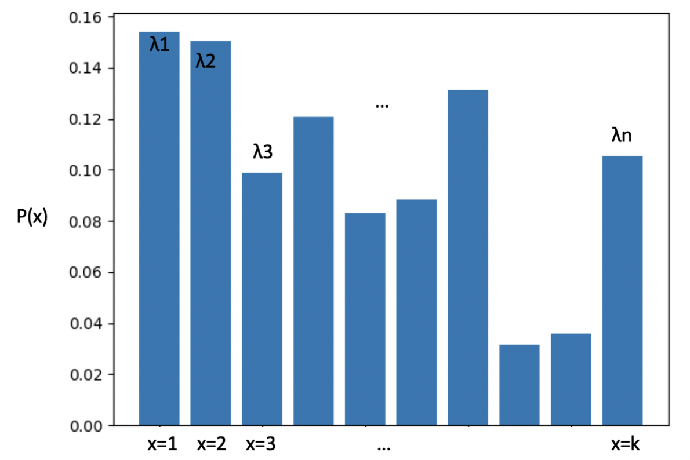
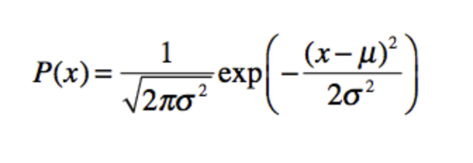
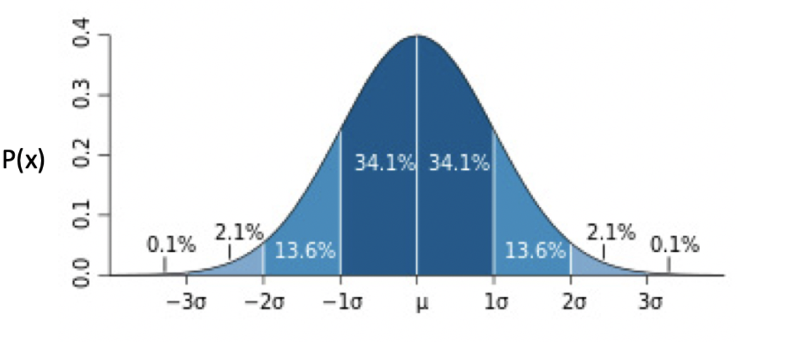

### 随机变量 ###

随机变量根据其取值是否连续，可分为离散型随机变量和连续型随机变量。举几个例子，抛硬币出现正反面的次数以及每周下雨的天数，都是离散的值，所以对应的随机变量为离散型。而**汽车每小时行驶的速度和银行排队的时间，都是连续的值，对应的随机变量为连续型。**

而随机变量的取值对应了随机现象的一种结果。正是结果的不确定性，才导致了随机变量取值的不确定性，于是我们就引入了概率。我们可以说，每种值是以一定的概率出现的。

#### 概率分布 #### 

概率分布描述的其实就是随机变量的概率规律。

抛硬币正面次数、每周下雨天数这种离散型随机变量，对应的概率分布是很好理解的，但是对于连续型的随机变量，如何理解它们的概率分布呢

仪表盘所显示的数字，是将实际速度离散化处理之后的数字。除了仪表盘上的速度，汽车行驶在时间维度上也是连续的。类似地，我们还需要对时间进行离散化，比如每分钟查看仪表盘一次并读取速度值。

**伯努利分布（Bernoulli Distribution**），这是单个随机变量的分布，而且这个变量的取值只有两个，0 或 1。伯努利分布通过参数λ来控制这个变量为 1 的概率

从这个图也可以看出，之前抛硬币的概率分布就属于伯努利分布。

另一个是**分类分布（Categorical Distribution）**，也叫 Multinoulli 分布。它描述了一个具有 k 个不同状态的单个随机变量。这里的 k，是有限的数值，如果 k 为 2 的时候，那么分类分布就变成了伯努利分布

离散型随机变量的状态数量是有限的，所以可以通过伯努利和分类分布来描述。可是对于连续型随机变量来说，状态是无穷多的，这时我们就需要连续分布模型。比较经典的连续分布有正态分布

这个分布可以近似表示日常生活中很多数据的分布，我们经常使用它进行机器学习的特征工程，对原始数据实施标准化，使得不同范围的数据具有可比性。所以，如果想要学习机器学习，一定要掌握正态分布。

正态分布（Normal Distribution），也叫高斯分布（Gaussian Distribution）

在这个公式中有两个参数，μ表示均值，σ表示标准差

越靠近中心点μ，出现的概率越高，而随着渐渐远离μ，出现的概率先是加速下降，然后减速下降，直到趋近于 0。蓝色区域上的数字，表示了这个区域的面积，也就是数据取值在这个范围内的概率。例如，数据取值在[-1σ, μ]之间的概率为 34.1%。

现实中，很多数据分布都是近似于正态分布的。例如人类的身高体重。拿身高来说，大部分人都是接近平均值身高，偏离平均身高越远，相对应的人数越少。这也是为什么正态分布很常用的原因。

#### 期望值  #### 

期望值，也叫数学期望，是**每次随机结果的出现概率乘以其结果的总和**。**如果我们把每种结果的概率看作权重，那么期望值就是所有结果的加权平均值**。它在我们的生活中十分常见，例如计算多个数值的平均值，其实就是求期望值，只不过我们假设每个数值出现的概率是相同的。

离散型的更容易理解，打个形象的例子，开门做生意，假设每条有三种可能，一种是生意满堂，一天能有10万的收入，一种是一半客人，一天收入只有5万，最后一种是没人来，一天收入为0，那么问每天收入“预期”是多少？由于有三种情况，我们不能直接说10万、5万还是0，只能看三种情况出现的概率分别是多少？如果客满的概率是1.0，其他两种是0.0，那么一天的收入是10*1.0=10万，如果客满的概率是0.5， 半客满的概率是0.3，没人的概率是0.2，那么一天收入的“期望”就是10*0.5+5*0.3+0*0.2 = 6.5万

