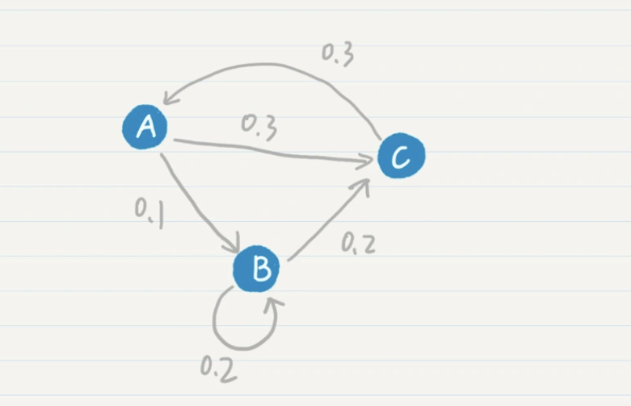
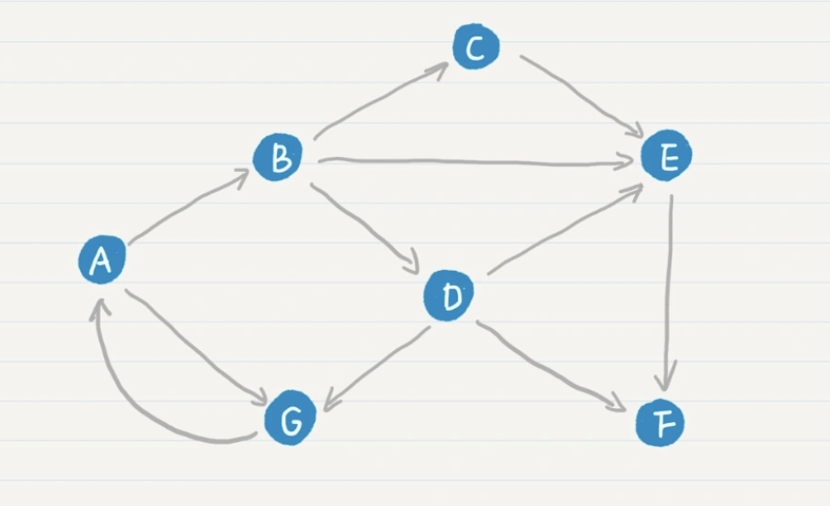
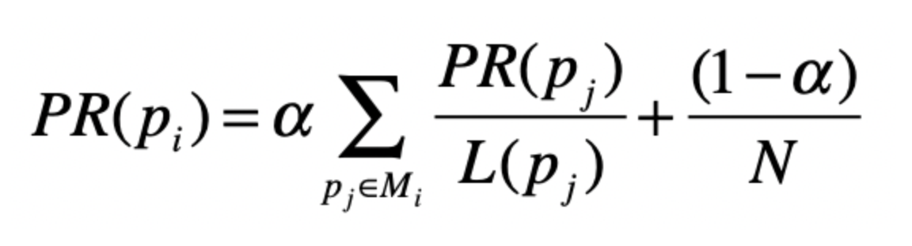
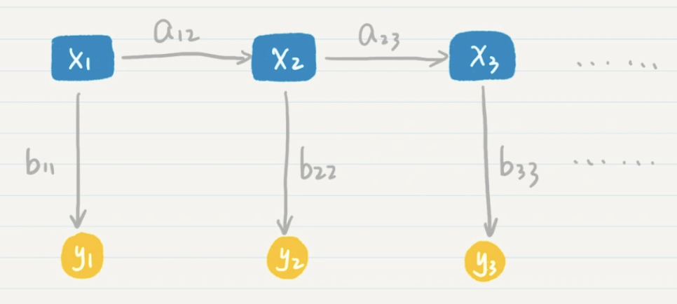
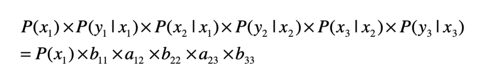
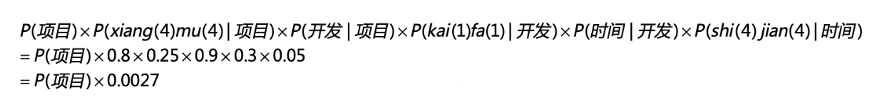
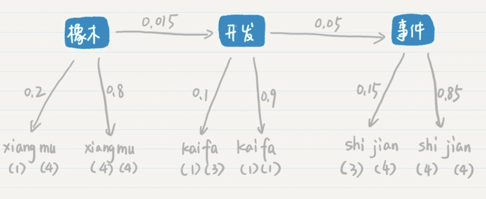
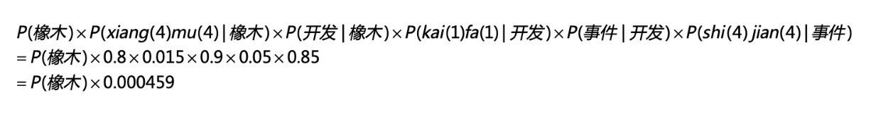

概率语言模型的研究对象其实是一个词的序列，以及这个词序列出现的概率有多大。那语言模型是不是也可以用于估算其他序列出现的概率呢？答案是肯定的。

语言模型中有个重点：马尔科夫假设及对应的多元文法模型。如果我们把这一点进一步泛化，就能引出马尔科夫模型。也就是说，只要序列的每个状态之间存在转移的概率，那么我们就可以使用马尔科夫模型。有时候情况会更复杂，不仅每个状态之间的转移是按照一定概率进行的，就连每个状态本身也是按照一定概率分布出现的，那么还需要用到隐马尔科夫模型

### 马尔科夫模型  ###

马尔科夫假设，这个假设是说，每个词出现的概率和之前的一个或若干个词有关。我们换个角度思考就是，每个词按照一定的概率转移到下一个词

如果把词抽象为一个状态，那么我们就可以认为，状态到状态之间是有关联的。前一个状态有一定的概率可以转移到到下一个状态。如果多个状态之间的随机转移满足马尔科夫假设，那么这类随机过程就是一个马尔科夫随机过程。而刻画这类随机过程的统计模型，就是马尔科夫模型（Markov Model）。

在马尔科夫模型中，如果一个状态出现的概率只和前一个状态有关，那么我们称它为一阶马尔科夫模型或者马尔科夫链



Google 公司最引以为傲的 PageRank 链接分析算法，它的核心思想就是基于马尔科夫链。这个算法假设了一个“随机冲浪者”模型，冲浪者从某张网页出发，根据 Web 图中的链接关系随机访问。在每个步骤中，冲浪者都会从当前网页的链出网页中随机选取一张作为下一步访问的目标。在整个 Web 图中，绝大部分网页节点都会有链入和链出。那么冲浪者就可以永不停歇地冲浪，持续在图中走下去。

在随机访问的过程中，越是被频繁访问的链接，越是重要。可以看出，每个节点的 PageRank 值取决于 Web 图的链接结构。**假如一个页面节点有很多的链入链接，或者是链入的网页有较高的被访问率，那么它也将会有更高的被访问概率。**

那么，PageRank 的公式和马尔科夫链有什么关系呢？



其中 A、B、C 等结点分别代表了页面，而结点之间的有向边代表了页面之间的超链接。我们可以假设每张网页就是一个状态，而网页之间的链接表明了状态转移的方向。这样，我们很自然地就可以使用马尔科夫链来刻画“随机冲浪者”。

在最基本的 PageRank 算法中，我们可以假设每张网页的出度是 n，那么从这张网页转移到任何下一张相连网页的概率都是 $$1/n$$，**因此这个转移的概率只和当前页面有关，满足一阶马尔科夫模型的假设**。

PageRank 在标准的马尔科夫链上，引入了随机的跳转操作，也就是假设冲浪者不按照 Web 图的拓扑结构走下去，只是随机挑选了一张网页进行跳转。这样的处理是类比人们打开一张新网页的行为，也是符合实际情况的，避免了信息孤岛的形成。最终，根据马尔科夫链的状态转移和随机跳转，可以得到如下的 PageRank 公式。



1. $$p_i$$ 表示第 i 张网页
2. $$M_i$$ 是 pi 的入链接集合
3. $$p_j$$ 是 $$M_i$$ 集合中的第 j 张网页
4. $$PR(p_j)$$ 表示网页 $$p_j$$ 的 PageRank 得分
5. $$L(p_j)$$ 表示网页 $$p_j$$ 的出链接数量

$$1/L(p_j)$$ 就表示从网页 $$p_j$$ 跳转到 $$p_i$$ 的概率,α 是用户不进行随机跳转的概率，N 表示所有网页的数量。

#### 隐马尔科夫模型 ####

在某些现实的应用场景中，我们是无法确定马尔科夫过程中某个状态的取值的。这种情况下，最经典的案例就是语音识别。使用概率对语音进行识别的过程，和语言模型类似，因此我们可以把每个等待识别的词对应为马尔科夫过程中的一个状态。

```
ni(三声) zhi(一声) dao(四声) wo(三声) zai(四声) deng(三声) ni(三声) ma(一声)
```

写在文档里的文字对于计算机是确定的，“嘛”“吗”“妈”不会弄错。可是，如果你说一句“你知道我在等你吗”，听众可能一直弄不明白为什么要等别人的妈妈，除非你给他们看到文字版的内容，证明最后一个字是口字旁的“吗”。另外，再加上各种地方的口音、唱歌的发音或者不标准的拼读，情况就更糟糕了。

计算机只知道某个词的发音，而不知道它具体怎么写，对于这种情况，我们就认为计算机只能观测到每个状态的部分信息，而另外一些信息被“隐藏”了起来。这个时候，我们就需要用隐马尔科夫模型来解决这种问题。**隐马尔科夫模型有两层，一层是我们可以观测到的数据，称为“输出层”，另一层则是我们无法直接观测到的状态，称为“隐藏状态层”**



* $$x_1$$，$$x_2$$，$$x_3$$ 等等属于隐藏状态层
* $$a_{12}$$ 表示了从状态 $$x_1$$ 到 $$x_2$$ 的转移概率，$$a_{23}$$ 表示了从状态 $$x_2$$ 到 $$x_3$$ 的转移概率

那么在这个两层模型示例中，“隐藏状态层”产生“输出层”的概率是多少呢？这是一系列条件概率决定的



假设正在进行普通话语音识别，计算机接受了一个词组的发音。我在下面列出了它的拼音。

```
xiang(四声)mu(四声) kai(一声)fa(一声) shi(四声)jian(四声)
```

根据我们手头上的语料数据，这个词组有多种可能，列出两种


有了这些概率的分布，我们来看看“项目开发时间”这个词组最后生成的概率是多少





和第一种情况类似，我们可以计算“橡木开发事件”这个词组最后生成的概率是多少



| 这主要是从统计的可行性出发，以语音识别为例，我们的语料（或者说标注数据、历史数据）都是给定文本，比如说中文，然后收集用户的发音（如果是中文，发音也就对应是拼音），所以可以很自然的拿到P(拼音|中文)这种概率。


