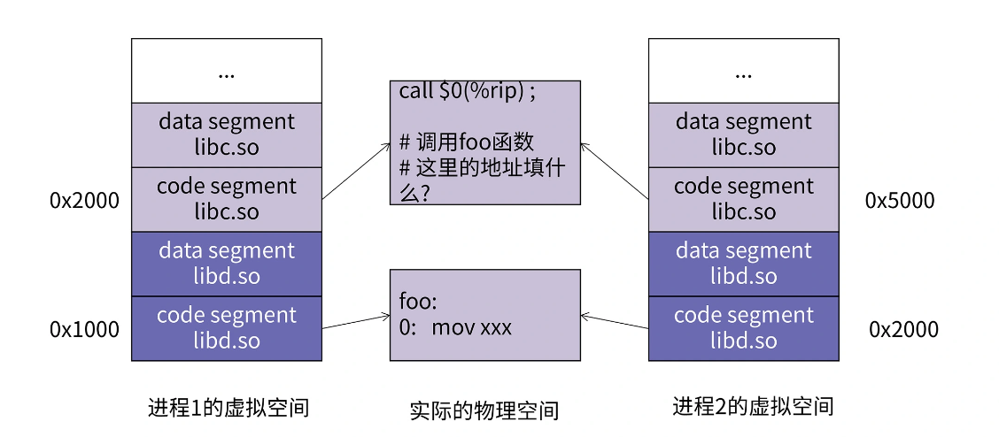
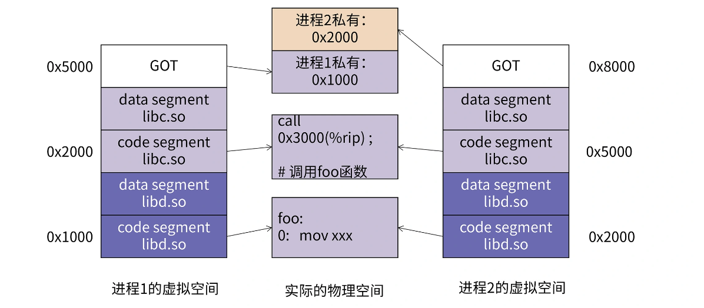

### 动态链接 ###

静态连接的方式对于计算机内存和磁盘的空间浪费非常严重。特别是多进程操作系统情况下,静态链接极大地浪费了内存空间,想象一下每个程序内部除了都保留着printf()函数、scanf()函数、strlen(等这样的公用库函数,还有数量相当可观的其他库函数及它们所需要的辅助数据结构。在现在的Linux系统中,一个普通程序会使用到的C语言静态库至少在1MB以上,那么,如果我们的机器中运行着100个这样的程序,就要浪费近100MB的内存:如果磁盘中有2000个这样的程序,就要浪费近2GB的磁盘空间,很多Linux的机器中,/usr/bin下就有数千个可执行文件。


把链接过程推迟到了运行时执行就是**动态链接**

程序与libc.so之间真正的链接工作是由动态链接器完成的,而不是静态链接器ld完成的。也就是说,动态链接是把链接这个过程从本来的程序装载前被推迟到了装载的时候。但是程序每次被装载时都要进行重新进行链接,是不是很慢?的确,动态链接会导致程序在性能的一些损失,但是对动态链接的链接过程可以进行优化,比如延迟绑定(Lazy Binding)等方法,可以使得动态链接的性能损失尽可能地减小。据估算,动态链接与静态链接相比,性能损失大约在5%以下。当然经过实践的证明,这点性能损失用来换取程序在空间上的节省和程序构建和升级时的灵活性,是相当值得的。

#### 简单动态链接例子 ####

```c
/* Program1.c */
#include "Lib.h"

int main(){
  foobar(1);
  return 0;
}

/* Program2.c */
#include "Lib.h"

int main(){
  foobar(2);
  return 0;
}

/* Lib.c */
#include <stdio.h>

void foobar(int i){
  printf("Printing from Lib.so %d\n",i);
}

/*Lib.h*/
#ifndef LIB_H
#define LIB_H

void foobar(int i);

#endif

```

使用GCC将Lib.c编译成一个共享对象文件

```shell
gcc -fPIC -shared -o Lib.so Lib.c
```

-shared 表示产生共享对象

分别链接

```shell
gcc -o Program1 Program1.c ./Lib.so
gcc -o Program2 Program2.c ./Lib.so
```

当程序模块Program1.c被编计羊成为Program1.o时编译器还不不知道foobar()函数的地址。当链接器将Program1.0链接成可执行文件时,这时候链接器必须确定Programl.0中所引用的foobar()函数的性质。如果foobar()是一个定义与其他静态目标模块中的函数,那么链接器将会按照静态链接的规则,将Program1.o中的foobar地址引用重定位;如果foobar()是一个定义在某个动态共享对象中的函数,那么链接器就会将这个符号的引用用标记为一个动态链接的符号,不对它进行地址重定位,把这个过程留到装载时再进行。

那么这里就有个问题,**链接器如何知道foobar的引用是一个静态符号还是一个动态符号?这实际上就是我们要用到Lib.so的原因。Lib.so中保存了完整的符号信息(因为运行时进行动态链接还须使用符号信息)**,把Lib.so也作为链接的输入文件之一,链接器在解析符号时就可以知道:foobar是一个定义在Lib.so的动态符号。这样链接器就可以对foobar的引用做特殊的处理,使它成为一个对动态符号的引用。

**共享对象在被装载时,如何确定它在进程虚拟地址空间中的位置**?为了实现动态链接,我们首先会遇到的问题就是**共享对象地址的冲突问题**,程序模块的指令和数据中可能会包含一些绝对地址的引用,我们在链接产生输出文件的时候,就要假设模块被装载的目标地址。比如把0x1000到0x2000分配给模块A，把地址0x2000到0x3000分配给模块B，很明显 ,**在动态链接的情况下,如果不同的模块目标装载地址都一样是不行的**。比如一个很简单的情况,**一个人制作了一个程序,该程序需要用到模块B,但是不需要用到模块A,所以他以为地址0x1000到0x2000是空闲的,于是分配给了另外一个模快C。这样C和原先的模块A的目标地址就冲突了**,任何人以后将不能在同一个程序里面使用模块A和C。

#### 装载时重定位 ####

为了解决模块装载地址固定的问题，可否可以让共享对象在任意地址加载？另一种表述是：**共享对象在编译时不能假设自己在进程虚拟地址空间中的位置。**与此不同的是，可执行文件基本可以确定自己在进程虚拟地址空间中的起始位置，因为可执行文件往往是第一个被加载的文件，可以选一个固定空闲的地址

在链接时，对所有绝对地址的引用不作重定位，而把这一步推迟到**装载时完成**，一旦模块装载地址确认，即目标地址确认，那么就会对程序**所有绝对地址的引用进行重定位**，但动态链接模块被装载映射至虚拟空间后，指令部分是在多个进程之间共享的，**由于装载时重定位的方法需要修改指令，所有没有办法做到同一份指令被多个进程共享**，因为指令被重定位后对于每个进程来讲是不同的，**当然动态链接库中的可修改数据部分对于不同进程来说有多个副本，是可以采用装载时重定位的方法解决**


#### 地址无关代码 ####

	

如果两个进程共享了 libc.so 和 libd.so 两个动态库，而且 libc 中会调用 libd 中定义的 foo 方法。

1. 进程 1 将 foo 方法映射到自己的虚拟地址 0x1000 处，而调用 foo 方法的指令被映射到 0x2000 处，那么 call 指令如果采用依赖 rip 寄存器的相对寻址的办法，这个偏移量应该填 -0x1000。
2. 进程 2 将 foo 方法映射到自己虚拟地址 0x2000 处，调用 foo 方法的指令被映射到 0x5000 处，那么 call 指令的参数就应该填 -0x3000。这就产生了冲突。

相对寻址要求目标地址和本条指令的地址之间的相对值是固定的，这种代码就是地址有关的代码。当目标地址和调用者的地址之间的相对值不固定时，就需要地址无关代码技术了。



在上图中，call 指令处被填入了 0x3000，这是因为进程 1 的 GOT 与 call 指令之间的偏移是 0x5000-0x2000=0x3000

同时进程 2 的 GOT 与 call 指令之间的偏移是 0x8000-0x5000=0x3000。所以对于这一段共享代码，不管是进程 1 执行还是进程 2 执行，它们都能跳到自己的 GOT 表里。

**进程1 和 进程2 在装载libc.so的时候装载地址是可以不一样的，0x2000和0x5000， 但GOT对于共享对象的相对地址是不会变的，GOT在动态库中的数据段，所以在每个进程中都有一个副本**

#### 数据段地址无关性 ####

数据部分是否有绝对地址引用问题？

```c
static int a;
static int *p = &a;
```

指针p指向的就是一个绝对地址，它指向变量a，而变量a的地址会随着共享对象的装载地址改变而改变

**对于数据段来说，每个进程都有一份独立的副本**，所以不担心被进程改变，可以选择**装载重定位**的方法来解决**数据段中绝对地址引用问题**，对于共享对象来说，如果数据段中有绝对地址的引用，那么编译器和链接器就会产生一个重定位表，当动态链接器装载共享对象时，如果发现该共享对象有这样重定位入口，那么动态链接器就会对该共享对象进行重定位

实际上，甚至可以让代码段也使用这种装载时重定位方法，而不使用地址无关代码，在编译共享对象使用"-fPIC"参数，这个参数表示产生地址无关代码段，如果不使用则：

```shell
$gcc -shared pic.c -o pic.so
```

如果代码不是地址无关的，就不能被多个进程共享，于是就失去了节省内存的优点，但装载时重定位的共享对象的运行速度比使用地址无关代码的共享对象快，因为不用每次访问全局数据和函数时需要做一次计算当前地址以及间接地址寻址的过程


