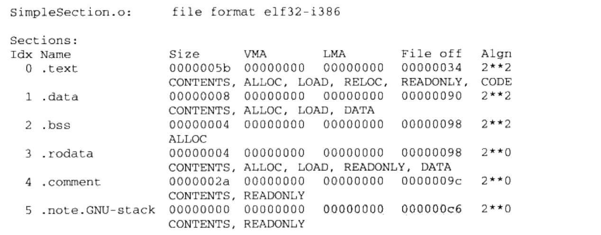
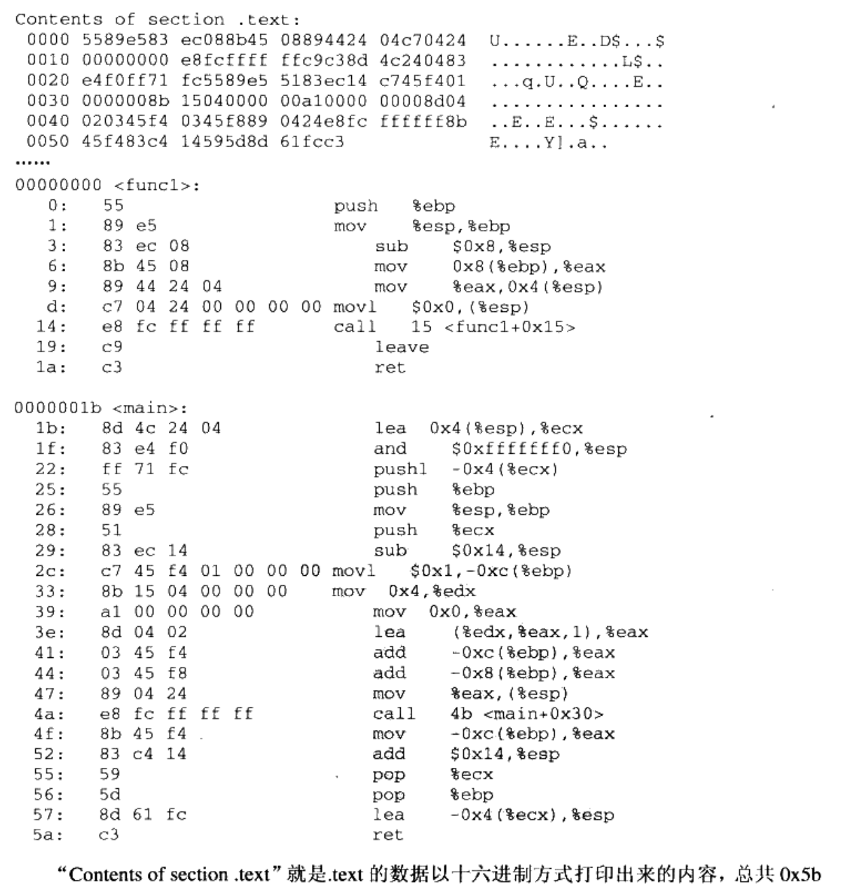
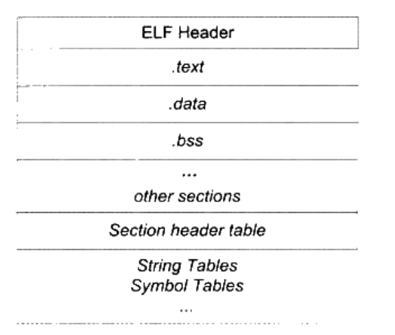
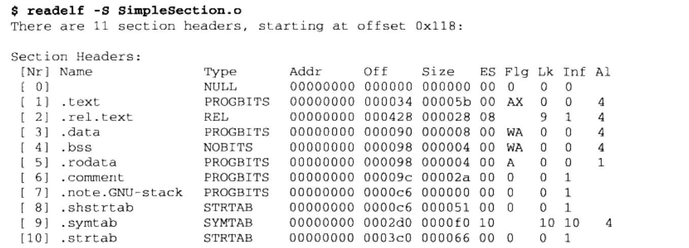

### 目标文件格式 ###

在linux下使用file命令查看相应文件格式：

```shell
$ file foobar.o
foobar.o: ELF 32-bit LSB relocatable, Intel 80386, version 1, not stripped

$ file /bin/bash
/bin/bash: ELF 32-bit LSB executable, Intel 80386, version 1
```

目标文件按不同属性以"段"的形式存储

源代码编译后的机器指令放在代码段(Code Section)里，.code 或 .text;

全局变量和局部静态变量放在数据段(Data Section)里，.data

未初始化的全局变量和局部静态变量一般放在一个叫bss段里，默认值是0，程序运行的时候的确是需要占用空间的，所以只是预留位置

对于现代CPU来说，程序必须提高缓存的命中率，指令区和数据区的分离有利于提高程序的局部性

以SimpleSection.c编译出来的目标文件为分析对象

```c
int printf(const char* format,...)

int global_init_var = 84;
int global_uninit_var;

void func1(int i){
  printf("%d\n", i);
}

int main(void){
  static int static_var = 85;
  static int static_var2;
  
  int a = 1;
  int b;
  
  func1(static_var + static_var2 + a + b);
  
  return a;
}

```

```shell
$ gcc -c SimpleSection.c 

# 使用binutils工具 objdump来查看object内部结构

$ objdump -h SimpleSection.o
# 参数 -h 就是把ELF文件各个段的基本信息打印出来

```



#### 代码段 ####

```shell
$ objdump -s -d SimpleSection.o
```



最左面一列是偏移量，中间4列是十六进制内容，最右面一列是.text段的ASCII码形式

#### 数据段 #### 

.data 保存的是已经初始化了的全局静态变量和局部静态变量

.rodata存放的是只读数据，如const 修饰的变量和字符串常量

#### BSS段 ####

存放的是未初始化的全局变量和局部静态变量

### ELF文件结构描述 ###



#### 文件头 ####

用readelf命令来查看ELF文件

```shell
ELF Header:
 Magic: 7f 45 4c 46 01 01 01 00 00 00 00 00 00 00 00 00
 Class : ELF32
 Data:  2's complement,little endian
 Version: 1(current)
 OS/ABI:  UNIX - System V
 ABI Version: 0
 Type: REL (Relocatable file)
 Machine: Intel 80386
 Version: 0x1
 Entry point address: 0x0
 Start of Program headers: 0 (bytes into file)
 Start of section header: 280
 Flag:  0x0
 Size of this header:   52(bytes)
 Size of program header: 0(bytes)
 Size of section headers: 40 (bytes)
 ...
```

ELF文件头结构及相关常数被定义在``` /usr/include/elf.h```里,因为ELF文件在各种平台下都通用,ELF文件有32位版本和64位版本。它的文件头结构也有这两种版本,分别叫做"Elf32 Ehdr"和"Elf64_Ehdr"。32位版本与64位版本的ELF文件的文件头内容是一样
的,只不过有些成员的大小不一样。

#### 段表 ####

段表(Sectiion Header Table)就是保存段的基本属性的结构。段表是ELF文件中除了文件头以外最重要的结构,它描述了
ELF的各个段的信息,**比如每个段的段名、段的长度、在文件中的偏移、读写权限及段的其他属性。也就是说,ELF文件的段结构就是由段表决定的,偏译器、链接器和装载器都是依靠段表来定位和访问各个段的属性的**。**段表在ELF文件中的位置由ELF文件头**的``` e_shoff ```
成员决定,比如SimpleSection.o中,段表位于偏移0x118。



readelf输出的结果就是ELF文件段表的内容,,它是一个以``` Elf32_Shdr ```结构体为元素的数组。数组元素
的个数等于段的个数,每个"Elf32_Shdr"结构体对应一个段。"Elf32_Shdr"又被称为段描
述符(Section Descriptor)。

#### 重定位表 ####

SimpleSection.o中有一个叫做```.rel.text ```的段,它的类型(sh_type)为``` SHT_REL```,也就是说它是一个重定位表(Relocation Table)。
**链接器在处理目标文件时,须要对目标文件中某些部位进行重定位,即代码段和数据段中那些对绝对地址的引用的位置。这些重定位的信息都记录在ELF文件的重定位表里面**,对于每个须要重定位的代码段或数据段,都会有一个相应的重定位表。比如SimpleSection.o中
的".rel.text"就是针对".text"段的重定位表


