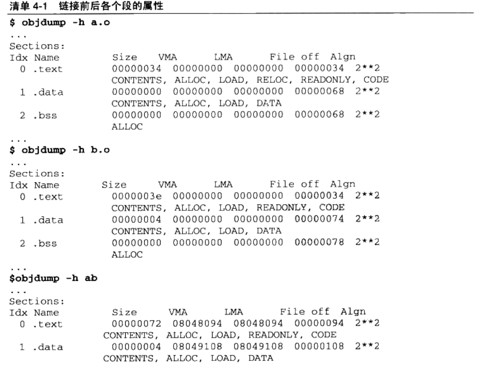
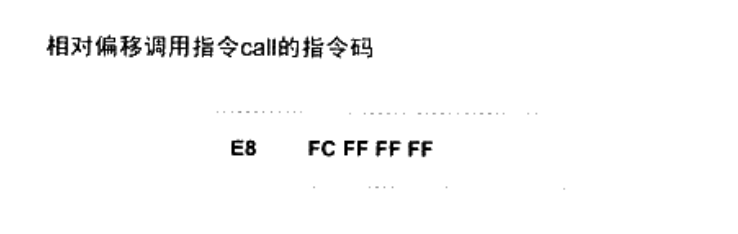
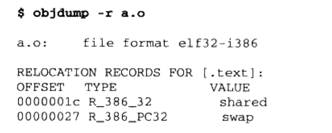

#### 相似段合并 ####

将所有输入文件的.text合并到输出文件的.text段

"链接器为目标文件分配地址和空间"这句话中的"地址和当空间"其实有两个含义:第一个是在输出的可执行文件中的空间:第二个是在装载后的虚拟地址中的虚拟地址空间，**对于有实际数据的段,比如".text"和".data"来说,它们在文件中和虚拟地址中都要分配空,因为它们在这两者中都存在:而对于".bss"这样的段来说,分配空间的意义只局限于虚拟地址空间,因为它在文件中并没有内容**。事实上,我们在这里谈到的空间分配只关注于虚拟地址空间的分配,因为这个关系到链接器后面的关于地址让计算的步骤,而可执行文件本身的空间分配与链接过程关系并不是很大。

#### 两步链接 ####

**第一步空间与地址分配** ： 扫描所有的输入目标文件,并且获得它们的各个段的长度、属性和位置,并且将输入目标文件中的符号表中所有的符号定义和符号引用收集起来,统一放到一个全局符号表。这一步中,链接器将能够获得所有输入人目标文件的段长度,并且将它们合并,计算出输出文件中各个段合并后的长度与位置,并建立映射关系。

**第二步符号解析与重定位**： 使用上面第一步中收集到的所有信息,读取输入文件中段的数据、重定位信息,并且进行符号解析与重定位、调整代码中的地址等。事实上第二步是链接过程的核心,特别是重定位过程。

符号地址的确定

链接器开始计算各个符号的虚拟地址，因为各个符号在段内的相对位置固定，所以main shared swap的地址已经确定，只不过链接器要给每个符号加上一个偏移量，使它们能够调整到正确的虚拟地址

### 重定位 ###

"a.o"是怎么使用外部符号的？，使用objdump的 -d 参数可以看到"a.o"的反汇编结果

"a.o"定义了一函数main,这个函数占用0x33个字节，共17条指令；最左边是每条指令的偏移量，对于shared的引用是一条mov指令，总共8个字节，作用是将shared的地址赋值到ESP寄存器+4偏移地址中去，前面4个字节是指令码，后面4个字节是shared的地址

当源代码"a.c"在被编译成目标文件时,编译器并不知道"shared"和"swap"的地址,因为它们定义在其他目标文件中。所以**编译器就暂时把地址0看作是"shared"的地址**

swap函数的调用：

0xE8是操作码，这条指令是一条近址相对位移调用指令，后面4个字节是被调用函数的相对于调用指令的下一条指令的偏移量，在没有重定位之前，相对偏移被置为0xFFFFFFFC(小端)，常量-4的补码

紧跟在这条call指令后面那条add指令地址为0x2b,相对于add指令偏移的地址为：0x2b - 4 = 0x27，所以这条call指令的实际调用地址为0x27,0x27并不是swap函数的地址，只是一个临时的地址，因为编译的时候编译器并不知道swap的真正地址

用objdump反汇编输出程序ab的代码段，main函数的两个重定位入口都已经被修正到正确位置

#### 重定位表 ####

那么链接器是怎么知道哪些指令要被调整？ELF文件中有一个叫重定位表(Relocation Table)的结构专门用来保存这些与重定位相关的信息，可以使用objdump来查看目标文件的重定位表

该命令可以查看a.o所有引用到外部符号的地址，a.o里面有两个重定位入口，重定位入口的偏移(OFFSET)表示该入口在要被重定位的段中的位置

#### 修正方式 ####

X86基本重定位类型

**R_386_32:**  值为1，绝对寻址修正 S + A

**R_386_PC32**: 值为2，相对寻址修正 S + A - P

A = 保存在被修正位置的值

P = 被修正的位置（相对于段开始的偏移量或者虚拟地址），该值可通过r_offset计算得到

S = 符号的实际地址，由r_info的高24位指定的符号的实际地址

假设a.o和b.o链接成最终可执行文件后，main函数的虚拟地址为0x1000，swap函数的虚拟地址为0x2000；shared变量的虚拟地址为0x3000

**绝对寻址修正：**a.o的第一个重定位入口，0x18的这条mov指令的修正，修正方式是R_386_32,即绝对地址修正，对于这个重定位入口，它修正后的结果应该是S + A

* S是符号shared的实际地址，即0x3000
* A是被修正位置的值，即0x00000000

修正后的地址：0x3000 + 0x00000000 = 0x3000

**相对寻址修正**：偏移为0x26的这条call指令，修正方式是R_386_PC32，修正结果是S + A - P

* S是符号swap的实际地址，即0x2000
* A是被修正位置的值，即0xFFFFFFFC(-4)
* P为被修正的位置，当链接成可执行文件时，这个值应该是被修正位置的虚拟地址，即0x1000(main的虚拟地址) + 0x27

修正后的地址为：0x2000 + (-4) - (0x1000 + 0x27) = 0xFD5

这条相对位移调用指令调用的地址是该指令下一条指令的起始地址加上偏移量，即： 0x102b + 0xfd5 = 0x2000，刚好是swap函数的地址

