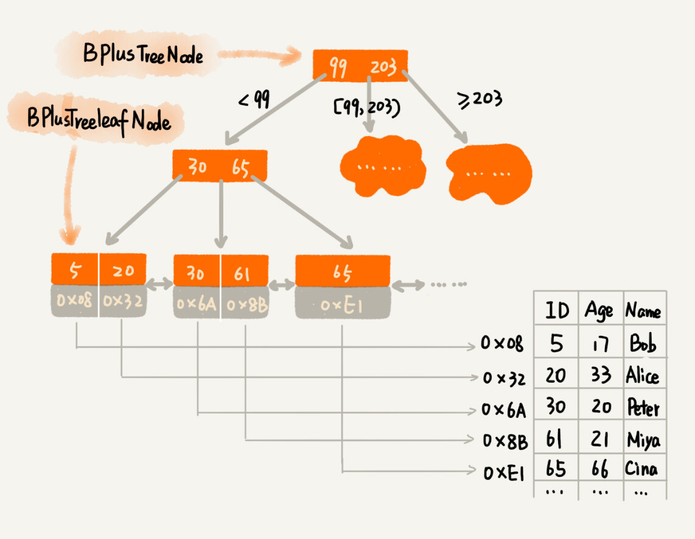

#### 解决问题的前提是定义清楚问题

* 根据某个值查找数据，比如 ```select * from user where id=1234；```
* 根据区间值来查找某些数据，比如``` select * from user where id > 1234 and id < 2345。```

性能方面的需求，我们主要考察时间和空间两方面，也就是执行效率和存储空间。

先来看散列表。散列表的查询性能很好，时间复杂度是 O(1)。但是，散列表不能支持按照区间快速查找数据。所以，散列表不能满足我们的需求。

尽管平衡二叉查找树查询的性能也很高，时间复杂度是 O(logn)。而且，对树进行中序遍历，我们还可以得到一个从小到大有序的数据序列，但这仍然不足以支持按照区间快速查找数据。

#### 改造二叉查找树来解决这个问题

树中的节点并不存储数据本身，而是只是作为索引。除此之外，我们把**每个叶子节点串在一条链表**上，链表中的数据是从小到大有序的。

改造之后，如果我们要求某个区间的数据。我们只需要拿区间的起始值，在树中进行查找，当查找到某个叶子节点之后，我们再顺着链表往后遍历，直到链表中的结点数据值大于区间的终止值为止


但是，我们要为几千万、上亿的数据构建索引，如果将索引存储在内存中，尽管内存访问的速度非常快，查询的效率非常高，但是，**占用的内存会非常多。**

可以借助时间换空间的思路，把索引存储在硬盘中，而非内存中

这种将索引存储在硬盘中的方案，尽管减少了内存消耗，但是在数据查找的过程中，需要读取磁盘中的索引，因此数据查询效率就相应降低很多。

二叉查找树，经过改造之后，支持区间查找的功能就实现了。不过，**为了节省内存，如果把树存储在硬盘中，那么每个节点的读取（或者访问），都对应一次磁盘 IO 操作。树的高度就等于每次查询数据时磁盘 IO 操作的次数。**

那如何降低树的高度呢？

给 16 个数据构建二叉树索引，树的高度是 4，查找一个数据，就需要 4 个磁盘 IO 操作（如果根节点存储在内存中，其他节点存储在磁盘中）

如果我们将 m 叉树实现 B+ 树索引，用代码实现出来，就是下面这个样子（假设我们给 int 类型的数据库字段添加索引，所以代码中的 keywords 是 int 类型的）：

```java
/**
 * 这是B+树非叶子节点的定义。
 **B+ 树是一棵完全平衡的 m 阶多叉树。所谓的 m 阶，指的是每个节点最多有 m 个子节点，并且每个节点里都存了一个紧凑的可包含 m 个元素的数组。
 *
 * 假设keywords=[3, 5, 8, 10]
 * 4个键值将数据分为5个区间：(-INF,3), [3,5), [5,8), [8,10), [10,INF)
 * 5个区间分别对应：children[0]...children[4]
 *
 * m值是事先计算得到的，计算的依据是让节点大小正好等于页的大小：
 * PAGE_SIZE = (m-1)*4[keywordss大小]+m*8[children大小]
 *	(8指的是引用（指针）占的内存大小)
 */
public class BPlusTreeNode {
  public static int m = 5; // 5叉树
  public int[] keywords = new int[m-1]; // 键值，用来划分数据区间
  public BPlusTreeNode[] children = new BPlusTreeNode[m];//保存子节点指针
}

/**
 * 这是B+树中叶子节点的定义。
 *
 * B+树中的叶子节点跟内部节点是不一样的,
 * 叶子节点存储的是值，而非区间。
 * 这个定义里，每个叶子节点存储3个数据行的键值及地址信息。
 *
 * k值是事先计算得到的，计算的依据是让所有信息的大小正好等于页的大小：
 * PAGE_SIZE = k*4[keyw..大小]+k*8[dataAd..大小]+8[prev大小]+8[next大小]
 */
public class BPlusTreeLeafNode {
  public static int k = 3;
  public int[] keywords = new int[k]; // 数据的键值
  public long[] dataAddress = new long[k]; // 数据地址

  public BPlusTreeLeafNode prev; // 这个结点在链表中的前驱结点
  public BPlusTreeLeafNode next; // 这个结点在链表中的后继结点
}
```

不管是内存中的数据，还是磁盘中的数据，操作系统都是按页（一页大小通常是 4KB，这个值可以通过 getconfig PAGE_SIZE 命令查看）来读取的，一次会读一页的数据。如果要读取的数据量超过一页的大小，就会触发多次 IO 操作。所以，**我们在选择 m 大小的时候，要尽量让每个节点的大小等于一个页的大小。读取一个节点，只需要一次磁盘 IO 操作。**



### 如何理解 B+ 树的数据结构？

**B+ 树给出了将树形索引的所有节点都存在磁盘上的高效检索方案，使得索引技术摆脱了内存空间的限制**

**操作系统对磁盘数据的访问是以块为单位的**。因此，如果我们想将树型索引的一个节点从磁盘中读出，即使该节点的数据量很小（比如说只有几个字节），但磁盘依然会将整个块的数据全部读出来，而不是只读这一小部分数据，这会让有效读取效率很低。

**B+ 树的一个关键设计，就是让一个节点的大小等于一个块的大小。节点内存储的数据**，不是一个元素，而是一个可以装 m 个元素的有序数组

内部节点仅存储 key 和维持树形结构的指针**，并不存储 key 对应的数据（无论是具体数据还是文件位置信息）。这样内部节点就能存储更多的索引数据**

而**叶子节点仅存储 key 和对应数据，不存储维持树形结构的指针**。通过这样的设计，B+ 树就能做到节点的空间利用率最大化。

此外，B+ 树还将同一层的所有节点串成了有序的双向链表，这样一来，B+ 树就同时具备了良好的范围查询能力和灵活调整的能力了。

因此，**B+ 树是一棵完全平衡的 m 阶多叉树。所谓的 m 阶，指的是每个节点最多有 m 个子节点**，**并且每个节点里都存了一个紧凑的可包含 m 个元素的数组。**

### B+ 树是如何检索的？

这样的结构，使得 B+ 树可以作为一个完整的文件全部存储在磁盘中。当从根节点开始查询时，**通过一次磁盘访问，我们就能将文件中的根节点这个数据块读出，然后在根节点的有序数组中进行二分查找。**

* 我们先确认要寻找的查询值，位于数组中哪两个相邻元素中间
* 将第一个元素对应的指针读出，获得下一个 block 的位置。读出下一个 block 的节点数据后，我们再对它进行同样处理。这样，B+ 树会逐层访问内部节点，直到读出叶子节点
* 对于叶子节点中的数组，直接使用二分查找算法，我们就可以判断查找的元素是否存在。如果存在，我们就可以得到该查询值对应的存储数据。**如果这个数据是详细信息的位置指针，那我们还需要再访问磁盘一次，将详细信息读出**。

**B+ 树是一棵完全平衡的 m 阶多叉树。所以，B+ 树的一个节点就能存储一个包含 m 个元素的数组，这样的话，一个只有 2 到 4 层的 B+ 树，就能索引数量级非常大的数据了**，因此 B+ 树的层数往往很矮。比如说，一个 4K 的节点的内部可以存储 400 个元素，那么一个 4 层的 B+ 树最多能存储 400^4，也就是 256 亿个元素。

因为 B+ 树只有 4 层，这就意味着我们最多只需要读取 4 次磁盘就能到达叶子节点。并且，我们还可以通过将上面几层的内部节点全部读入内存的方式，来降低磁盘读取的次数。

比如说，对于一个 4 层的 B+ 树，每个节点大小为 4K，那么第一层根节点就是 4K，第二层最多有 400 个节点，一共就是 1.6M；第三层最多有 400^2，也就是 160000 个节点，一共就是 640M。对于现在常见的计算机来说，前三层的内部节点其实都可以存储在内存中，**只有第四层的叶子节点才需要存储在磁盘中。这样一来，我们就只需要读取一次磁盘即可。这也是为什么，B+ 树要将内部节点和叶子节点区分开的原因。通过这种只让内部节点存储索引数据的设计，我们就能更容易地把内部节点全部加载到内存中了。**


