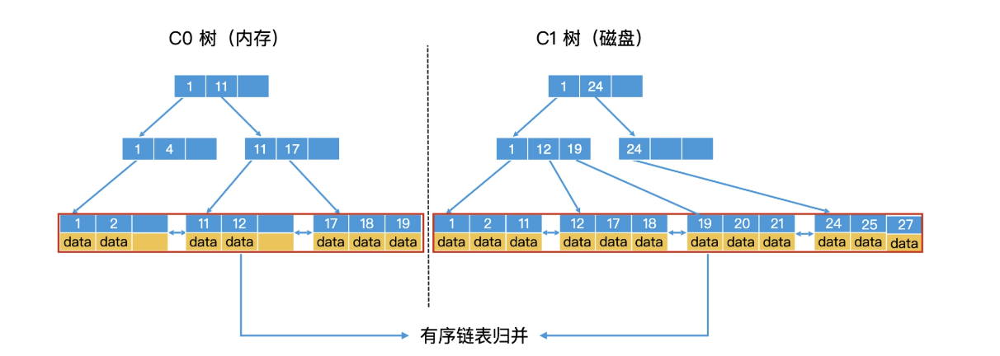
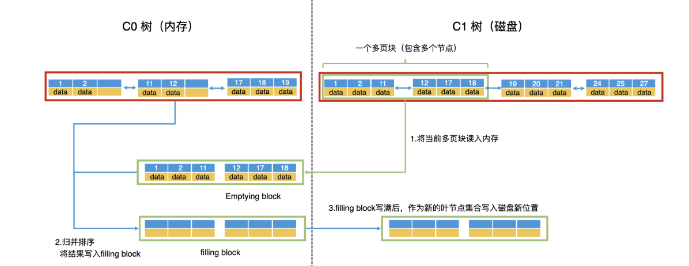

在关系型数据库之外，还有许多常见的大数据应用场景，比如，日志系统、监控系统。这些应用场景有一个共同的特点，那就是数据会持续地大量生成，而且相比于检索操作，它们的写入操作会非常频繁。另外，即使是检索操作，往往也不是全范围的随机检索，更多的是针对近期数据的检索。

**B+ 树的数据都存储在叶子节点中，而叶子节点一般都存储在磁盘中。因此，每次插入的新数据都需要随机写入磁盘，而随机写入的性能非常慢**。如果是一个日志系统，每秒钟要写入上千条甚至上万条数据，这样的磁盘操作代价会使得系统性能急剧下降，甚至无法使用。

#### 如何利用批量写入代替多次随机写入？

操作系统对磁盘的读写是以块为单位的，我们能否以块为单位写入，而不是每次插入一个数据都要随机写入磁盘呢？这样是不是就可以大幅度减少写入操作了呢？

早期，LSM Tree 中包含了多个树状结构，C0-tree 存储在内存，而 C1-tree 存储在磁盘中，**实质就是利用内存，延迟写入磁盘的时机。**

**C0-tree 由于常驻内存**，检索起来不会产生 IO，所以理论上，我们可以使用各种可用于**高效索引的数据结构来存储数据，比如红黑树、跳表等等**

但是因为内存成本高昂，能存储的数据必然有限，更大量的数据仍然需要存储在磁盘里。**而磁盘中的 C1-tree 一般被实现为特殊的 B+ 树。**

数据的存储也会分为两个阶段，**我们会一直先在内存中存储元素，直到内存中的数据到达一个阈值，我们会开始和 C1-tree 中的节点进行合并和覆写**，过程和多路归并有点相似

#### 如何将内存数据与磁盘数据合并？

内存中 C0 树的大小是有上限的，那当 C0 树被写满之后，我们要怎么把它转换到磁盘中的 C1 树上呢？这就涉及滚动合并（Rolling Merge）的过程了。

将 C0 树和 C1 树的所有叶子节点中存储的数据，看作是两个有序链表，**那滚动合并问题就变成了我们熟悉的两个有序链表的归并问题**

由于**磁盘具有顺序读写效率高的特性**，因此，为了提高 C1 树中节点的读写性能，除了根节点以外的节点都要尽可能地存放到连续的块中，让它们能作为一个整体单位来读写。**这种包含多个节点的块就叫作多页块（Multi-Pages Block）。**

* 第一步，以多页块为单位，将 C1 树的当前叶子节点从前往后读入内存。**读入内存的多页块，叫作清空块（**Emptying Block），意思是处理完以后会被清空。
* 第二步，将 **C0 树的叶子节点和清空块中的数据进行归并排序**，把**归并的结果写入内存的一个新块中**，叫作填充块（Filling Block）。
* 第三步，如果**填充块写满了，我们就要将填充块作为新的叶节点集合顺序写入磁盘**。这个时候，如果 C0 树的叶子节点和清空块都没有遍历完，我们就继续遍历归并，**将数据写入新的填充块。如果清空块遍历完了，我们就去 C1 树中顺序读取新的多页块，加载到清空块中**
* 第四步，重复第三步，直到遍历完 C0 树和 C1 树的所有叶子节点，并将所有的归并结果写入到磁盘,同时删除 C0 树和 C1 树中被处理过的叶子节点。这样就完成了滚动归并的过程。

因为磁盘的顺序读写性能和内存是一个数量级的，这使得 LSM 树的性能得到了大幅的提升。

##### LSM 树是如何检索的？

因为同时存在 C0 和 C1 树，所以要查询一个 key 时，我们会先到 C0 树中查询。如果查询到了则直接返回，不用再去查询 C1 树了。

C0 树会存储最新的一批数据，所以 C0 树中的数据一定会比 C1 树中的新。因此，**如果一个系统的检索主要是针对近期数据的，那么大部分数据我们都能在内存中查到，检索效率就会非常高。**

