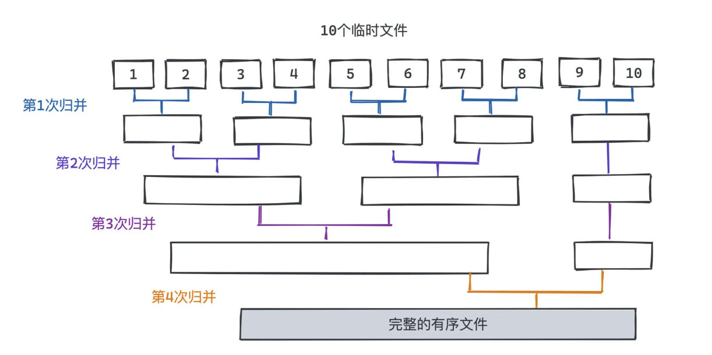

假设现在有 1TB 的任意文本，请问如何能将其中出现的单词按照字母序排列，得到一个新的文本？

就直接用堆排序，建立一个小顶堆，然后遍历整个文本进行分词，将每个单词都依次 push 进堆，最后再逐一出队输出到一个文本，最后就可以得到一个按字典序升序排列的文本了。

忽略了一个至关重要的问题，就是我们的**内存可能没有这么大！**

比如和排序相关的问题，绝大部分题目肯定会给你一个数组去存放需要排序的元素，隐含了内存可以一次性将所有数据读入的条件。

但在实际工作中，我们经常会遇到内存中放不下所有数据的排序场景

#### TB 级数据排序

需要借助外存去处理极大量数据的排序时，就需要使用外部排序算法了。

文件其实是可以一部分一部分读的，**如果内存中一次放不下全部的数据，也许我们可以将文件分成若干段，分别读入内存中，并采用常见的内排序算法（比如堆排序），对这段可以在内存中存储的段落进行排序**；得到若干个有序的文件段后，最后通过一些合并的方式，得到整体有序的文件

根据内存大小，将待排序的文件拆成多个部分，使得每个部分都是足以存入内存中的。然后选择合适的内排序算法，并输出到容量可以更大的外存临时文件中，**每个临时文件都是有序排列的，我们将其称之为一个“顺段”。**

归并阶段

我们对前面的多个“顺段”进行合并，思想和归并排序其实是一样的。以 2 路归并为例，每次都将两个连续的顺段合并成一个更大的顺段。

因为内存限制，**每次可能只能读入两个顺段的部分内容**，所以我们需要一部分一部分读入，在内存里将可以确定顺序的部分排列，并输出到外存里的文件中

* 在第一个阶段部分排序中，由于内存可以装下每个顺段的所有元素，所以几种主流的 O(nlogn) 的算法都是可以的，其中快速排序在大部分场景下是最快的，因此我们可以首选快速排序。
* 比较复杂的是归并阶段。**因为内存不足以装下所有需要排序的元素**，**所以 O(nlogn) 的堆排和快排都已经没办法被应用在外排的场景中了**，但基于分治思想的归并排序却依然可以很好地发挥作用
* 外部排序场景下，我们还有个**非常大的时间消耗就是 IO，也就是输入输出。**
* 从图中其实可以看出来，**每一层我们读取外存的数据总量其实是一样的**，本质上就是将所有的数据都遍历一遍。

而**内存大小是一样的，所以每一层中读取外存的次数也就是一样的**，,那么**显然关系我们读取次数的多少主要就取决于所需归并的层数了**。因此，我们要做的事情就是让归并的层数越低越好。

#### 如何降低归并层数

以 2 路归并为例，每次合并两个连续的顺段，每一层的顺段都会减少一半，直至只剩一个顺段，也就是需要的排序结果。因而，假设初始一共有 n 个顺段，那么我们大致需要 log2n 层。

如果进行 k 路归并，所以就大概只需要 logk(n) 层即可完成整个归并

**一个显著的问题就是在 k 路归并中，我们需要从 k 个元素中选择出最小的元素，代价比 2 路归并的更高**。如果用最暴力的方式，遍历 k 个元素，每次选择最小的元素的过程将产生 O(k) 的时间复杂度

选择 k 个元素中的最小元素，显然有优于暴力遍历 O(k) 复杂度的算法。比如，堆就可以解决这个问题。

现在有了败者树的加持，多路归并排序就可以比较高效地解决外部排序的问题了。对于 1TB 任意文本的排序问题，大致思路就是：

1. 先用内排序算法，尽可能多的加载源文件，将其变成 n 个有序顺段。
2. 在内存有限的前提下每 k 个文件为一组，每次流式地从各个文件中读取一个单词，借助败者树选出字典序最低的一个，输出到文件中，这样就可以将 k 个顺段合并到一个顺段中了；反复执行这样的操作，直至所有顺段被归并到同一个顺段。

看起来我们每次从文件中只读取了一个单词，但操作系统在读文件的时候是会按页为单位读取并缓存下来的，所以某一次磁盘访问之后的若干次访问，其实都会直接命中 cache，也就是说，并不是每次从败者树中取出元素时都会真的产生磁盘 IO

