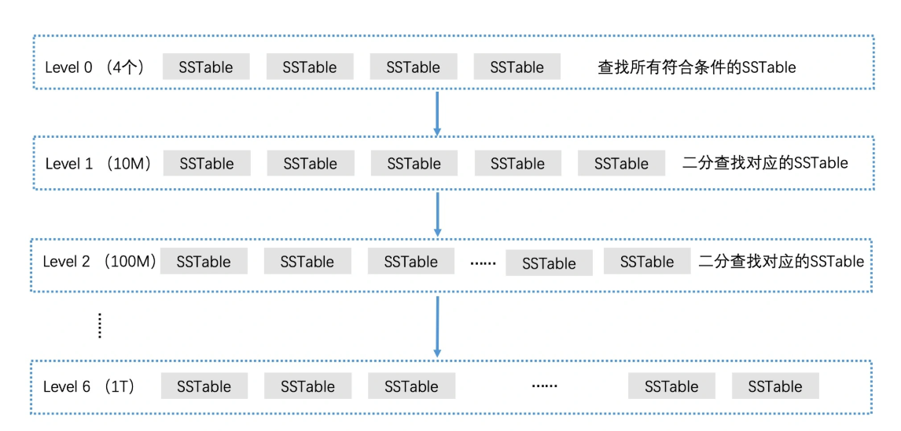

#### 现代 LSM Tree

###### 如何利用读写分离设计将内存数据高效存储到磁盘？

**对内存中索引的高效检索，我们可以用很多检索技术，如红黑树、跳表等，这些数据结构会比 B+ 树更高效**。因此，LevelDB 对于 LSM 树的第一个改进，就是使用跳表代替 B+ 树来实现内存中的 C0 树。

内存数据要如何高效存储到磁盘？

我们是将内存中的 C0 树和磁盘上的 C1 树归并来存储的。但如果内存中的数据**一边被写入修改，一边被写入磁盘，我们在归并的时候就会遇到数据的一致性管理问题。一般来说，这种情况是需要进行“加锁”处理的，但“加锁”处理又会大幅度降低检索效率。**

为此，LevelDB 做了读写分离的设计。它将内存中的数据分为两块，一块叫作 MemTable，它是可读可写的。另一块叫作 Immutable MemTable，它是只读的。这两块数据的数据结构完全一样，都是跳表。

* 当 MemTable 的存储数据达到上限时，我们直接将它切换为只读的 Immutable MemTable，然后重新生成一个新的 MemTable，来支持新数据的写入和查询。
* 由于 Immutable MemTable 是只读的，因此，它不需要加锁就可以高效地写入磁盘中。

接着看 C0 树和 C1 树的归并。在原始 LSM 树的设计中，内存索引写入磁盘时是直接和磁盘中的 C1 树进行归并的。但如果工程中也这么实现的话，会有两个很严重的问题：

1. 合并代价很高，因为 C1 树很大，而 C0 树很小，这会导致它们在合并时产生大量的磁盘 IO；
2. 合并频率会很频繁，由于 C0 树很小，很容易被写满，因此系统会频繁进行 C0 树和 C1 树的合并，这样频繁合并会带来的大量磁盘 IO，这更是系统无法承受的。

* LevelDB 采用了延迟合并的设计来优化。具体来说就是，**先将 Immutable MemTable 顺序快速写入磁盘，直接变成一个个 SSTable（Sorted String Table）文件**
* 之后再对这些 SSTable 文件进行合并。这样就避免了 C0 树和 C1 树昂贵的合并代价

在这种方案下，数据又是如何检索的呢？在检索一个数据的时候，我们会先在 MemTable 中查找，如果查找不到再去 Immutable MemTable 中查找。如果 Immutable MemTable 也查询不到，我们才会到磁盘中去查找。

因为磁盘中原有的 C1 树被多个较小的 SSTable 文件代替了。那现在我们要解决的问题就变成了，**如何快速提高磁盘中多个 SSTable 文件的检索效率。**

#### SSTable 的分层管理设计

尽管 **SSTable 中的数据是有序的(插入MemTable的时候就是有序的，如平衡二叉树的插入 )**，但是每个 SSTable 覆盖的数据范围都是没有规律的，所以 SSTable 之间的数据很可能有重叠。

**一次性 dump 成磁盘上的一段自然是比较快的，这样一段段的数据，我们就称为一个个 segment**。所以最简单的持久化方式就是我们在磁盘上把内存中有序的键值对直接 dump 成一个个段，也就是 segment。

我们把**内存中有序的数据结构比如红黑树中的记录，dump 到一段磁盘上的空间，然后按 segment 一段一段往后叠加**。

从后面的段开始，往前遍历，看看是否有查找到目标 key，有的话就返回。**由于从后往前遍历，我们第一次查询到 key 的时候，一定就是这个 key 对应的最新状态。**

但很显然，这样的存储会有很多问题。

* 首先数据冗余很大，随着时间推移，磁盘上就会有大量重复的键；
* 其次我们需要遍历每个有序的 segment，查看数据是否存在。随着数据量增大，最坏情况下，要遍历的 segment 会非常多，整个系统的查询效率显然是惨不忍睹的

###### 压缩数据

每个 segment 都是有序的，那我们显然可以比较高效地对多段数据进行合并操作,在 SSTable 的主流实现里，**我们会把不同的阶段被合并的 segment 放到不同的层中，并限制每一层数量，当某层 segment 超过一定数量，我们就会把它们删除，合并出一个更大的 segment 放入下一层。**

LevelDB 采用了延迟合并的设计来优化。具体来说就是，**先将 Immutable MemTable 顺序快速写入磁盘，直接变成一个个 SSTable（Sorted String Table）文件，之后再对这些 SSTable 文件进行合并**

尽管 SSTable 中的数据是有序的，但是每个 SSTable 覆盖的数据范围都是没有规律的，所以 SSTable 之间的数据很可能有重叠。

比如说，第一个 SSTable 中的数据从 1 到 1000，第二个 SSTable 中的数据从 500 到 1500。那么当我们要查询 600 这个数据时，我们并不清楚应该在第一个 SSTable 中查找，还是在第二个 SSTable 中查找。**最差的情况是，我们需要查询每一个 SSTable，这会带来非常巨大的磁盘访问开销。**

让每个 SSTable 的覆盖范围不重叠。这样我们就能将 SSTable 按照覆盖范围来排序了。并且，**由于每个 SSTable 覆盖范围不重叠，当我们需要查找数据的时候，我们只需要通过二分查找的方式，找到对应的一个 SSTable 文件**，

* 系统在最开始时，只会生成一个 SSTable 文件，这时候我们不需要进行任何处理
* 当系统生成第二个 SSTable 的时候，为了保证覆盖范围不重合，我们需要将这两个 SSTable 用多路归并的方式处理，生成新的 SSTable 文件。

为了方便查询，我们要保证每个 SSTable 文件不要太大。因此，**LevelDB 还控制了每个 SSTable 文件的容量上限（不超过 2M）**

这时，新的 SSTable 文件之间的覆盖范围就不重合了

当系统再新增一个 SSTable 时，我们还用之前的处理方式，来计算这个新的 SSTable 的覆盖范围，然后**和已经排好序的 SSTable 比较，找出覆盖范围有重合的所有 SSTable 进行多路归并。**

随着 SSTable 文件的增多，多路归并的对象也会增多。那么，最差的情况会是什么呢？**最差的情况是所有的 SSTable 都要进行多路归并。这几乎是一个不可能被接受的时间消耗，系统的读写性能都会受到很严重的影响**。

将 SSTable 进行分层管理，然后逐层滚动合并。这就是 LevelDB 的分层思想，也是 LevelDB 的命名原因

* 首先，从 Immutable MemTable 转成的 SSTable 会被放在 Level 0 层。Level 0 层最多可以放 4 个 SSTable 文件。
* 当 Level 0 层满了以后，我们就要将它们进行多路归并，生成新的有序的多个 SSTable 文件，这一层有序的 SSTable 文件就是 Level 1 层，同时删除Level 0层合并的文件
* 接下来，如果 Level 0 层又存入了新的 4 个 SSTable 文件，那么就需要和 Level 1 层中相关的 SSTable 进行多路归并了
* 如果 Level 1 中的 SSTable 数量很多，那么在大规模的文件合并时，磁盘 IO 代价会非常大。因此，LevelDB 的解决方案就是，**给 Level 1 中的 SSTable 文件的总容量设定一个上限（默认设置为 10M）**，这样多路归并时就有了一个代价上限。
* 当 Level 1 层的 SSTable 文件总容量达到了上限之后，我们就需要选择一个 SSTable 的文件，将它并入下一层
* 下一层会将容量上限翻 10 倍，这样就能容纳更多的 SSTable 了。依此类推，如果下一层也存满了，我们就在该层中选择一个 SSTable，继续并入下一层。这就是 LevelDB 的分层设计了。

尽管 LevelDB 通过限制每层的文件总容量大小，能保证做多路归并时，会有一个开销上限。但是层数越大，容量上限就越大，**那发生在下层的多路归并依然会造成大量的磁盘 IO 开销**。这该怎么办呢？

在多路归并生成第 n 层的 SSTable 文件时，**LevelDB 会判断生成的 SSTable 和第 n+1 层的重合覆盖度，如果重合覆盖度超过了 10 个文件，就结束这个 SSTable 的生成，继续生成下一个 SSTable 文件。**

**通过这个限制，LevelDB 就保证了第 n 层的任何一个 SSTable 要和第 n+1 层做多路归并时，最多不会有超过 10 个 SSTable 参与**，从而保证了归并性能

#### 如何查找对应的 SSTable 文件

* 首先，我们会在 Level 0 层中进行查找。由于 Level 0 层的 SSTable 没有做过多路归并处理，它们的覆盖范围是有重合的
* 检查 Level 0 层中所有符合条件的 SSTable，在其中查找对应的元素。如果 Level 0 没有查到，那么就下沉一层继续查找
* 而从 Level 1 开始，每一层的 SSTable 都做过了处理，这能保证覆盖范围不重合的。因此，对于同一层中的 SSTable，我们可以使用二分查找算法快速定位唯一的一个 SSTable 文件。如果查到了，就返回对应的 SSTable 文件；如果没有查到，就继续沉入下一层，直到查到了或查询结束。

#### SSTable 文件中的检索加速

在定位到了对应的 SSTable 文件后，接下来我们该怎么查询指定的元素呢？

LevelDB 使用索引与数据分离的设计思想，将 SSTable 分为数据存储区和数据索引区两大部分。

在读取 SSTable 文件时，不需要将整个 SSTable 文件全部读入内存，只需要先将数据索引区中的相关数据读入内存就可以了。这样就能大幅减少磁盘 IO 次数。

在进行精确查找时，我们将数据索引区中的 Index Block 读出，Index Block 中的每条记录都记录了每个 Data Block 的最小分隔 key、起始位置，还有 block 的大小。**由于所有的记录都是根据 Key 排好序的，因此，我们可以使用二分查找算法，在 Index Block 中找到我们想查询的 Key。**

#### 利用缓存加速检索 SSTable 文件的过程

每次对 SSTable 进行二分查找时，我们都需要将 Index Block 和相应的 Data Block 分别从磁盘读入内存，这样就会造成两次磁盘 I/O 操作。我们知道磁盘 I/O 操作在性能上，和内存相比是非常慢的，这也会影响数据的检索速度

LevelDB 分别设计了 table cache 和 block cache 两个缓存。其中，block cache 是配置可选的，**它是将最近使用的 Data Block 加载在内存中。而 table cache 则是将最近使用的 SSTable 的 Index Block 加载在内存中。这两个缓存都使用 LRU 机制进行替换管理。**

