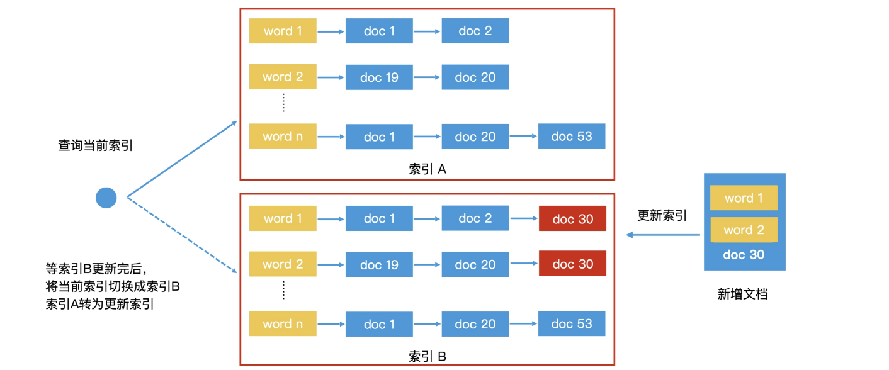
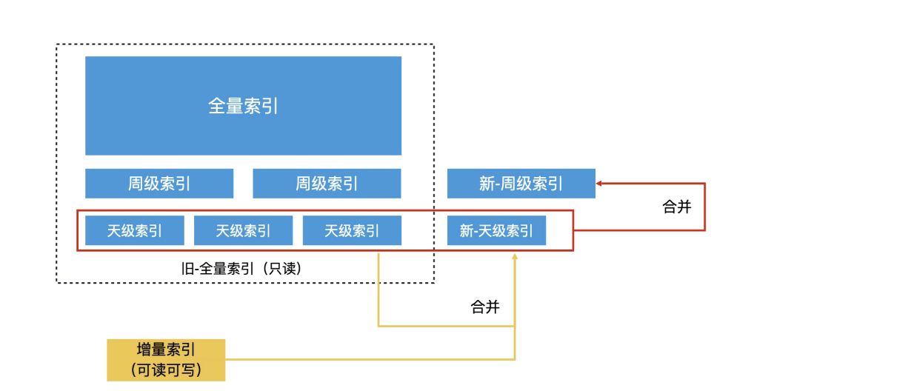

对于超大规模的网页建立索引会非常耗时，工业界往往会使用分布式技术来并行处理。

对于发布较久的网页，搜索引擎可以有充足的时间来构建索引。但是一些新的网页和文章，往往发布了几分钟就可以被用户搜索到。这又是怎么做到的呢？

### 工业界如何更新内存中的索引？

只要解析新文章有哪些关键词，然后将文章 ID 加入倒排表中关键词对应的文档列表即可。没错，在没有其他用户使用的情况下，这样的方法是可行的。但如果你有过一定的工程经验，你就会知道，在实际应用中，**必然会有多个用户同时访问这个索引。**

这个时候，如果我们直接更新倒排索引，就可能造成用户访问错误，甚至会引发程序崩溃。因此，一般来说，我们会对倒排表加上“读写锁”，然后再更新。但是，**加上“锁”之后会带来频繁的读写锁切换，整个系统的检索效率会比无锁状态有所下降。**

在工业界的实现中，我们会使用一种叫做“Double Buffer（双缓冲）机制”的解决方案，使得我们可以在无锁状态下对索引完成更新。

* 所谓“Double Buffer”，就是在内存中同时保存两份一样的索引，一个是索引 A，一个是索引 B。
* 我们会使用一个指针 p 指向索引 A，表示索引 A 是当前可访问的索引，那么用户在访问时就会通过指针 p 去访问索引 A。
* 如果我们要更新，只更新索引 B。这样，索引 A 和索引 B 之间就不存在读写竞争的问题了。因此，在这个过程中，索引 A 和索引 B 都可以保持无锁的状态。

那更新完索引 B 之后，我们该如何告知用户应该来访问索引 B 呢？这时候，我们可以将指针 p 通过原子操作（即无法被打断的最细粒度操作，在 Java 和 C++11 等语言中都有相应实现）**从 A 直接切换到 B 上。接着，我们就把索引 B 当作“只读索引”，然后更新索引 A。**

通过这样的机制，我们就能同时维护两个倒排索引，保持一个读、一个写，并且来回切换，最终完成高性能的索引更新。不过，为了避免切换太频繁，我们并不是每来一条新数据就更新，而是**积累一批新数据以后再批量更新。这就是工业界常用的 Double Buffer 机制。**

但是对于索引到了一定量级的应用而言，使用 Double Buffer 会带来翻倍的内存资源开销。比如说，**像搜索引擎这样万亿级网页的索引规模，数据大部分存储在磁盘上，更是无法直接使用 Double Buffer 机制进行更新的。**因此，我们还是需要寻找其他的解决方案。

### 如何使用“全量索引结合增量索引”方案？

* 首先，系统会周期性地处理全部的数据，生成一份完整的索引，也就是全量索引。这个索引不可以被实时修改，因此为了提高检索效率，我们可以不加“锁”
* 那对于实时更新的数据我们应该怎样处理呢？我们会将新接收到的数据单独建立一个可以存在内存中的倒排索引，也就是**增量索引**。
* 当查询发生的时候，我们会同时查询全量索引和增量索引，将合并的结果作为总的结果输出

因为增量索引相对全量索引而言会小很多，内存资源消耗在可承受范围，所以我们可以**使用 Double Buffer 机制对增量索引进行索引更新。这样一来，增量索引就可以做到无锁访问**

而**全量索引本身就是只读的，**也不需要加锁。因此，整个检索过程都可以做到无锁访问，也就提高了系统的检索效率。

“全量索引结合增量索引”的检索方案，可以很好地处理新增的数据

##### 删除问题

假设，一个数据存储在全量索引中，但是在最新的实时操作中，它被删除了，那么在增量索引中，这个数据并不存在。当我们检索的时候，增量索引会返回空，但全量索引会返回这个数据。如果我们直接合并这两个检索结果，这个数据就会被留下作为检索结果返回，但是这个数据明明已经被删除了，这就会造成错误。

要解决这个问题，我们就需要在增量索引中保留删除的信息。最常见的解决方案是增加一个删除列表，将被删除的数据记录在列表中，然后检索的时候，我们将全量倒排表和增量倒排表的检索结果和删除列表作对比。**如果结果数据存在于删除列表中，就说明该数据是无效的，我们直接删除它即可。**

#### 增量索引空间的持续增长如何处理？

“全量索引结合增量索引”的方案非常实用，但是内存毕竟有限。如果我们不对内存中的增量索引做任何处理，那随着时间推移，内存就会被写满。

##### 合并法

**我们完全可以把全量索引想象成是一个已经将多个小索引合并好的大索引**，再把增量索引想象成是一个新增的小索引。这样一来，我们完全可以直接归并全量索引和增量索引，生成一个新的全量索引，这也就避免了从头处理所有文档的重复开销。这种方法就是效率更高的再合并法。

##### 滚动合并法

不过，如果全量索引和增量索引的量级差距过大，那么再合并法的效率依然不高。

增量索引只有上万条记录，但全量索引可能有万亿条记录。这样的两个倒排索引合并的过程中，只有少数词典中的关键词和文档列表会被修改，**其他大量的关键词和文档列表都会从旧的全量索引中被原样复制出来，再重写入到新的全量索引中，这会带来非常大的无谓的磁盘读写开销**。

最直接的解决思路就是原地更新法。所谓“**原地更新法**”，就是不生成新的全量索引，直接在旧的全量索引上修改。

比如说，一个检索系统在磁盘中保存了全量索引、周级索引和天级索引。所谓周级索引，就是根据本周的新数据生成的一份索引，那天级索引就是根据每天的新数据生成的一份索引。**在滚动合并法中，当内存中的增量索引增长到一定体量时，我们会用再合并法将它合并到磁盘上当天的天级索引文件中。**

由于天级的索引文件条数远远没有全量索引多，因此这不会造成大量的无谓数据复制。**等系统中积累了 7 天的天级索引文件后，我们就可以将这 7 个天级索引文件合并成一个新的周级索引文件**。因此，在每次合并增量索引和全量索引的时候，通过这样逐层滚动合并的方式，就不会进行大量的无谓数据复制的开销。这个过程就叫作滚动合并法。

