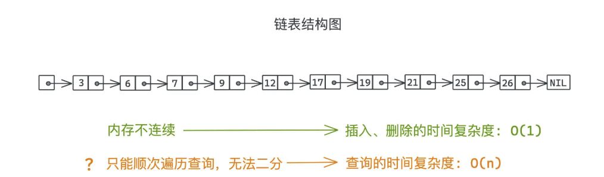
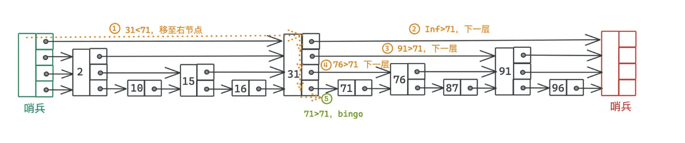

#### 跳表为什么诞生

事实上，在 Redis 对有序集合的实现里，我们同时维护了跳表和哈希表，为的就是利用单值查询时哈希表的高效性，但哈希表的存储是无序的，这意味着当我们想要使用范围查询的时候，**相比于红黑树或者跳表这样有序的数据结构，哈希表就会产生一定的劣势**

**不采用树状结构，仍然采用链表，再通过一些数据结构上的调整**，我们也是可以实现类似二分查询这样跳跃查询效果的。这就是跳表主要被发明出来的动机。

###### 跳表具体解决什么问题

如果用链表存储有序集合，在查询的时候会碰到什么样的问题？



主要就是在插入的时候，由于链表本身不要求内存连续，所以插入和删除的时间复杂度是 O(1)，而数组为了保持内存空间的连续性，需要花费 O(n) 的成本做插入和删除的操作。

也正是因为链表内存不连续，我们在基于 key 查询链表节点时，**即使整个链表已经是按照 key 有序排列了，我们仍然需要顺次遍历进行查询，不能像在有序数组中那样二分地跳跃查询**

链表不依次遍历就没有办法寻址到每一个节点，**但是如果我们有办法在链表上增加一些捷径，跳着走呢？**

### 链表是怎么设计的

我们把一个个遍历链表节点比作是一站站地铁，**如果在链表上能加一些间距更大的火车站，自然就快得多。**

我们会给链表上增加一些额外的层和指针，**越高的层，指针指向的下一个节点会跳跃更大的距离，越低的层，指针间距越小**

所有的节点都会出现在最低层，也就是第一层，这一层就是一个包含了所有有序集合中元素的有序链表

这样我们寻找某个元素的时候，就可以像换乘公共交通一样，先坐站距更远的交通工具，再换站距更小的交通工具，最后一段可能就是徒步，整个搜索效率就会高很多

假设我们想搜索的是 71 这个节点:



在原始的链表中，我们需要逐个遍历，需要进行 6 次跳跃。如果采用了跳表这样分层链表的存储方式，沿着指针移动的过程，可以变成 2 次。

1. 如果当前指针指向的值为 target，说明找到，返回即可；
2. 如果当前指针指向的右节点的值大于 target，我们进入更低的一层；
3. 如果当前指针指向的右节点的值小于等于 target，我们将指针移动到右节点

**本质上来说，高层的链表和线性索引的原理是很像的，我们就是通过为原始的链表增加了不同层的索引，起到了和平衡二分搜索树一样的快速搜索的效果。**

### 跳表实现原理

如何维护这样的多层链表结构？如何在合适的时机里加入新的层，以保证既可以高效查询，又不至于带来太高的维护成本呢？

假设元素只存储键，且必须是 int 类型，直接用 val 来表示。

```c++
//整个跳表节点的定义如下
struct Node
{
    // 至少需要向右、向下指针
    Node* right;
    Node* down;  
    int val;
    Node(Node *right, Node *down, int val) 
      : right(right), down(down), val(val){}
};
```

```c++
    bool search(int target)
    {
        Node *p = head;
        while(p)
        {
            // 左右寻找目标区间
            while(p->right && p->right->val < target)
            {
                p = p->right;
            }
            // 没找到目标值，则继续往下走
            if(!p->right || target < p->right->val)
            {
                p = p->down;
            }
            else
            {   
                //找到目标值，结束
                return true;
            }
        }
        return false;
    }
```

#### 完美跳表

跳表每一层间距到底是多少合适呢？

最理想状态下，跳表所用的存储空间和查询过程，应该和二叉树是非常像的，我们会要求每一层都包含下一层一半的节点

基于和二叉树一样的原因，层数一共是 logN 层，**在每一层中，我们最多只会进行一次跳跃，这是因为如果需要跳跃两次的话，我们在上一层判断的时候就会选择直接右跳，而不是下跳。因此每一层我们最多访问两个节点。整体搜索时间复杂度为 O(logN)**

但是完美跳表有一个非常显著的问题：**在有序集合动态插入和删除的过程中，我们很难高效地维护这样的结构。**

随着不同的插入顺序**，我们最差可能需要在某次插入中重置大部分节点的指针关系，这样的更新的维护成本显然不满足我们的期望，在引入了完美跳表的约束后，链表的插入、删除优势荡然无存**。那怎么办呢？

#### 引入随机性

跳表和随机性相关的地方主要体现在插入过程。假设需要插入的节点值为 val

* 首先，我们进行一遍查找过程，也就是根据三个分支条件判断要么返回，要么向下移动，要么向右移动，直到找到某个次小于且最接近于 val 的节点。
* 其次，在搜索过程中，我们需要记录一下搜索路径，这个和 DFS 中记录路径的方式是一样的，**每进到下一层前，把当前节点推入一个数组即可。**
* 最后，随着搜索结束，我们一定会停留在跳表的最底层，且搜索指针指向的是最接近于目标值的节点，这个时候就需要进行真正的插入操作了。
* 为了保证每一层的节点数量**从期望上来说是上一层的两倍**，每次插入一个节点的时候，我们可以采用抛硬币的策略，通过 50% 的概率决策，**决定是否需要继续将这个插入到更高的一层**
* 由于我们记录了整个路径，插入上一层的实现，也就是简单将一个新的节点插入到路径里上一层节点的右侧。简单算一下你就可以发现每个节点插入时在每一层的概率分别是：
  * 第一层时 100% 会被插入（所有节点都出现在第一层）
  * 第二层只有 1/2 的概率会被插入
  * 第三层是 1/4 的概率会被插入

关键就是我们**需要放弃不同层数里严格倍增的节点数量约束，而只是让每一层的节点数量，在期望上，满足均匀分配和倍增的关系即可**。这样从时间复杂度和空间复杂度上来说，我们的期望值其实不会有变化，只是会有一定的小波动。

```c++
    void add(int num) {
        // 从上至下记录搜索路径
        pathList.clear();
        Node *p = head;
        // 从上到下去搜索 次小于num的数字
        while(p)
        {
            // 向右找到次小于num的p
            while (p->right && p->right->val < num)
            { 
                p = p->right;
            }
            pathList.push_back(p);
            p = p->down;
        }

        bool  insertUp = true;
        Node* downNode = NULL;
        // 从下至上搜索路径回溯，50%概率
        // 这里实现是会保证不会超过当前的层数的，然后靠头结点去额外加层， 即每次新增一层
        while (insertUp && pathList.size() > 0)
        {
            Node *insert = pathList.back();
            pathList.pop_back();
            // add新结点
            insert->right = new Node(insert->right,downNode,num); 
            // 把新结点赋值为downNode
            downNode = insert->right; 
            // 50%概率   
            insertUp = (rand()&1)==0;
            // cout << " while new node " << num << " insertUp " << insertUp << endl;
        }
        // 插入新的头结点，加层
        if(insertUp)
        {  
            // cout << " insertUp new node " << num << endl;
            head = new Node(new Node(NULL,downNode,num), head, -1);
        }
    }
```


