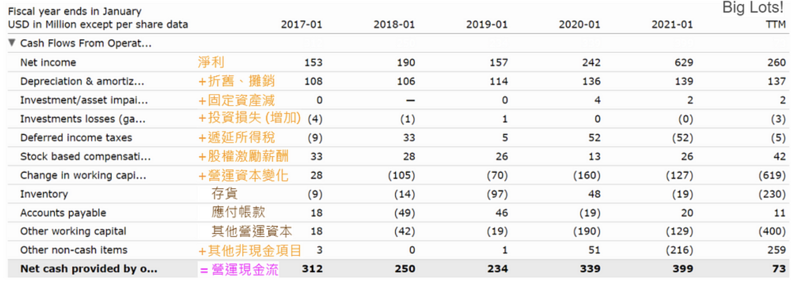
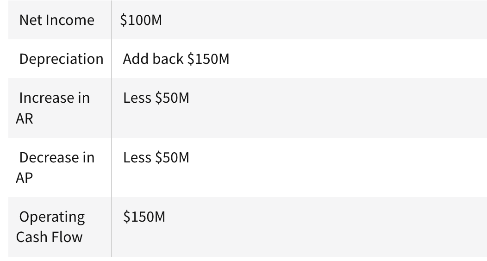

營業活動現金流的英文通常會以 Cash Flow From Operating Activities 或 Operating Cash Flow（OCF） 等形式出現。

#### Net Income 淨利 ####

**Net Income**  = EBIT - Interest - Taxes

#### Depreciation & Amortization 折舊、攤銷 ####

因為折舊及攤銷不是真正的失去現金，所以要加回去。

#### Change in Working Capital 營運資本變化

Working Capital（營運資本）= Current Assets（流動資產）– Current Liabilities（流動負債）

Change in Working Capital **為兩個財報期間的營運資本差值**

## Indirect Method(间接方法) ##

**OCF = NI + D&A - NWC**

**Where:**

- **NI equals the company's net income**
- **D&A is depreciation and amortization**
- **NWC is the increase in net working capital**

Net income must be adjusted for changes in [working capital](https://www.investopedia.com/terms/w/workingcapital.asp) accounts on the company's balance sheet. For example, an increase in AR indicates that revenue was earned and reported in net income on an accrual basis although cash has not been received. This increase in AR must be subtracted from net income to find the true cash impact of the transactions.

净利润必须根据公司资产负债表上营运资金账户的变化进行调整，例如，AR 的增加表明尽管尚未收到现金，但已赚取收入并按权责发生制在净利润中报告。必须从净利润中减去应收账款的增加，才能找到交易的真实现金影响。

Conversely, an increase in AP indicates that expenses were incurred and booked on an accrual basis that has not yet been paid. This increase in AP would need to be added back to net income to find the true cash impact.

相反，AP 的增加表明已产生并按权责发生制记账但尚未支付的费用。 AP 的增加需要加回到净利润中才能找到真正的现金影响。

### Example of the Indirect Method

Consider a manufacturing company that reports a net income of 100 million, while its operating cash flow is 150 million. The difference results from a depreciation expense of 150 million, an increase in accounts receivable of 50 million, and a decrease in accounts payable of 50 million. It would appear on the operating cash flow section of the cash flow statement in this manner:

## How Does Operating Cash Flow Differ From Net Income?

Operating cash flow differs from net income which is the difference between sales revenue and the costs of goods, [operating expenses, taxes, and other costs](https://www.investopedia.com/ask/answers/012615/are-taxes-calculated-operating-cash-flow.asp). When using the indirect method to calculate operating cash flow, net income is one of the initial variables. While both metrics measure the financial health of a firm, the main difference between [operating cash flow and net income](https://www.investopedia.com/ask/answers/012915/what-difference-between-operating-cash-flow-and-net-income.asp) is the time gap between sales and actual payments. If payments are delayed, there [may be a difference](https://www.investopedia.com/ask/answers/042115/what-difference-between-net-income-and-cash-flow-operating-activities.asp) between net income and operating cash flow.

经营现金流量与净利润不同，净利润是销售收入与商品成本、营业费用、税金和其他成本之间的差额。采用间接法计算经营现金流量时，净利润是初始变量之一。虽然这两个指标都衡量公司的财务状况，但经营现金流和净利润之间的主要区别在于销售和实际付款之间的时间差距。如果付款延迟，净利润和经营现金流之间可能会出现差异。

### What Is Cash Flow From Operating Activities ###

Cash flow from operating activities does not include long-term capital expenditures(/ ɪkˈspendɪtʃər / )（资本支出） or investment revenue and expense. CFO focuses only on the core business, and is also known as operating cash flow (OCF) or net cash from operating activities.

经营活动产生的现金流量不包括长期资本支出或投资收支。 CFO 只关注核心业务，也称为经营现金流 (OCF) 或经营活动产生的净现金。

[Cash flow](https://www.investopedia.com/terms/c/cashflow.asp) forms one of the most important parts of business operations and accounts for the total amount of money being transferred into and out of a business. Since it affects the company's [liquidity](https://www.investopedia.com/terms/l/liquidity.asp), it has significance(/ sɪɡˈnɪfɪkəns / 重要性) for multiple reasons. It allows business owners and operators check where the money is coming from and going to, it helps them take steps to generate and maintain(/ meɪnˈteɪn / 保持，维持) sufficient(/ səˈfɪʃ(ə)nt / 足够的，充足的) cash necessary for operational efficiency and other necessary needs, and it helps in making key and efficient financing decisions.

现金流是企业运营最重要的部分之一，占企业转入和转出的资金总额。由于它会影响公司的流动性，因此其重要性有多种。它允许企业主和经营者检查资金的来源和去向，帮助他们采取措施产生和维持运营效率和其他必要需求所需的足够现金，并有助于做出关键且高效的融资决策。

Investors examine a company’s cash flow from operating activities, within the cash flow statement, to determine where a company is getting its money from. In contrast to investing and financing activities which may be one-time or sporadic revenue, the operating activities are core to the business and are recurring in nature.

投资者在现金流量表中检查公司经营活动产生的现金流量，以确定公司的资金来源。与可能是一次性或零星收入的投资和融资活动相比，经营活动是业务的核心，并且本质上是经常性的。

