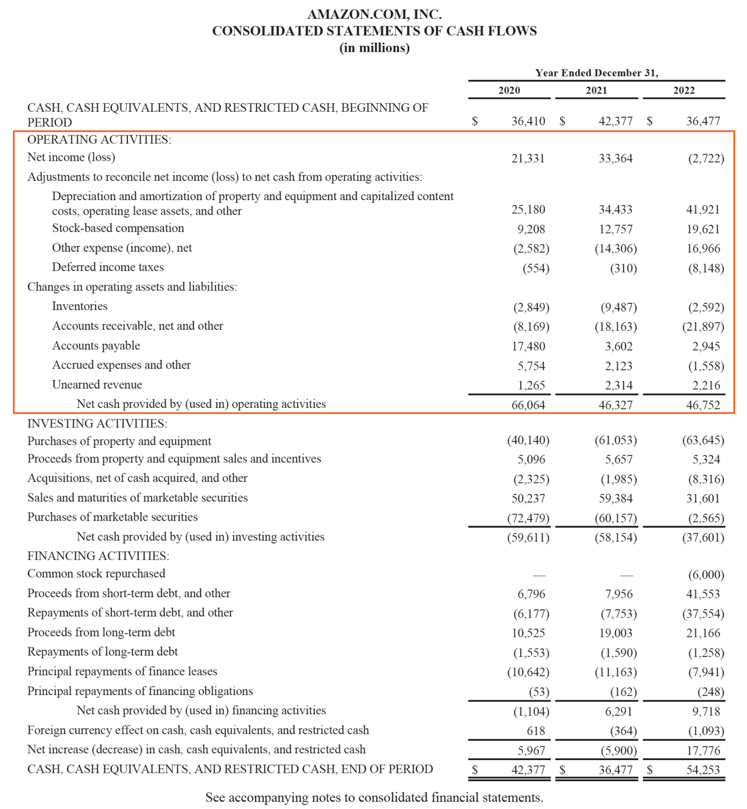

營業活動現金流的英文通常會以 Cash Flow From Operating Activities 或 Operating Cash Flow（OCF） 等形式出現。

**Operating cash flow (OCF) is how much cash a company generated (or consumed) from its operating activities during a period.**（经营现金流（OCF）是指公司在一段时间内从经营活动中产生（或消耗）的现金量。）

**The OCF calculation will always include the following three components: 1) net income, 2) plus non-cash expenses, and 3) minus the net increase in net working capital.**

OCF 计算始终包括以下三个组成部分：1) 净利润，2) 加上非现金支出，以及   3) 减去净营运资本的净增加。

**Financial analysts will look at OCF, along with free cash flow (FCF) and net income, to analyze a company’s profitability.**

财务分析师将关注 OCF、自由现金流 (FCF) 和净利润，以分析公司的盈利能力。

Below is an example of operating cash flow (OCF) using Amazon’s 2022 [annual report](https://ir.aboutamazon.com/annual-reports/).

As you can see, the consolidated statement of cash flows is organized into three distinct sections, with operating activities at the top, then investing activities, and finally, financing activities. In addition to those three sections, the statement also shows the starting cash balance, total change for the period, and ending balance.

(以下是使用亚马逊 2022 年年度报告的运营现金流 (OCF) 示例。

正如您所看到的，合并现金流量表分为三个不同的部分，经营活动位于顶部，然后是投资活动，最后是融资活动。除了这三个部分之外，报表还显示期初现金余额、期间总变化和期末余额。)

Let’s analyze how the operating section works:

- Net income from the bottom of the income statement is used as the starting point(以损益表底部的净利润为起点)
- All non-cash items are “added back,” meaning any accruals are reversed, including:(所有非现金项目均“加回”，这意味着任何应计项目都将被冲销，包括)
  - Depreciation and amortization, which is the accrual-based(应计项目) expensing of capital the company invested in maintaining its property, equipment, website, software, etc. (折旧和摊销，是公司用于维护其财产、设备、网站、软件等的应计资本支出。)
  - Stock-based compensation is expensed but not paid out with actual cash; instead, this compensation(赔偿金，补偿金) is paid with the issuance of shares to key employees(股票薪酬已支出，但不以实际现金支付；相反，这种补偿是通过向关键员工发行股票来支付的)
  - Other expense/income could include various items such as unrealized gains or losses or other accrued items(其他费用/收入可能包括各种项目，例如未实现的损益或其他应计项目)
  - [Deferred taxes](https://corporatefinanceinstitute.com/resources/accounting/deferred-tax-liability-asset/) arise from the difference between accounting methods companies use when filing their taxes vs those needed for filing their financial statements(递延税款是由于公司在报税时使用的会计方法与提交财务报表所需的会计方法之间的差异而产生的)
- Change in working capital (operating assets and liabilities) adjustments include:(营运资本变动（营运资产和负债）调整包括：)
  - When inventory on the balance sheet goes up, it results in a reduction of cash (or vice versa) (当资产负债表上的库存增加时，会导致现金减少（反之亦然）)
  - When accounts receivable increases, it also creates a reduction of cash, as it means a portion of the revenues recorded have not yet been paid by customers(当应收账款增加时，也会导致现金减少，因为这意味着记录的部分收入尚未由客户支付)
  - When accounts payable, accrued expenses, and unearned revenue increase, they cause an increase in cash.(当应付账款、应计费用和未实现收入增加时，它们会导致现金增加。)

#### Net Income 淨利 ####

**Net Income**  = EBIT - Interest - Taxes

#### Depreciation & Amortization 折舊、攤銷 ####

因為折舊及攤銷不是真正的失去現金，所以要加回去。

#### Change in Working Capital 營運資本變化

Working Capital（營運資本）= Current Assets（流動資產）– Current Liabilities（流動負債）

Change in Working Capital **為兩個財報期間的營運資本差值**

## **Operating Cash Flow vs Net Income**

Net income and earnings per share (EPS) are two of the most frequently referenced financial metrics, so how are they different from operating cash flow? The main difference comes down to accounting rules such as the [matching principle](https://corporatefinanceinstitute.com/resources/accounting/matching-principle/) and the accrual principle when preparing financial statements.(净利润和每股收益（EPS）是两个最常被引用的财务指标，那么它们与经营现金流有何不同？主要区别在于编制财务报表时的配比原则和权责发生制等会计规则。)

Net income includes various sorts of expenses, some that may have actually been paid for and some that may have simply been created by accounting principles (such as depreciation).(净利润包括各种费用，有些可能是实际支付的，有些可能只是根据会计原则产生的（例如折旧）)

In addition, a company’s revenue recognition principle and matching of expenses to the timing of revenues can result in a material difference between OCF and net income.(此外，公司的收入确认原则以及费用与收入时间的匹配可能会导致 OCF 和净利润之间存在重大差异。)

Unfortunately, it is not possible to simply say that one number is always higher or lower than the other. Sometimes, OCF is higher than net income (as with Amazon), and sometimes it’s the opposite.(不幸的是，不可能简单地说一个数字总是高于或低于另一个数字。有时，OCF 高于净利润（如亚马逊），有时则相反。)

### What Is Cash Flow From Operating Activities ###

Cash flow from operating activities does not include long-term capital expenditures(/ ɪkˈspendɪtʃər / )（资本支出） or investment revenue and expense. CFO focuses only on the core business, and is also known as operating cash flow (OCF) or net cash from operating activities.

经营活动产生的现金流量不包括长期资本支出或投资收支。 CFO 只关注核心业务，也称为经营现金流 (OCF) 或经营活动产生的净现金。

[Cash flow](https://www.investopedia.com/terms/c/cashflow.asp) forms one of the most important parts of business operations and accounts for the total amount of money being transferred into and out of a business. Since it affects the company's [liquidity](https://www.investopedia.com/terms/l/liquidity.asp), it has significance(/ sɪɡˈnɪfɪkəns / 重要性) for multiple reasons. It allows business owners and operators check where the money is coming from and going to, it helps them take steps to generate and maintain(/ meɪnˈteɪn / 保持，维持) sufficient(/ səˈfɪʃ(ə)nt / 足够的，充足的) cash necessary for operational efficiency and other necessary needs, and it helps in making key and efficient financing decisions.

现金流是企业运营最重要的部分之一，占企业转入和转出的资金总额。由于它会影响公司的流动性，因此其重要性有多种。它允许企业主和经营者检查资金的来源和去向，帮助他们采取措施产生和维持运营效率和其他必要需求所需的足够现金，并有助于做出关键且高效的融资决策。

Investors examine a company’s cash flow from operating activities, within the cash flow statement, to determine where a company is getting its money from. In contrast to investing and financing activities which may be one-time or sporadic revenue, the operating activities are core to the business and are recurring in nature.

投资者在现金流量表中检查公司经营活动产生的现金流量，以确定公司的资金来源。与可能是一次性或零星收入的投资和融资活动相比，经营活动是业务的核心，并且本质上是经常性的。

