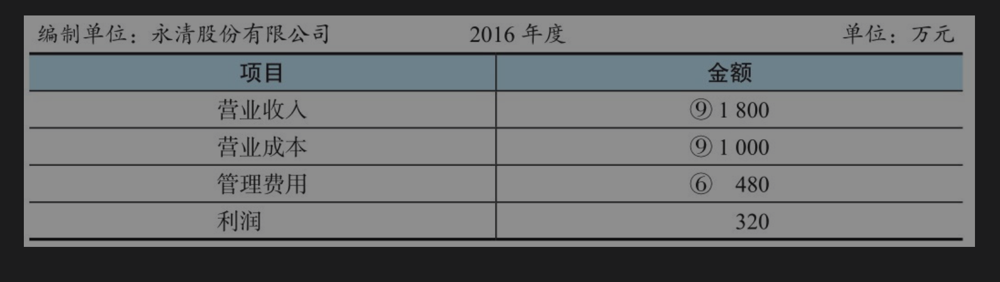
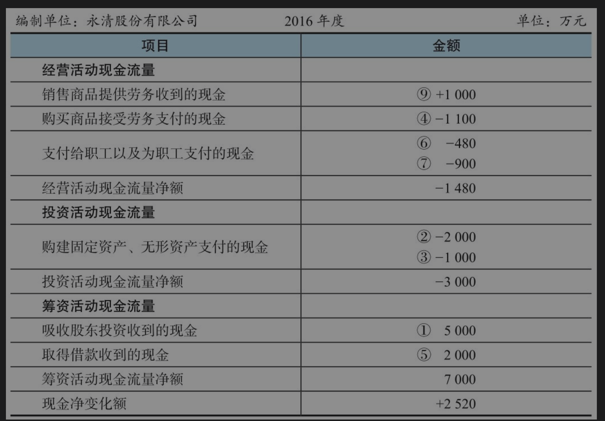

我们经常说会计是一门通用的商业语言，会计语言描述的是企业的经济活动，财务部门是根据企业的经济活动来汇总编制财务报表的。

**现代会计采用借贷复式记账法**，每一笔会计分录都反映了经济活动的来龙去脉。

现代会计采用借贷复式记账法，每一笔会计分录都反映了经济活动的来龙去脉。

* 资产=负债+股东权益
* 利润=收入-成本费用

利润归股东所有，是股东权益的组成部分。我们可以把两个公式合并为一个：

**资产=负债+股东权益+收入-成本费用**

这个公式是一个恒等式，要永远保持平衡

* “借”这个符号表示企业资产和成本费用的增加
* “贷”这个符号表示企业资产和成本费用的减少

模拟一家企业的情况，将有助于大家理解财务报表数字的生成过程:

1. 2016年1月1日，郭永清教授与4个朋友每人各出资1000万元，以银行存款共5000万元成立永清股份有限公司，从事园林器械的生产。上述活动对资产负债表的影响为：**借记银行存款5000万元，代表资产中的货币资金增加**；同时贷记实收资本5000万元，代表股东权益增加5000万元。对现金流量表的影响为：**筹资活动现金流量中吸收股东投资收到的现金5000万元**

2. 2016年2月1日，公司花费2000万元买入某工业园区的厂房，其中包括土地使用权800万元，房屋建筑物1200万元。上述活动对资产负债表的影响为：**借记无形资产（土地使用权）800万元和固定资产（房屋建筑物）1200万元，代表资产中的无形资产和固定资产增加**；同时**贷记银行存款2000万元，代表银行存款减少2000万元**。对现金流量表的影响为，投资活动现金流量中购建固定资产、无形资产支付的现金2000万元。
3. 2016年2月10日，公司花费1000万元买入生产线。上述活动对资产负债表的影响为：**借记固定资产（生产线）1000万元，代表固定资产增加**；同时贷**记银行存款1000万元，代表银行存款减少1000万元**。对现金流量表的影响为：投资活动现金流量中购建固定资产、无形资产支付的现金1000万元。
4. 2016年3月1日～12月31日，公司采购原材料1100万元。上述活动对资产负债表的影响为：**借记存货（原材料）1100万元**，代表原材料增加1100万元；同时**贷记银行存款1100万元，代表银行存款减少1100万元**。对现金流量表的影响为：经营活动现金流量中购买商品、接受劳务支付的现金1100万元。
5. 2016年3月15日，公司从银行借款2000万元，其中700万元的期限为1年，1300万元的期限为3年。上述活动对资产负债表的影响为：**借记银行存款2000万元，代表银行存款增加2000万元**；同时**贷记短期借款700万元、长期借款1300万元，代表流动负债增加700万元，非流动负债增加1300万元**。对现金流量表的影响为：筹资活动现金流量中取得借款收到的现金2000万元。(融资活动中虽然银行存款增加了，但是负债也相应增加了，不过一个是短期流动负债，另一个是长期的非流动负债)
6. 2016年1月1日～12月31日，公司给管理人员发放工资480万元。上述活动对资产负债表的影响为：**贷记银行存款480万元，代表银行存款减少480万元**。对利润表的影响为：借记管理费用480万元，代表管理费用增加480万元。对现金流量表的影响为：经营活动现金流量中支付给职工以及为职工支付的现金480万元。
7. 2016年3月1日～12月31日，生产过程中领用原材料900万元，支付生产工人工资900万元，房屋建筑物折旧60万元，生产线折旧100万元，土地使用权摊销40万元，这些构成了**企业生产产品过程中发生的成本**。上述过程对资产负债表的影响为：**借记生产成本2000万元，代表存货中的在产品增加**；**贷记存货（原材料）900万元、银行存款900万元（因为发了工人工资）、累计折旧160万元、累计摊销40万元**，代表相应的资产减少。对现金流量表的影响为：经营活动现金流量中支付给职工以及为职工支付的现金900万元

固定资产和无形资产的一个主要特征:

其价值则随着固定资产的磨损和无形资产权利的流逝，逐渐地转移到所生产的产品中去。**这部分转移到产品中的固定资产和无形资产价值，就是固定资产折旧和无形资产摊销**

也就是说，公司使用固定资产和无形资产生产产品的过程中，固定资产变旧，无形资产权利减少，因此应当把折旧和摊销记入产品的生产成本

由于固定资产和无形资产的支出金额很大，而且受益期很长，如果将这些支出一次性记入某个会计年度，会导致当年明显亏损。而实际上当年从该固定资产得到的受益不会这么多，同时，其他受益年份又没有体现出应有的支出。这样在衡量年度经营业绩的时候明显不够合理，**所以会计上将固定资产和无形资产入账后，在受益期内计提折旧和摊销。**

永清股份有限公司2016年度的利润为320万元，但是经营活动现金流量净额为-1480万元。

* 一是因为价值800万元的产品销售出去以后，还没有收到现金形成的应收账款；
* 二是因为还有已支付现金，但是尚未销售出去的1000万元存货

**企业有利润并不意味着有相应的现金**。产生差异的深层原因在于，**资产负债表和利润表使用的是权责发生制**，**现金流量表使用的是收付实现制**。笔者在此简单介绍会计核算中的权责发生制和收付实现制。

**收付实现制，**是指以现金的实际收付为标志来确定本期收入和支出的会计核算基础。凡在当期实际收到的现金收入和支出，均应作为当期的收入和支出；凡是不属于当期的现金收入和支出，均不应作为当期的收入和支出。**一句话，收付实现制就是现钱买卖，一手交钱一手交货。收付实现制以现金为基础，不涉及跨期确认的问题**。公司在编制现金流量表时，不需要做任何会计估计和选择，就看公司当期发生的真金白银的现金流。

**权责发生制**，是指以取得收取款项的权利或支付款项的义务为标志来确定本期收入和费用的会计核算基础。凡是当期已经实现的收入和已经发生的或应当负担的费用，不论款项是否收付，都应作为当期的收入和费用；凡是不属于当期的收入和费用，即使款项已在当期收付，也不应作为当期的收入和费用。一句话，权责发生制就是信用买卖，可以预付或赊欠。权责发生制以权利和义务为基础，涉及跨期确认的问题。**公司在编制资产负债表和利润表时，需要判断收入和费用所归属的期间**

