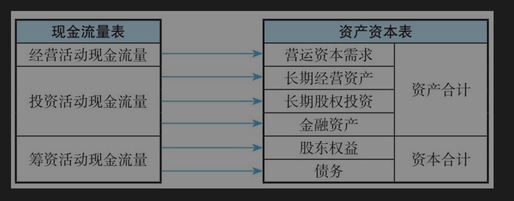

### 标准资产负债表的缺陷  ###

1. 资产按流动性分类的第一个缺陷是比较武断主观，没有真正考虑资产的变现能力问题

《企业会计准则第30号——财务报表列报》的规定，资产满足下列条件之一的，应当归类为流动资产：①预计在一个正常营业周期中变现、出售或耗用。②主要为交易目的而持有。③预计在资产负债表日起一年内变现

上述归类主观性很强，**比如“预计”“目的”等都需要人为判断。实务中，一般把现金、存货、应收票据、应收账款、其他应收款、预付款项等列入流动资产，而不管存货、应收账款等项目到底何时能真正变现，也不管资产的真正变现能力，只是机械地进行资产的归类。**

问题在于，到底是存货的变现能力和流动性好，还是持有至到期投资和可供出售金融资产的变现能力和流动性好？现实中，**在多数情况下，持有至到期投资的债券和可供出售金融资产的股票存在着活跃的交易市场，其变现能力和流动性比存货更好。在一家公司需要使用现金的时候，出售金融资产往往比出售存货更加容易。但是，在标准资产负债表中，我们把存货归类为流动资产，却把持有至到期投资和可供出售金融资产归类为非流动资产。大谬也**！

2. 负债满足下列条件之一的，应当归类为流动负债：①预计在一个正常营业周期中清偿。②主要为交易目的而持有。③自资产负债表日起一年内到期应予以清偿。④企业无权自主地将清偿推迟至资产负债表日后一年以上

一是没有考虑公司的经济活动与财报之间的逻辑关系，应付票据、应付账款、应付职工薪酬等负债来自经营活动，短期借款等来自筹资活动，公司对于经营活动和筹资活动的决策及执行来自不同的部门和业务

二是没有考虑负债是否需要资金成本。营运负债往往是不需要承担资金成本的，即使有也基本上可以忽略不计；而短期借款、长期借款、应付债券等债务需要承担资金成本。对于一个有竞争力的公司，通常可以利用上下游供应链中的优势地位占用较多的其他公司资金。在公司营运正常的情况下，这类负债可以节约公司的资金成本，因此反而越多越好

### 资产负债表的重构：资产资本表 ###

为了分析和后续估值，我们按照现金流量表中的活动分类，对资产负债表进行重构:

* **筹资活动**对应公司的资本总额，即公司占用了多少股东和债权人的资金
* **投资活动**和**经营活动**对应公司的资产总额，即公司投入了多少资金在不同的资产项目上面

重构后，资产不再按照流动性分类，而是按照带来经济利益的方式分类

* **资产分为金融资产、经营资产**（含营运资本和长期营运资产）、长期股权投资三类
* **资本按其来源和期限**，分为股东权益和债务（含短期债务和长期债务

资产资本表采用“资产=资本”的等式。该等式为恒等式:

* **资本表明公司的资金来源**，**资产表明公司的资金使用**。一家公司使用的资金总额一定是其来源的资金总额

一家公司资金来源的总额一定被投入到了不同的资产项目上面，因此等于其使用的资金总额。

