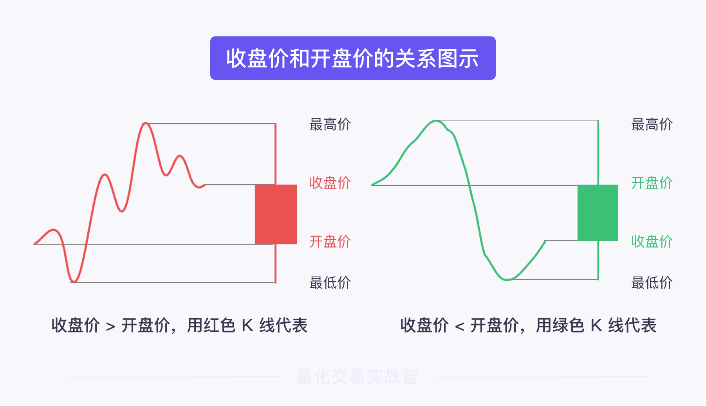

### 指标的分类 ###

**1）基本面指标**：反映的是股票背后的**公司**、**行业**、**宏观经济**特征。

基本面指标用于基本面分析，它分析的是股票内在价值的影响因素，例如公司的经营状况、行业前景以及宏观经济环境。这些因素会影响股价在中长期的运行趋势。

**2）技术面指标**：反映的是股票的**历史交易数据**的特征。

技术面指标用于技术面分析，它分析的是股票的价格、成交量等一切由交易产生的数据。通过分析数据中的规律，预测中短期的股价走势。

###  常用基本面指标

基本面的分析主体有**公司、行业和宏观经济环境**。因此，与主体相对应，基本面指标可以进一步细分为三类：


基本面指标非常多。这里我介绍一个初学者最常用的基本面指标——**市盈率**。

**市盈率 = 股票价格 ÷ 每股收益**。它用来反映股票的价值是否被市场高估或者低估。

公式当中，**股票价格**代表市场对公司未来价值的预估，而**每股收益**衡量的是公司目前的实际盈利能力。

较高的市盈率，反映了投资者对公司发展潜力的认同。适当地高估，表示市场相信公司能在未来提升盈利能力，这是一种良性的信号。一般来讲，市盈率在 20 至 30 之间属于正常范围。

但是，市盈率过高或过低时，需要格外谨慎。过高的市盈率说明当前的股票价格相对实际价值而言，已经处在过高的水平，可能出现回落趋势。但是反过来，过低的市盈率并不一定代表价格有上涨趋势，它说明市场对公司的未来不看好，也许公司的确缺少发展潜力，需要谨慎判断。

### 常用技术面指标

技术指标反映的是股票历史交易数据的特征。

说到交易，无非就是两件事——“多少钱”和“买多少”，即`价格`和`成交量`。

因此，股票市场中，**股票的价格和成交量是两个最基础的技术指标**。在价格和成交量的基础上，可以衍生出更多技术指标。

**基础技术指标**

K 线是我们最常用的技术指标，它的本质是价格。K 线的形状和颜色记录了股票的价格变化。



**成交量**

**成交量指一段时间内成交的股票总手数，**可以缩写为 VOL。它反映了资金进出市场的情况。

股市中什么都可以骗人，唯有成交量是真的。它是和 K 线同等重要的基础技术指标，但很容易被小白忽视。


成交量的大小体现了该股票对市场的吸引程度。如果市场看好一支股票，会有大量资金流入，成交量放大；反之，资金避而远之，成交量就会萎缩。

**2）衍生技术指标**

**趋势类指标 - MACD 指标**

MACD 指标的全称是**平滑异同移动平均线**，是反映股票价格趋势的重要指标

MACD 由四部分组成：`DIF 值`、`DEA 值`、`MACD 值`和`零轴线`


图中的蓝线称为 **DIF 值**。它是 12 日短期移动平均线与 26 日长期移动平均线的差值。因为 DIF 值的变动较为灵敏，因此又称快线。

图中的红线称为 **DEA 值**。它是 DIF 值的 9 日移动平均线。因其变化较缓，又称慢线。

图中的红绿柱称为 **MACD 值**，它表示 DIF 值与 DEA 值的差值。以**零轴线**为界，MACD 值大于零是红色柱子，表示此刻 DIF 值大于 DEA 值；反之是绿色柱子，表示此刻 DIF 值小于 DEA 值。

MACD 指标的本质就是反映 DIF 值（快线）和 DEA 值（慢线）之间的**交叉分离**情况

如何运用 MACD 指标呢？

**DIF 值由下向上穿过 DEA 值，形成的交叉称作金叉，此时柱子由绿变红；DIF 值由上向下穿过 DEA 值，形成的交叉称作死叉，此时柱子由红变绿。**


一般来讲，**金叉**表示下跌减缓，是买入信号；**死叉**表示上涨减缓，是卖出信号。

如果金叉发生在零轴线以上，称作**零上金叉**，预示更强的上涨趋势。如果死叉发生在零轴线以下，叫做**零下死叉**，预示更强的下跌趋势


**大盘类指标 - ADR 指标**

ADR 指标的全称是**涨跌比率**，表示股市中上涨股票数量与下跌股票数量之比，用来反映大盘的强弱趋向。

如图所示，下方的红线就是 ADR 线，它描绘了每天的 ADR 指标变化趋势

ADR 指标的具体公式为：**ADR ＝ 股市中上涨的股票数量 ÷ 股市中下跌的股票数量**

例如，某日股市中共有 800 支股票上涨，1000 支股票下跌，则 ADR = 800 ÷ 1000 = 0.8 。

多数情况下，ADR 的取值在 1 附近波动。ADR 指标过高，意味着市场整体上涨过度，回落的可能性较大；反之，ADR 指标过低，意味着市场下跌过度，上涨可能性大。

**情绪类指标 - ARBR 指标**

ARBR 的全称是**人气意愿指标**，用来反映一支股票在市场中的买卖人气和买卖意愿。

**AR 指标**以当日的开盘价为基点，判断它在最高价和最低价之间所处的位置。

**BR 指标**以前一日收盘价为基点，判断它在最高价和最低价之间所处的位置。

**摆动类指标 - KDJ 指标**

KDJ 指标又称**随机摆动指标**，它用于衡量股价偏离正常水平的程度。

先看一下它的图像吧。如下图所示，上方是 K 线图，下方是对应的 KDJ 曲线，它由三条线组合而成。


KDJ 指标由 K 值、D 值、J 值组成，这三个值均是由每日的最高价、最低价和收盘价计算而来。

**K 值**：表示近期的收盘价在总体价格区间中的位置；
**D 值**：对近期的 K 值进行平均处理，较 K 值更加平滑；
**J 值**：代表 K 值和 D 值之间的距离

KDJ 指标非常灵敏，随着股价变化上下摆动。我们可以通过它的摆动幅度判断股价是否偏离正常范围。

如果摆动幅度过大，说明股价过度偏离正常范围，可能出现反转趋势，从而产生买入卖出信号。

### 指标查看途径 ###

首先，ForTrader 中收录了许多常用的基本面指标和技术面指标，本课程会逐步将它们的使用方法介绍给你。

此外，在常见的金融软件中，例如同花顺，东方财富，通达信，都可以轻松地找到想要的指标。

### 指标的选取 ###

**1）投资目标**


##### 指标选取 ####

首先回顾一下大谷的选股思路：希望从上证 50 指数 中选出放量上涨的股票。

**1）选对象**

例如，选股时，我们既可以分析公司财务状况，也可以分析股票的交易数据等，这些都是我们可以选择的对象。

根据大谷的描述，**他希望从上证 50 指数中选出放量上涨的股票。为了实现这一点，我们要看的对象是上证 50 成分股的交易数据。**

**2）选特征**

在大谷的交易思路中，交易数据需要满足两个特征：放量和上涨。

**放量**指的是成交量比过去一段时间有所增高，**上涨**指的是股价比前一天有所提升。

**3）选指标**

**a.放量**：需要用到两个指标——`当日成交量`和`过去 N 天的成交量均值`，前者大于后者时表示放量。这里的 N 表示天数，它的取值没有标准答案。我们可以基于经验先假设一个值，例如 120，然后在模型检验阶段再去调试它。

**b.上涨**：需要用到`当日涨幅`。需要注意的是，如果当日涨幅非常小，例如 0.01%，上涨的趋势并不明显，对选股帮助甚微。因此，我们可以再设置一个门槛，当日涨幅大于门槛时，才视为出现上涨趋势。我们可以先基于经验假设一个门槛值，例如 2%，模型检验阶段再去调试。

### 择时指标

首先回顾一下大谷择时的思路：及时地预测价格趋势，在上涨前买入，下跌前卖出。

**1）选对象**

择时阶段，我们可以分析的主体也有很多，比如价格趋势、市场情绪、大盘强弱、随机摆动等。

根据大谷的交易思路，我们应该选择价格趋势作为对象。

**2）选特征**

价格趋势需要满足两个特征：即将上涨和即将下跌。

**3）选指标**

什么指标能够相对准确地预测股价的上涨和下跌呢？


于是，在择时模块，我们可以选取 MACD 指标，它包括 DIF 值、DEA 值和 MACD 值。通过这三个值的关系，判断零上金叉和零下死叉，从而预测上涨和下跌。

### 风控指标

**1）选对象**

在这里，大谷的要求很简单，只考虑亏损程度即可。

**2）选特征**

按照大谷的意愿，我们需要设定一个临界点，只要股价低于临界点，就执行风控。

**3）选指标**

止损价格需要根据大谷能够接受的亏损程度来确定。比如，大谷不想承受超过 5% 的亏损，所以止损价格就可以设置为 **股票买入价格 × (1 - 5%)**。同样的，5% 这个比例我们也可以在后续模型检验中调试。

至此，我们已经梳理完了选标的、择时、风控三部分要用到的指标


### 建立数学关系 ###


### 策略代码讲解 ###

定义`常量`；

1）目标当日涨幅：2%
2）成交量均值的计算周期：120
3）止损比例：5%

如果我们要定义**“目标当日涨幅：2%”**，并将它命名为 `target_increase`。

```python
def indicators(context):
    """指标"""
    # 设置成交量均值的计算周期
    context.volume_days = 120
    # 设置目标当日涨幅
    context.target_increase = 0.02
    # 设置止损比例
    context.loss_ratio = 0.05
```

### MACD 指标


```python
macd_instance = MACD(data.close, period_me1=12, period_me2=26, period_signal=9)

# macd 属性对应 DIF 值，signal 属性对应 DEA 值。二者相减，对应的就是 MACD 值。
def indicators(context):
    """指标"""
    # MACD类的实例化，快的EMA周期为12，慢的EMA周期为26，差离值计算周期为9 
    macd_instance = MACD(data.close, period_me1=12, period_me2=26, period_signal=9)

    # 将对应的值写入到字典中
    stock1_macd = {
        'DIF值': macd_instance.macd,
        'DEA值': macd_instance.signal,
        'MACD值': macd_instance.macd-macd_instance.signal
    }
```

将 MACD 指标的计算过程拓展到所有股票，即上证 50 的成分股。

想要计算所有股票的 MACD 指标，我们必须要先获取**所有股票的数据**

```python
# 标的池中有多支标的，需要获取所有标的的数据
context.datas

def indicators(context):
    """指标"""
    # 创建MACD指标字典
    context.stock_info = {}

    # 遍历所有标的
    for data in context.datas:

        # MACD类的实例化，快的EMA周期为12，慢的EMA周期为26，差离值计算周期为9
        macd_instance = MACD(data.close, period_me1=12, period_me2=26, period_signal=9)

        # 将对应的值写入到MACD指标字典中
        context.stock_info[data._name] = {
            'DIF值': macd_instance.macd,
            'DEA值': macd_instance.signal,
            'MACD值': macd_instance.macd-macd_instance.signal,
        }
```

### 标的模块

```python
def choose_stock(context):
"""标的"""
    # 设置基准标的：上证50
    context.benchmark = '000016.XSHG'
    # 设置组合标的，上证50里面的所有成分股
    context.symbol_list = ["000016.XSHG"]
    # 设置解析成分股
    context.parse_index = True

    # 创建列表，用来储存合格标的
    context.stock_list = []

    # 遍历初始标的池中的所有标的
    for data in context.datas:
        
        # 如果当前标的历史交易天数小于计算周期
        if len(data.volume) < context.volume_days:
            # 跳过本次循环
            continue

        # 创建成交量累加变量
        count_volume = 0            
        # 计算总成交量，将指定时间内的每日成交量累加求和
        for i in range(context.volume_days):
            count_volume += data.volume[-i]
        # 计算历史成交量均值
        volume_avg = count_volume / context.volume_days
        
        # 计算当日涨幅
        daily_increase = (data.close[0]-data.close[-1]) / data.close[-1]

        # 判断当日涨幅是否超过目标当日涨幅，并且当日成交量超过历史成交量均值
        if daily_increase > context.target_increase and data.volume[0]>volume_avg:
            # 将通过判断的标的添加到合格标的池
            context.stock_list.append(data._name)

```

**数学关系**：在上证 50 指数中，选当日涨幅在 2% 以上，当日成交量大于过去 120 日成交量均值的股票

* 用 for 循环累加求和，计算过去 120 天的总成交量

* 用总成交量除以天数，得到均值，命名为 `volume_avg`。
* 计算每支股票的**当日涨幅**。它的计算公式是：当日涨幅 = (当日收盘价 - 前一日收盘价) ÷ 前一日收盘价

如果股票同时满足以下两个条件，就将股票的名称添加到合格标的池中。

1）条件一：当日涨幅 > 目标当日涨幅
2）条件二：当日成交量 > 过去 120 日成交量均量

### 择时模块

```python
def timing(context):
    """择时"""
    # 遍历初始标的池中的所有标的
    for data in context.datas:

        # 获取MACD指标数据和持仓信息
        macd_info = context.stock_info[data._name]
        position = context.getposition(data)

        # 如果标的在合格标的池中且当前未持仓
        if data._name in context.stock_list and position.size == 0:

            # 如果DIF值和DEA值均大于0，并且MACD值由负变正
            if macd_info['DIF值'][0] > 0 and macd_info['DEA值'][0] > 0 and macd_info['MACD值'][-1] < 0 and macd_info['MACD值'][0] > 0:
                # 发送买入指令，系统自动执行买入交易
                context.buy(data=data)

        # 如果当前已持仓        
        elif position.size != 0:
            # 如果DIF值和DEA值均小于0，并且MACD值由正变负
            if macd_info['DIF值'][0] < 0 and macd_info['DEA值'][0] < 0 and macd_info['MACD值'][-1] > 0 and macd_info['MACD值'][0] < 0 :
                # 执行平仓
                context.close(data=data)
```


* 遍历初始标的池。for 循环会将所有股票逐个提取出来，判断是否符合择时的条件。
* 获取当前股票的 MACD 指标数据和持仓信息，为择时判断做准备
* 股票需满足以下 3 个条件，才能买入：
  * 股票进入合格标的池
  * 当前未持仓
  * 满足零上金叉
* 判断是否满足**零上金叉**，对应代码如下：

```python
# 零上：DIF值 > 0 且 DEA值 > 0
macd_info['DIF值'][0] > 0 and macd_info['DEA值'][0] > 0
# 金叉：前一日MACD值 < 零，当日MACD值 > 零
macd_info['MACD值'][-1] < 0 and macd_info['MACD值'][0] > 0

```

* 判断是否平仓。

```python
# 股票平仓需要满足 2 个条件：当前已持仓、满足零下死叉
```

### 风控模块

```python
def control_risk(context):
    """风控"""
    # 遍历初始标的中的所有标的
    for data in context.datas:
        # 获取标的持仓信息
        position = context.getposition(data)

        # 如果当前已持仓
        if position.size != 0:
            # 计算止损价格
            stop_price = (1 - context.loss_ratio) * position.price

            # 如果当日收盘价低于止损价格
            if data.close[0] < stop_price:
                # 执行平仓
                context.close(data=data)   
```

根据止损比例，计算出止损时的股票价格。计算公式是：止损价格 = (1 - 止损比例) * 买入价格。其中，买入价格用 `position.price` 调用。

如果当日收盘价低于止损价格，执行平仓


