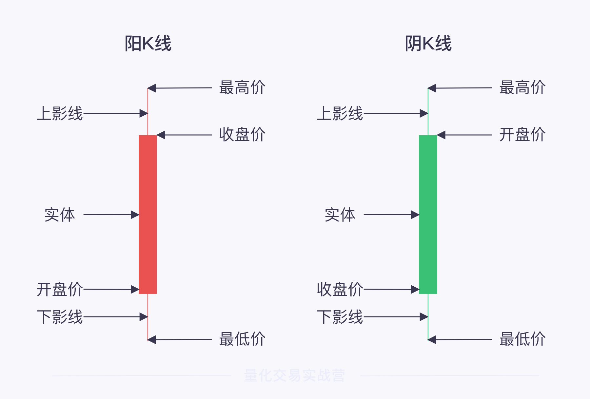
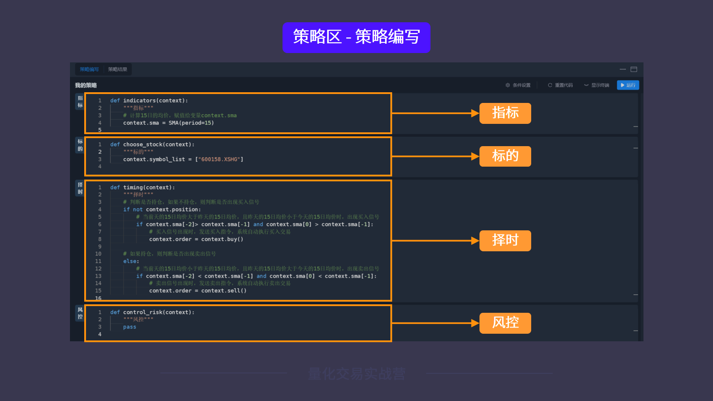
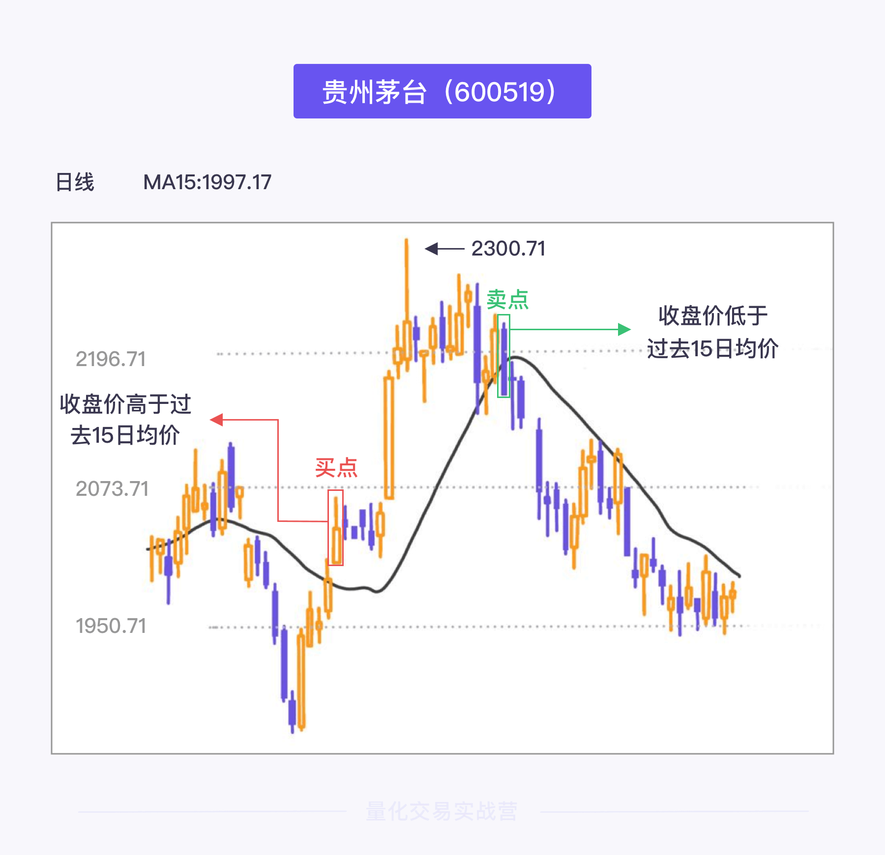
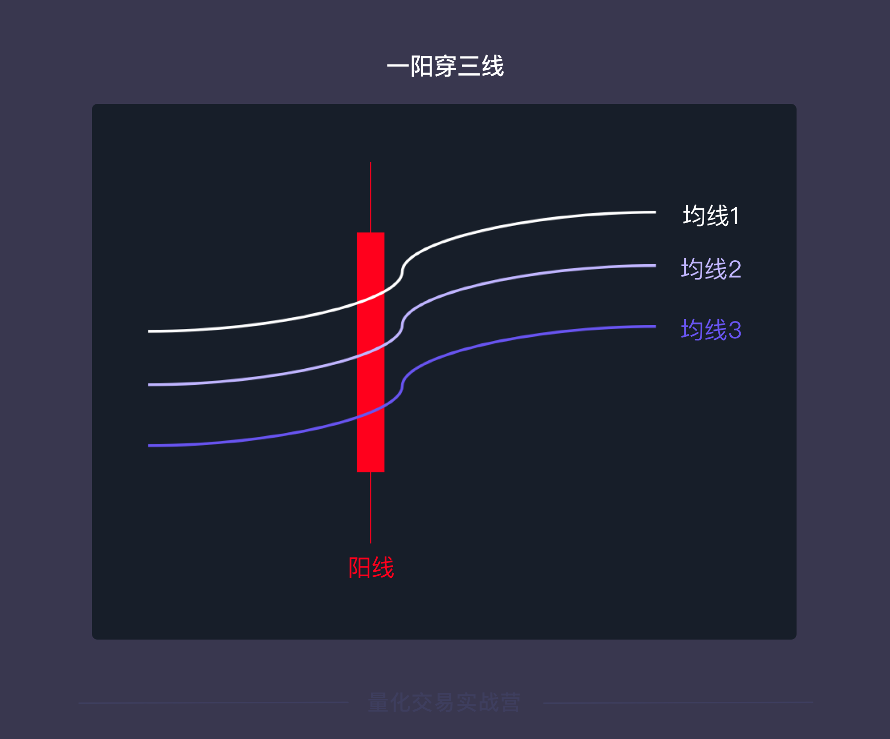
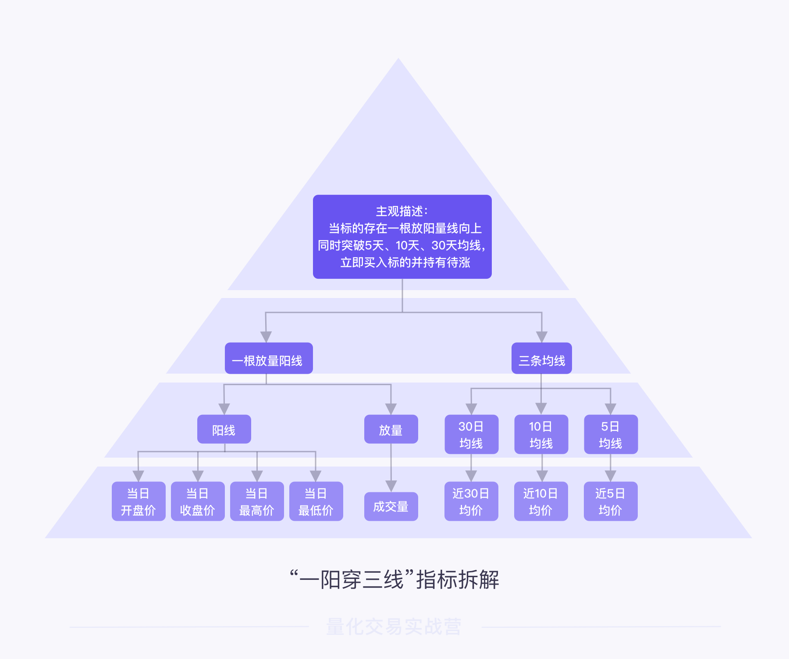
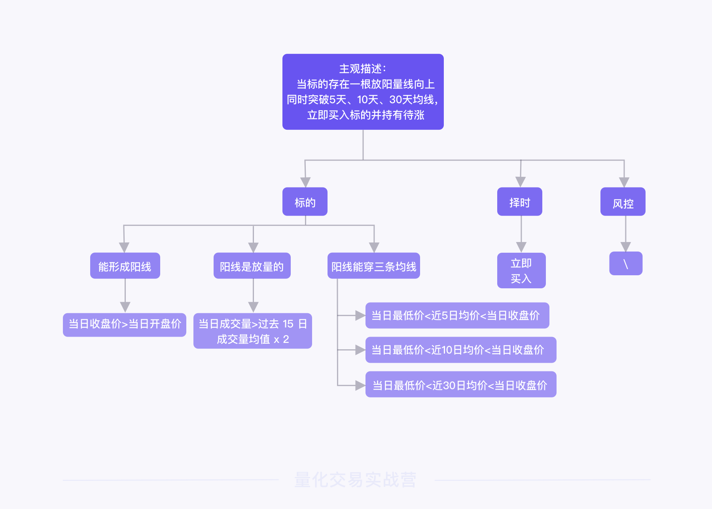

量化交易就是指借助现代统计学和数学的方法，利用计算机技术进行交易的证券投资方式，是从人脑判断到电脑判断的过程。

### 何为合格的 Quant？ ###

宽客就是专门从事量化交易的人。“宽客”这个词最早源于2004年出版的《宽客人生:从物理学家到数量金融大师的传奇》（My Life as a Quant- Refections on Physics and Finance）。

* **量化IT工程师**，日常协助研究员、交易员解决编程技术难题，他需要精通 C++ 语言，并且运用 C++ 语言搭建低延迟交易系统，对撮合机制、订单类型、交易接口、市场微观结构等有一定的理解。行业风向变化周期较长，有足够的时间专研，例如追求更高效地利用 CPU 多进程、更高速的算法、更低的网络延时等
* **量化研究员**，日常工作是维护已经运行的策略，而另一项任务就是研发新的策略，需要经过样本内外的检验，一些关键指标，如夏普比率、年化收益率和最大回撤都要达到要求。然后进行模拟盘测试，只有两者表现出色，才可以在实盘上“验证”。要能基于编程语言易学性和数据分析来论证策略的有效性，量化研究员一般会主攻 Python、R、MATLAB 等动态语言，并且需要一定的 SQL 基础，若想往高频交易方向发展，则要求懂 C++ 语言。
* **量化交易员**，日常工作是通过接收客户或基金经理的指令，在一定时间内，尽可能低买高卖或者分批操作来降低冲击成本，你也可以把它理解为更关注交易本身的宽客，运用量化交易技术来赚取收益或减少成本。

比如在某些事情上，拥有一些独特的判断能力，比如在信息或数据的获取与分析中，有不一样的看法，再比如看到某个股票的 K 线走势时，你能大概率的判断当前主力是在吸筹还是在出货。

吸筹：吸筹是指在股市中庄家、主力或大户介入某一个股，一段时间内不断买入的行为。

出货：出货是股市用语，指庄家在高价时，不动声色地卖出股票，称为出货

#### K线 ####

一根 K 线主要包括三个部分：实体、上影线和下影线。

实体即开盘价与收盘价之间的部分；上影线是实体以上的部分，即实体上方的细线；下影线则是实体以下的部分，即实体下方的细线。

* `开盘价`，是指某种投资标的在证券交易所每个交易日开市后的第一笔买卖成交价格
* `收盘价`，是指某种投资标的在证券交易所一天交易活动结束前最后一笔交易的成交价格。

### ForTrader 的组成结构 ###

* 指标模块，用于生成交易信号。计算指标的方法多种多样，可以是经济数据或估值指标，也可以是技术指标。
* 标的模块，根据你的交易想法选择相应的投资标的，可以是股票、基金等标的代码。
* 择时模块，主要解决“什么时候交易”的问题。在这个模块编写策略的买入卖出逻辑，在合适的时机交易标的。
* 风控就是指风险管理者采取各种措施和方法，消灭或减少风险事件发生的各种可能性，或风险控制者减少风险事件发生时造成的损失。它是策略组成的一个可选部分

### 认识均线突破策略 ###

#### 什么是均线？ ####

均线从数字的变动中去预测股价未来短期、中期、长期的变动方向，为投资决策提供依据。

简单来说，均线计算方式就是：`N 日移动平均线 = N 日收市价之和 / N`。

计算均线需要先设置均线周期，也就是公式中的 N 值。

举个例子，如果我们要计算 15 日均线价格，就要先将均线周期 N 设置为 15 日，并将投资标的第 1-15 个交易日的收盘价求和，除以 15，就能得到 15 日的第一个均点；向后移动一个交易日，再将第 2-16 个交易日的收盘价求和，除以 15，得到第二个均点。重复以上步骤，将得到的所有均价连成一条线，就生成了 15 日均线

#### 什么是均线突破策略？ ####

均线突破策略的使用核心是**通过均线指标，简单判断股票价格的趋势以及买入、卖出的时间点**。

更具体一点的描述是：**在当前交易日，如果股票的收盘价高于过去 15 日均价，则大概率认为股票价格在未来一段时间内会上涨；低于，则大概率下跌**。

对应到实际的操作，则是**在当前交易日**，如果某只股票**收盘价向上突破它 15 日内的平均价格**，开始指挥计算机**买入股票**；**收盘价向下跌破15 日内的平均价格**，开始**卖出股票**。

**中国石油（601857）**这只 A 股历史上著名的能源巨头股票，我们以它作为例子。

先看一个非常简单的想法：当你有 10000 元，打算每天买 100 股的中国石油，这同样也是一种投资策略。

###  单均线策略

用一句话概括就是：
——**均线向上拐时，买入股票；均线向下拐时，卖出股票**

### 一阳穿三线 ###

网络上有这么一种说法：当一只股票的 K 线图出现了“一阳穿三线”的现象，那它就是要上涨了，投资者要立即买入持有待涨。

它在 K 线图中的样子如下：👇

一阳穿三线通常指：当标的（一只股票）的股价经过长期下跌和充分整理之后，突然一根放量的阳线向上同时突破 `5 日均线`、`10 日均线`、`30 日均线`的情况。

“一阳穿三线”策略就是：**当标的存在一根放量阳线向上同时突破 5 日、10 日、30 日均线时，立即买入并持有待涨**。

#### 构建指标关系 ####

`标的`需要满足的条件就有：

* 能生成阳线；
* 阳线是放量的；
* 阳线要穿过三条均线

**条件一：标的能生成阳线**。

根据阳线的定义，能生成阳线就代表着：`当日收盘价`大于`当日开盘价`。

用数学语言表达就是：`当日收盘价 > 当日开盘价`。

轻松搞定，咱们看第二个条件。

**条件二：标的阳线是放量的**。

放量，就是当日成交量急剧放大，并大于过去一段时间的成交量均值。

这里涉及两个不确定的内容：一段时间、急剧放大。一段时间是多久？急剧放大要多大？

可以假定**当日成交量大于过去一段时间成交量均值的两倍**，就算远大于过去一段时间的均值。

综合来看，`当日成交量`大于`2 倍过去 15 日的成交量均值`，就算满足了条件。

用数学语言表达就是：`当日成交量 > 过去 15 日成交量均值 x 2`

**条件三：标的阳线要穿过三条均线**。

所以，当它“穿”过三条均线（5 日、10 日、30 日均线）时：

1）`近 5 日均价`小于`当日收盘价`、并大于`当日最低价`；
2）`近 10 日均价`小于`当日收盘价`、并大于`当日最低价`；
3）`近 30 日均价`小于`当日收盘价`、并大于`当日最低价`。

接下来，我们看看`择时`部分。

在择时部分，由于我们直接买入选出的标的，所以这背后暂时没有新的指标关系。

此外，`风控`部分，“一阳穿三线”无对应描述，所以也暂无内容。

