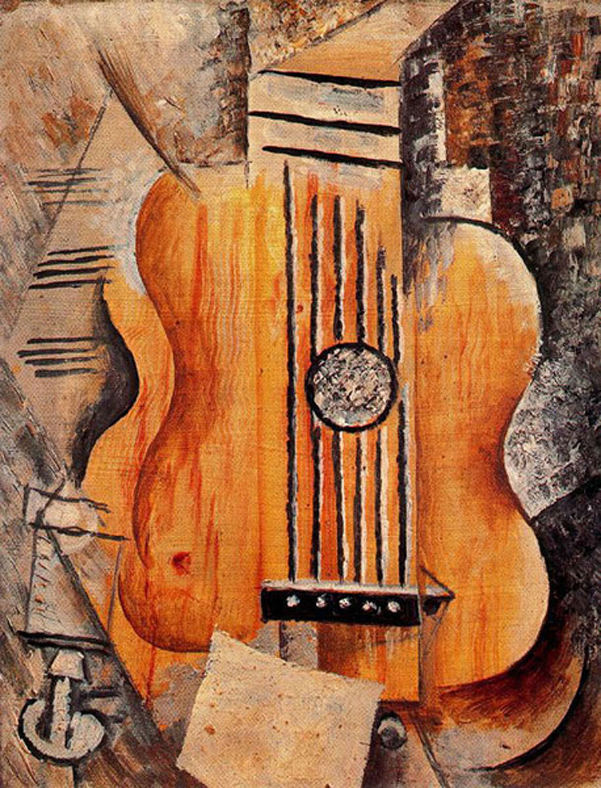

毕加索，是西班牙著名画家、雕塑家，是西方现代派绘画的主要代表人物，**他被评价为当代西方最有创造性和影响最深远的艺术家**，是 20 世纪的一个伟大艺术天才。

毕加索的父亲也是一位画家，而且是美院教授级别。他父亲喜欢画小鸟，在毕加索十三岁的时候，他看见父亲的一幅小鸟画没画完，便帮父亲素描涂色。后来，他父亲观察了一下毕加索画的地方，觉得他儿子已经超越了他，发誓从此再也不绘画了

《科学与博爱》（Science and Charity）巴勃罗·毕加索（Pablo Picasso）创作于1897年现存于西班牙巴塞罗那毕加索博物馆

毕加索还是唯一一位在活着的时候就能在卢浮宫看见自己作品的艺术家。

### 玫瑰色初恋：忧郁蓝色转向粉红色 ###

据不完全统计，毕加索的情人和妻子就有 7 个。不过，我们的主要目的是学习鉴赏油画，所以，我们对艺术家的私人生活不予评价。但是，毕加索的情人们真的称得上是他的缪斯女神们，因为她们是毕加索的创作源泉，给了他无数的艺术灵感。

毕加索的初恋是一名法国模特，名字叫费尔南德·奥利维尔，长得十分好看。他们于 1904 年在巴黎相遇，并且很快就坠入爱河。也是因为这个女孩的出现，让毕加索的生活充满了甜蜜。

在和奥利维尔在一起的时候，**毕加索画画使用的都是橘、粉红色系，作品画风也很明快**。比如，我们看下面这幅《拿烟斗的男孩》，就可以明显地感受到这时期的特点。

爱情给了毕加索最好的艺术土壤，让他的灵感和想法层出不穷。**也是在这个时期，他创作了《亚威农的少女》，这是世界上第一幅立体主义作品，算得上是毕加索的成名作。**

《亚威农的少女》（Chicks-from-avignon）巴勃罗·毕加索（Pablo Picasso）创作于1907年现存于美国纽约现代艺术博物馆

所以我们说，奥利维尔的爱情真的拯救了毕加索，给了他灵感。**因为在这段粉红色时期之前，毕加索度过了一段时间的“蓝色时期”。**蓝色时期与粉红色时期正好相反，蓝色时期的毕加索画画会使用大量的蓝色和黑色色调，很少使用温暖的颜色，画风阴郁，充满了忧郁的气息。

### 心中白月光：拼贴型立体主义 ###

伊娃是一位像极了洋娃娃的女人，她娇小纤弱，柔情似水，毕加索很喜欢她。而伊娃也很听他的话，对他很服从，这段恋情让毕加索整个人也变得十分温柔和柔和，内心的恐惧也少了很多

毕加索和伊娃在一起的时候，创作了许多立体主义的作品，来向伊娃表达爱意。可是，留下来的并不多，我们来简单看一幅画，叫《吉他》。

Guitar (I love Eva)巴勃罗·毕加索（Pablo Picasso）创作于1912年现存于法国巴黎毕加索博物馆

毕加索这时候的作品已经偏向于立体主义了，不过，当时还是没有人能理解毕加索开创的这条新的艺术道路的意义。这幅《吉他》有着明显的立体风格，从每个角度看上去，吉他都是立体的。

但是，在 1915 年 12 月，伊娃因为生病去世，他们只在一起了三年。从此，伊娃成为了毕加索心里的一抹白月光，她的一颦一笑都永远刻在了毕加索的回忆里。

